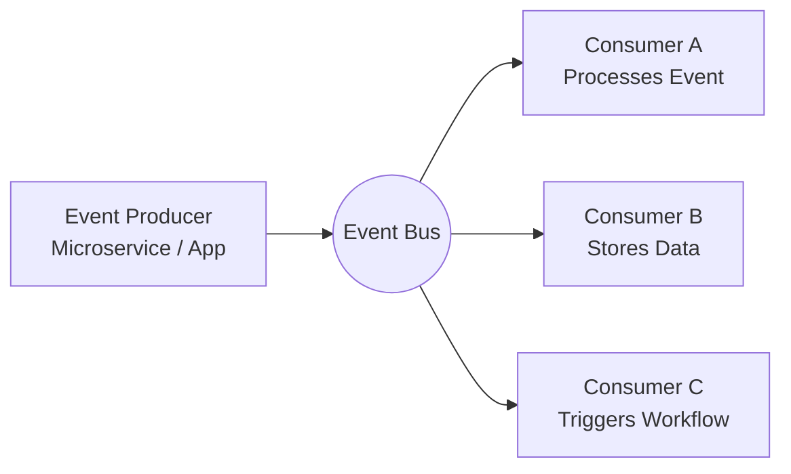

# 1. Definition

**Event-Driven Architecture (EDA)** is a software architecture where the system reacts to **events** instead of following a fixed sequence of operations.  
An event is any significant change in the system: a user action, a sensor signal, a message received, a state update, or a system trigger.

EDA systems are built around **producers** that generate events and **consumers** that react to them, usually connected through an **event bus**, **message broker**, or **queue**.

---

# 2. Why EDA Exists

EDA solves the limitations of tightly coupled, request-response applications.

**Key motivations:**

- Systems need to scale independently.
    
- Components must react in real time.
    
- High availability and loose coupling are required.
    
- Data must flow through pipelines smoothly.
    
- Workloads change dynamically and unpredictably.
    
- Microservices must communicate without blocking each other.
    

---

# 3. Core Concepts

## 3.1 Events

An event is a record of something that happened.  
Examples:

- “UserCreated”
    
- “OrderPlaced”
    
- “FileUploaded”
    
- “PaymentFailed”
    

Events contain details such as timestamps and payloads.

## 3.2 Event Producers

Components that detect or generate events.  
Examples:

- Web apps
    
- IoT sensors
    
- Microservices
    
- Background jobs
    

They send events into the system.

## 3.3 Event Consumers

Components that listen to events and react to them.  
Each consumer reacts **only** when the relevant event occurs.

## 3.4 Event Bus / Broker

The middleware responsible for transporting events.  
Examples:

- Kafka
    
- RabbitMQ
    
- Redis Streams
    
- AWS SNS/SQS
    
- NATS
    

It decouples producers and consumers, allowing them to function independently.

---

# 4. How EDA Works

The producer sends an event to the bus.  
The bus distributes it to all consumers that are subscribed to that event type.

---

# 5. Types of Communication Models

## 5.1 Pub/Sub (Publish–Subscribe)

A producer publishes an event.  
Any subscriber interested in that event receives it.  
Good for broadcasting and multi-consumer scenarios.

## 5.2 Event Streams

Events are stored as an ordered, immutable log, like Kafka logs.  
Consumers can replay them, reprocess them, or read at their own pace.

## 5.3 Queues

Events are consumed once, typically by a single worker.  
Good for work distribution.

---

# 6. Characteristics of EDA

## 6.1 Loose Coupling

Producers do not know who consumes the event.  
This gives flexibility and modularity.

## 6.2 Asynchronous Flow

Consumers react independently, and tasks do not block each other.

## 6.3 Elastic Scalability

Each component scales separately according to load.  
For example, increase workers for heavy tasks only.

## 6.4 Resilience

If one consumer fails, the others continue.  
Events can be replayed, retried, cached, or redirected.

---

# 7. When to Use EDA

Use EDA when:

- You need real-time reactions (alerts, notifications).
    
- You have microservices communicating at high volume.
    
- You want to decouple parts of a system.
    
- You need to scale different components independently.
    
- You have pipelines: ingestion → processing → output.
    
- You want to implement domain events (DDD + EDA).
    

---

# 8. Examples

## Example 1: E-Commerce Checkout

Events:

- CartCreated
    
- ItemAddedToCart
    
- OrderPlaced
    
- PaymentProcessed
    
- ShipmentStarted
    

Each event triggers different consumers.

## Example 2: Logging Pipeline

Producer: application logs  
Broker: Kafka  
Consumers:

- Storage service
    
- Analytics service
    
- Alert system
    

## Example 3: File Upload Processing

Event: “FileUploaded”  
Consumers might:

- Extract metadata
    
- Generate thumbnails
    
- Scan for viruses
    
- Index for search
    

---

# 9. Advantages and Disadvantages

## Benefits

- Highly scalable
    
- Fault tolerant
    
- Flexible
    
- Easy to extend features
    
- Great for distributed systems
    

## Drawbacks

- Debugging becomes harder
    
- Flow is not linear
    
- Requires monitoring and observability
    
- Message ordering can be tricky
    
- Systems can become eventually consistent, not instantly consistent
    

---
