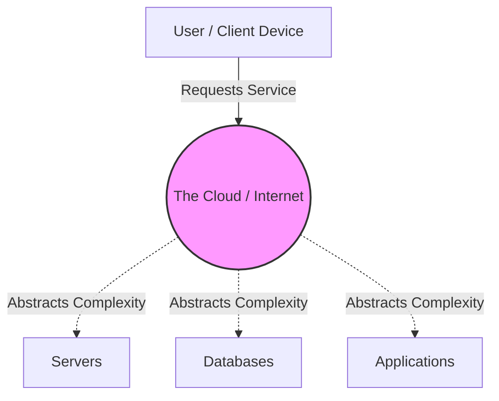
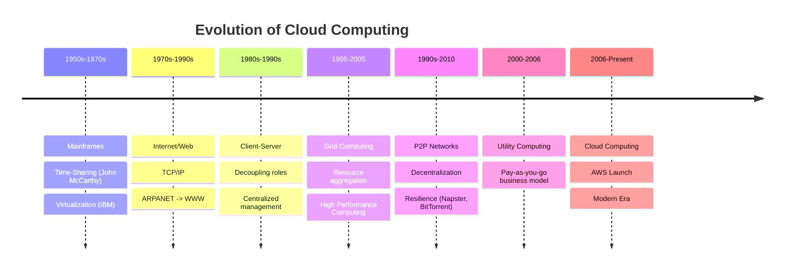
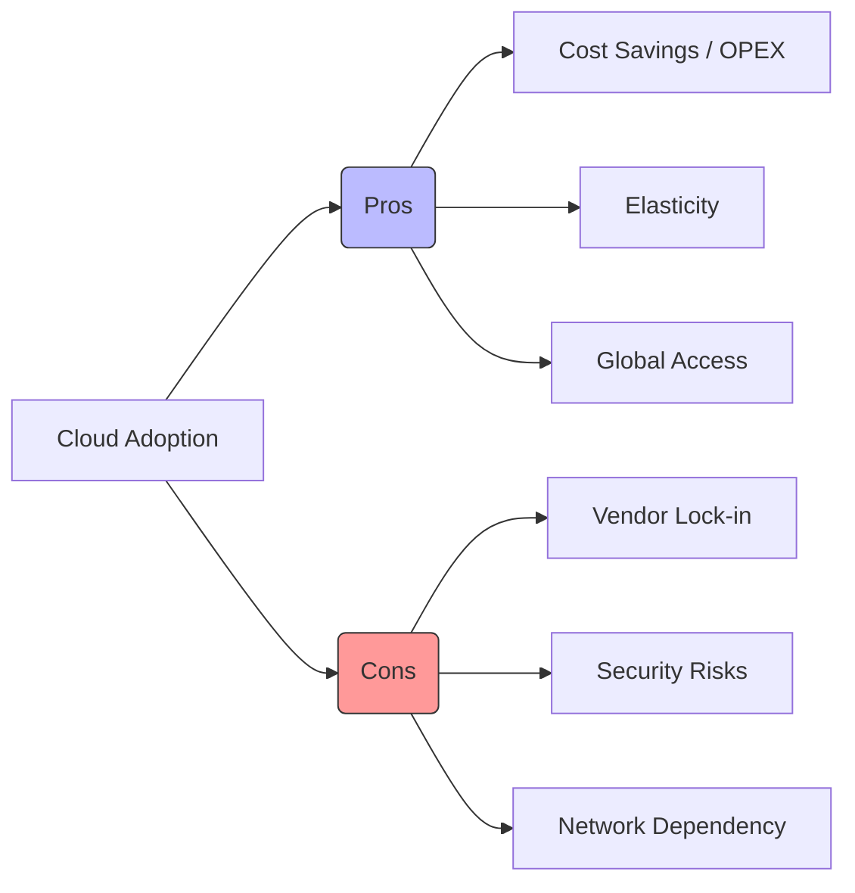
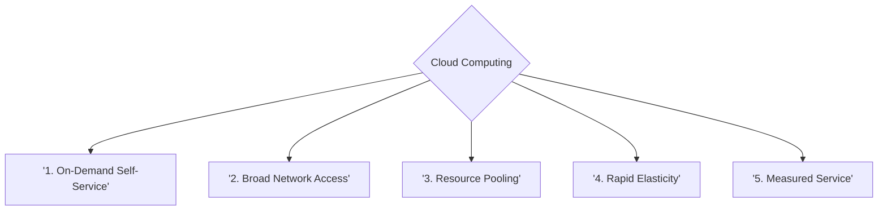
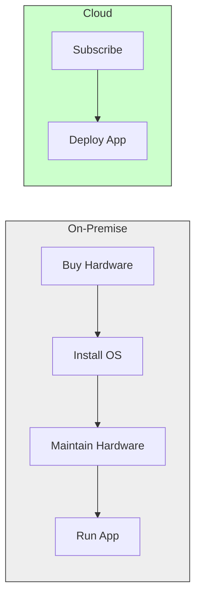

## 1. What is Cloud Computing?

### The Core Definition
Cloud Computing (Informatique en Nuage) is not a single technology, but a **consumption model** for IT resources.

> **Formal Definition:** It is a model that enables **ubiquitous, convenient, on-demand network access** to a shared pool of configurable computing resources (e.g., networks, servers, storage, applications, and services) that can be rapidly provisioned and released with minimal management effort or service provider interaction.

### Key Components of the Definition
1.  **Availability & Provisioning:**
    *   Resources are hosted by a provider (AWS, Google, Azure, etc.).
    *   The provider makes the infrastructure accessible; the user does not need to own the hardware.
2.  **On-Demand Usage:**
    *   Users consume resources exactly when they need them.
    *   **Flexibility:** You can spin up a server with a click or an API call.
3.  **Delivery via Internet:**
    *   Services are delivered over a network (usually the public Internet, but can be private networks).
    *   No complex local installation is required on the user's machine.

### The "Utility" Analogy
To truly understand the Cloud, think of it like **Electricity** or **Water** utilities:
*   **Ownership:** You do not own the power plant (Data Center).
*   **Access:** You plug into the grid (Internet) to get energy (Compute/Storage).
*   **Payment:** You pay only for the kilowatts you use (Pay-as-you-go).

---

## 2. Why is it called "The Cloud"?

The term is a metaphor that originated from early network engineering.

*   **The Symbol:** In network diagrams, engineers used a **cloud icon** to represent the Internet or a complex network infrastructure where the internal details were irrelevant to the end-user.
*   **The Meaning:** It symbolizes a "black box" or a domain of abstraction. The user cares about the *input* and *output*, not the complex routing or hardware physically located inside the "cloud."
*   **Historical Note:** The term was popularized in **1994** by Andy Hertzfeld (a Macintosh developer) to describe distributed computing.

---

## 3. The Service Concept

In the Cloud, everything is delivered as a **Service**.

*   **Free vs. Paid:** Services can be free with limits (e.g., Gmail's 15GB storage) or paid for premium features (e.g., Office 365, Netflix).
*   **Accessibility:** Because it is a service, it is accessible worldwide from any device (Smartphone, Tablet, PC).
*   **No Ownership:** The shift is from **Capital Expenditure (CAPEX)** (buying hardware) to **Operational Expenditure (OPEX)** (paying for services).

> [!TIP] **Exam Reminder**
> If asked to define Cloud Computing in one sentence, focus on these three elements:
> 1.  **On-demand** consumption.
> 2.  Access via the **Internet**.
> 3.  **Pay-per-use** billing.

---

# 02 - History and Evolution of Cloud Computing

## Overview
Cloud Computing did not appear overnight. It is the result of over 70 years of technological convergence. This note tracks the evolution from Mainframes to modern AI-driven Cloud.

---

## 1. Timeline of Technologies

The evolution can be visualized as a convergence of several distinct computing eras:

---

## 2. Detailed Evolutionary Steps

### A. Mainframes (1950s - 1970s)
*   **Context:** Computers were massive, expensive rooms filled with hardware. Only large organizations could afford one.
*   **The Innovation:** **Time-Sharing**.
    *   *Theorized by:* John McCarthy.
    *   *Concept:* Allow multiple users to access the same central computer via passive terminals (screens with no processing power) simultaneously.
*   **Contribution to Cloud:** This introduced the concept of **Mutualization** (sharing resources) to reduce individual costs.

### B. Virtualization (1960s - 1970s)
*   **Context:** Hardware was underutilized. A machine ran one OS and one task.
*   **The Innovation:** Software that creates an abstraction layer over hardware.
    *   IBM was a pioneer here.
    *   Allowed multiple Operating Systems (VMs) to run on a single physical node.
*   **Contribution to Cloud:** **Hardware Independence**. It proved we could slice up one physical machine into many "virtual" machines, maximizing efficiency.

### C. Internet & The Web (1970s - 1990s)
*   **Context:** Computers were isolated islands.
*   **The Innovation:** TCP/IP, ARPANET (1969), and the World Wide Web (1991).
*   **Contribution to Cloud:** **Accessibility**. It provided the global communication infrastructure and standard protocols (HTTP) necessary to access resources remotely.

### D. Client-Server Model (1980s - 1990s)
*   **The Innovation:** Distinct separation of duties.
    *   **Server:** Powerful machine providing services (DB, Web).
    *   **Client:** Consumer device (PC, Phone).
*   **Contribution to Cloud:** **Centralized Management**. It established the architecture where the "heavy lifting" is done centrally, and the user just consumes the result.

### E. Grid Computing (1995 - 2005)
*   **Concept:** Linking thousands of disparate computers to form a "virtual supercomputer" to solve a massive calculation problem (e.g., weather forecasting).
*   **Difference from Cloud:** Grid uses native OS (no virtualization usually) and is task-oriented.
*   **Contribution to Cloud:** **Scalability & Resource Orchestration**. It showed how to coordinate massive amounts of distributed power.

### F. Peer-to-Peer (P2P) (1990s - 2010)
*   **Examples:** Napster, BitTorrent, Bitcoin.
*   **Concept:** Decentralized network where every node is both a client and a server.
*   **Contribution to Cloud:** **Resilience**. If one node fails, the network survives. It also introduced automated service discovery.

### G. Utility Computing (2000 - 2005)
*   **Concept:** Computing resources should be metered and billed exactly like public utilities (water/gas).
*   **Contribution to Cloud:** **The Business Model**. This shifted IT from a fixed asset cost to a variable operating cost.

---

## 3. The Birth of Modern Cloud (2006)

While the term "Cloud Computing" was used as early as 1996 (Compaq), the modern era began with **Amazon**.

*   **The Origin Story (AWS):**
    *   Amazon built massive infrastructure to handle holiday shopping spikes (Black Friday).
    *   Most of the year, this infrastructure sat idle (waste).
    *   **2003:** Benjamin Black & Chris Pinkham proposed renting this excess capacity to others.
    *   **2006:** AWS launched **EC2** (Compute) and **S3** (Storage).
*   **Why this mattered:** It was the first time "Utility Computing" became a commercially viable reality accessible to anyone with a credit card.

### Evolution Phases
1.  **Expansion (2007-2010):** Google Docs, Netflix streaming, Heroku, Azure ("Red Dog").
2.  **Golden Age (2010-2015):** Docker (containers), massive enterprise adoption.
3.  **Innovation (2015-2020):** Kubernetes, Serverless (AWS Lambda), AI/ML integration.
4.  **COVID-19 Acceleration (2020-2022):** Forced digital transformation, mass telework.
5.  **Present (2023+):** Multi-cloud, Sovereign Cloud, Edge Computing, Generative AI.

---

## 4. Mainframe vs. Cloud Computing

It is important to distinguish the old model from the new, despite similarities.

| Feature | Mainframe | Cloud Computing |
| :--- | :--- | :--- |
| **Commonality** | Shared Resources (Time-sharing) | Shared Resources (Multi-tenancy) |
| **Commonality** | Centralized Management | Centralized Management (by provider) |
| **Geography** | Single Location (mostly) | **Distributed Globally** |
| **Network** | Local / Private | **Internet (Public)** |
| **Philosophy** | Strong Centralization | **Resilience & Distribution** |

> [!NOTE] **Crucial Insight**
> The modern Cloud is a synthesis of all previous technologies:
> *   **Mainframe:** Pooling resources.
> *   **Virtualization:** Abstracting hardware.
> *   **Grid:** High power processing.
> *   **Utility:** Pay-per-use model.

# 03 - Advantages and Disadvantages of Cloud

## Overview
Understanding the trade-offs of the Cloud is essential for architects and decision-makers. This note details the benefits (Why go to the cloud?) and the risks (Why hesitate?).

---

## 1. Key Advantages (Pros)

### A. Cost Reduction (The Economic Argument)
*   **Elimination of CAPEX:** Companies no longer need massive upfront investment in servers or datacenters.
*   **Shift to OPEX:** Expenses become operational (monthly bills).
*   **Pay-as-You-Go:** You only pay for what you use. This is crucial for startups or businesses with fluctuating traffic.
    *   *Stat:* Potential savings of 38-45% on operational costs.

### B. Maintenance Reduction
*   **Outsourcing Complexity:** The Cloud Provider (AWS, Azure) handles the hardware, electricity, cooling, and physical security.
*   **Updates:** Security patches and software updates are often managed automatically.
*   **Focus:** Allows the internal IT team to focus on *business logic* rather than fixing broken hard drives.

### C. Elasticity & Scalability (Crucial Concepts)
*   **Scalability:** The ability to handle growth.
    *   *Vertical (Scale-up):* Making a single server bigger (more RAM/CPU). Harder to do without downtime.
    *   *Horizontal (Scale-out):* Adding more servers. Infinite theoretical limit.
*   **Elasticity:** The ability to scale **automatically** and **rapidly** in response to real-time demand, both **up** and **down**.
    *   *Why it matters:* You don't pay for idle servers at night (scaling down), but you don't crash during a traffic spike (scaling up).

### D. Flexibility & Mobility
*   **Rapid Deployment:** You can spin up a server in Japan while sitting in Algeria in minutes.
*   **Accessibility:** Data is available from anywhere with an internet connection.
*   **Collaboration:** Teams work on the "single source of truth" (e.g., Google Docs), avoiding version conflicts.

---

## 2. Key Disadvantages (Cons)

### A. Security & Privacy
*   **Data Sovereignty:** Where is the data physically stored? (GDPR / French Data Laws).
*   **Trust:** You are handing your data to a third party.
*   **Shared Responsibility:** The provider secures the *cloud* (hardware), but YOU must secure what is *in the cloud* (data, passwords).

### B. Network Dependence
*   **The Critical Link:** If the Internet goes down, your business stops.
*   **Latency:** Accessing a server across the ocean introduces delay (lag), which can hurt performance for real-time apps.

### C. Vendor Lock-In
*   **The Trap:** It is easy to move *into* the cloud, but hard to move *out* or switch providers.
*   **Technical Lock-in:** Using proprietary APIs (e.g., using AWS DynamoDB makes it hard to switch to Azure SQL).
*   **Data Gravity:** Moving terabytes of data out of a cloud is slow and often expensive (Egress fees).

### D. Hidden Costs
*   **Bill Shock:** Because it is so easy to spin up resources, engineers might forget to turn them off.
*   **Complexity:** Predicting the monthly bill can be difficult due to complex pricing models (paying per request, per GB, per hour, etc.).

### E. Limited Control
*   **Black Box:** You cannot fix a physical server yourself. If AWS has an outage, you just have to wait. You are subject to the provider's maintenance schedule.

---

# 04 - The 5 Essential Characteristics

## Overview
According to NIST (and this course), for a system to be considered "Cloud Computing," it **must** satisfy these 5 characteristics. If it is missing one, it is not true Cloud.

---

## 1. On-Demand Self-Service (Libre-service à la demande)
*   **Definition:** A user can provision computing capabilities (server time, network storage) automatically without requiring human interaction with each service provider.
*   **Mechanism:** Web Portal, CLI, or API.
*   **Example:** Clicking "Launch Instance" on a dashboard and getting a server in 5 minutes, without calling an IT manager.

## 2. Broad Network Access (Large accès réseau)
*   **Definition:** Capabilities are available over the network and accessed through standard mechanisms.
*   **Devices:** Must support heterogeneous thin or thick client platforms (Mobile phones, tablets, laptops, workstations).
*   **Standardization:** Uses standard protocols (HTTP, HTTPS, REST) so any device can connect.

## 3. Resource Pooling (Mutualisation des ressources)
*   **Definition:** The provider’s computing resources are pooled to serve multiple consumers using a **Multi-tenant model**.
*   **Location Independence:** The user usually has no control or knowledge over the exact location of the provided resources (might know the Region, but not the specific rack or server).
*   **Analogy:** A hotel. Multiple guests share the same building, water pipes, and electricity, but have private rooms (tenants).

## 4. Rapid Elasticity (Élasticité rapide)
*   **Definition:** Capabilities can be elastically provisioned and released to scale rapidly outward and inward commensurate with demand.
*   **Consumer Perception:** To the consumer, the capabilities available for provisioning often appear to be **unlimited** and can be appropriated in any quantity at any time.
*   **Automation:** This usually happens via auto-scaling rules (e.g., "If CPU > 70%, add 2 servers").

## 5. Measured Service (Service mesuré)
*   **Definition:** Cloud systems automatically control and optimize resource use by leveraging a metering capability.
*   **Transparency:** Resource usage can be monitored, controlled, and reported, providing transparency for both the provider and consumer.
*   **Billing:** This enables the **Pay-per-use** (Pay-as-you-go) model. You are billed for gigabytes stored, hours of compute used, or volume of data transferred.

> [!TIP] **Exam Memorization**
> Remember the acronym **M.O.R.E.B.** (just reorder them):
> *   **M**easured Service
> *   **O**n-demand
> *   **R**esource Pooling
> *   **E**lasticity
> *   **B**road Network Access

---

# 05 - Cloud vs. On-Premise

## Overview
This note compares the traditional IT model (On-Premise) with the Cloud model. This comparison is frequently tested to ensure students understand the shift in responsibility and economics.

---

## 1. Definitions

### On-Premise (Sur site)
*   **Traditional Model:** The company buys, owns, installs, and manages everything.
*   **Location:** Servers are in the company's own basement or a rented rack in a local datacenter.
*   **Responsibility:** The internal IT team fixes everything from the air conditioning to the Python code.

### Cloud
*   **Modern Model:** Resources are hosted remotely by a giant provider.
*   **Location:** Provider's Datacenters (often unknown specific location).
*   **Responsibility:** Shared. Provider handles hardware; Customer handles data/apps.

---

## 2. Detailed Comparison Table

| Criterion | On-Premise | Cloud Computing |
| :--- | :--- | :--- |
| **Cost Model** | **CAPEX** (High initial investment). You buy the hardware upfront. | **OPEX** (Low initial cost). You pay a monthly subscription/usage fee. |
| **Scalability** | **Limited.** You are limited by the hardware you bought. Scaling up takes weeks/months (ordering new servers). | **High / Unlimited.** Expand instantly via software. |
| **Maintenance** | **High.** Managed manually by local IT staff. Includes hardware repair. | **Low.** Hardware maintenance is automated/handled by the provider. |
| **Control** | **Total Control.** You own the data and the physical disk. | **Partial Control.** You control the data, but rely on the provider for infrastructure security. |
| **Security** | **Internal.** You are solely responsible. Good for highly sensitive secrets, but risks internal incompetence. | **Shared.** Provider secures the fortress; you secure the room. Often better security than small companies can afford. |
| **Availability** | Depends on internal infrastructure redundancy (risky if one server room floods). | High availability via geographical redundancy (zones/regions). |

---

## 3. Summary of Pros/Cons in Context

### On-Premise
*   **Best for:** Highly regulated industries requiring total physical control of data, or legacy systems that cannot run on the cloud.
*   **Downside:** High cost, slow to change, heavy maintenance burden.

### Cloud
*   **Best for:** Startups, variable workloads (web traffic), global applications, and companies wanting to move fast (Time-to-market).
*   **Downside:** Monthly costs can spiral if not watched; dependency on internet connection.

---
