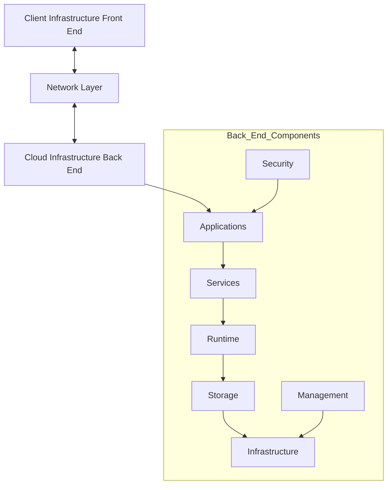
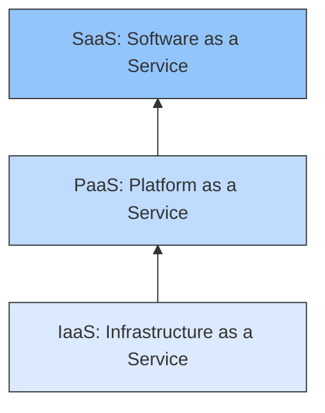

## Overview
Cloud architecture is not just a bunch of servers; it is a hierarchical structure of physical and virtual components that enable services to run. It is divided into two main sections: the **Front End** (Client) and the **Back End** (Cloud Provider), connected via a network.

---

## 1. Global Architecture Structure

The architecture is composed of physical and virtual components that allow the hosting and execution of applications.

### A. Front End (Client Infrastructure)
*   **Definition:** The side visible to the user. It includes the hardware and software used to access the cloud.
*   **Interface (GUI):** Allows users to interact with the cloud (e.g., a web browser for Gmail, a console for AWS).
*   **Devices:** PC, Tablet, Smartphone.

### B. The Internet (Communication)
*   The bridge between Front End and Back End.
*   It ensures the transmission of requests and data.

### C. Back End (Provider Infrastructure)
The "Back End" is the engine room. It contains all the resources required to provide the service. It is composed of several layers:

1.  **Application:** The software the user consumes (e.g., SaaS like Office 365).
2.  **Service:** The utility tools provided (Web services, data processing).
3.  **Runtime Cloud:** The "Virtual Execution Layer." It uses hypervisors to execute tasks simultaneously using virtual resources (CPU/RAM).
4.  **Storage:** Systems to manage and persist data (Hard drives, SSDs).
5.  **Infrastructure:** The physical hardware (Servers, Switches).

### D. Transversal Components
These components interact with *all* layers of the Back End:
*   **Management (Middleware):** The coordination layer. It acts as a bridge between applications and the OS. It manages resources, ensuring different components can "talk" to each other without the user needing to know technical details.
*   **Security:** Guarantees data protection, identity management, firewalls, and backups.

---

## 2. Underlying Infrastructure (Physical & Virtual)

The foundation of the Cloud is split into two categories: **Physical** (Hardware) and **Virtual** (Abstraction).

### A. Physical Infrastructure (Hardware)
This is what actually exists in the Data Center.

1.  **Data Centers:** Secure buildings housing the equipment.
2.  **Physical Servers (Hosts):**
    *   Powerful machines containing **CPU** (Compute), **RAM** (Memory), and **Network Cards**.
3.  **Physical Storage:** Hard Drives (HDD) and Solid State Drives (SSD).
4.  **Physical Network:** Routers, switches, cabling, and firewalls connecting servers to the world.
5.  **Power & Cooling:** Critical systems to keep servers running and prevent overheating.
6.  **Physical Security:** Biometrics, cameras, fire suppression.

### B. Virtual Infrastructure (Abstraction)
Virtualization is the technology that decouples software from hardware.

1.  **Hypervisor (Virtual Machine Monitor):** Software that slices a physical server into multiple isolated Virtual Machines (VMs). Examples: *VMware, KVM, Hyper-V*.
2.  **Virtual Machines (VM):** A software instance that simulates a full computer with its own OS (e.g., Ubuntu, Windows Server).
3.  **Containers:** Lighter than VMs. They package an app with its dependencies (libs, config) but share the OS kernel. Example: *Docker*.
4.  **Virtual Storage:** Logical storage volumes dynamically assigned to VMs.
5.  **Virtual Network (SDN/vLAN):** Software-defined networks allowing VMs to communicate securely.

### C. Orchestration Concepts
*   **Cluster:** A group of interconnected servers working as a single logical entity (for high availability).
*   **Nodes:** A base unit in a cluster (a single server running VMs or Containers).
*   **Cloud Management Platform (CMP):** The dashboard used to manage it all (e.g., *OpenStack, AWS Console*).
*   **OS Templates:** Pre-configured images (snapshots) used to deploy VMs instantly.

> [!NOTE] **Summary**
> The Cloud relies on a **real physical base**, but users interact only with a **virtual layer**, automated by management software.

---

# 07. Service Models Overview

## Overview
Cloud Computing offers resources through three primary delivery models, often visualized as a pyramid. Each layer is built upon the one below it.

---

## The Pyramid Model

1.  **IaaS (Base Layer):** Provides the raw infrastructure (Network, Storage, Servers). Targeted at **Network Architects / SysAdmins**.
2.  **PaaS (Middle Layer):** Provides a development environment (OS, Application Stack). Targeted at **Developers**.
3.  **SaaS (Top Layer):** Provides finished software. Targeted at **End Users**.

# 08. IaaS (Infrastructure as a Service)

## Definition
IaaS is the foundation of the cloud. The provider gives you access to fundamental computing resources (virtual hardware), and **you** manage the rest.

*   **Provider provides:** Physical datacenter, Network, Storage, Virtualization (Hypervisor).
*   **User manages:** Operating System (OS), Middleware, Runtime, Data, and Applications.

## Key Characteristics
*   **Virtualization:** Converts physical resources into logical resources.
*   **Control:** Offers the highest level of control to the user compared to PaaS/SaaS.
*   **Flexibility:** You can install *any* software or OS you want.

## Pros and Cons

| Advantages | Disadvantages |
| :--- | :--- |
| **Max Flexibility:** Choose your OS, config, and software. | **Complex Management:** You must patch the OS and secure the network yourself. |
| **Scalability:** Add RAM/CPU or new servers instantly. | **Technical Skills:** Requires DevOps/SysAdmin knowledge. |
| **Low Entry Cost:** No need to buy physical servers (CAPEX -> OPEX). | **Security Risk:** Misconfiguration by the user leads to hacks. |
| **Control:** Total control over the virtual machine. | **Unpredictable Billing:** Costs vary based on exact usage (CPU/Bandwidth). |

## Examples & Use Cases

### Top Providers
*   **AWS (Amazon Web Services):** EC2 (Elastic Compute Cloud).
*   **Microsoft Azure:** Virtual Machines.
*   **Google Cloud:** Compute Engine.
*   **OpenStack:** (Open source solution for private clouds).

### Real-World Use Cases (Exam Examples)
1.  **Hosting a Custom Web App (Student Project):**
    *   A student creates an AWS EC2 instance.
    *   Installs Ubuntu Linux.
    *   Manually installs Apache, MySQL, and PHP.
    *   Configures the Firewall.
    *   *Why IaaS?* They need full control over the specific versions of the software.

2.  **Netflix (Streaming Giant):**
    *   Netflix needs thousands of servers worldwide to stream video.
    *   Building physical datacenters everywhere is too expensive.
    *   **Solution:** They use AWS EC2. They auto-scale (add VMs) during peak viewing hours and scale down at night to save money.

---

# 09. PaaS (Platform as a Service)

## Definition
PaaS provides a complete environment ready for **development and deployment**. The provider manages the underlying infrastructure (including the OS), allowing the user to focus strictly on the **code**.

*   **Provider provides:** IaaS + Operating System + Middleware + Runtimes (Java, Python) + Database management.
*   **User manages:** Applications (Code) and Data.

## Key Features
*   **Dev Tools:** Includes compilers, debuggers, and frameworks.
*   **Automation:** Handles scaling, load balancing, and OS updates automatically.
*   **Speed:** "Code to Cloud" in minutes.

## Pros and Cons

| Advantages | Disadvantages |
| :--- | :--- |
| **No Infra Management:** No OS patching or server configs. | **Less Control:** You cannot tune the OS kernel or install unsupported libraries. |
| **Fast Dev Cycle:** Developers focus only on code. | **Vendor Lock-in:** Hard to migrate code specific to one platform (e.g., Google App Engine). |
| **Auto-Scalability:** The platform handles traffic spikes automatically. | **Compatibility Issues:** Some legacy apps may not run on PaaS. |
| **Collaboration:** Tools for multiple developers to work together. | **Flexibility:** Restricted by the provider's supported languages/versions. |

## Examples & Use Cases

### Top Providers
*   **Heroku:** (Famous for simplicity).
*   **Google App Engine.**
*   **Azure App Service.**

### Real-World Use Cases (Exam Examples)
1.  **Student Web App (The Fast Way):**
    *   Student writes a Python (Flask) app.
    *   Uses **Heroku**.
    *   Command: `git push heroku main`.
    *   *Result:* Heroku installs Python, sets up the server, creates a URL, and runs the app. The student did *zero* server configuration.

2.  **Mobile App Backend (Startup):**
    *   A startup needs a backend for a real-time analytics app.
    *   They don't have a SysAdmin.
    *   *Solution:* Use Google App Engine. It auto-scales with traffic, and Google handles security updates.

> [!TIP] **IaaS vs PaaS**
> *   **IaaS:** You act as the SysAdmin. You install the database.
> *   **PaaS:** You act as the Developer. You click a button to get a database.

---

# 10. SaaS (Software as a Service)

## Definition
SaaS is the delivery of a **finished application** over the internet. The user does not manage *anything* technical. They just log in and use the software.

*   **Provider manages:** Everything (Hardware, Network, OS, Application, Data Storage, Upgrades).
*   **User manages:** Access (passwords) and their own data (content).

## Key Characteristics
*   **On-Demand Software:** Accessible via a web browser or mobile app.
*   **No Installation:** No `.exe` to install.
*   **Automatic Updates:** Everyone is always on the latest version.

## Pros and Cons

| Advantages | Disadvantages |
| :--- | :--- |
| **Zero Install:** Access from anywhere (Universal accessibility). | **Zero Control:** You cannot change how the software works. |
| **Maintenance Free:** Provider fixes bugs and backs up data. | **Data Privacy:** Your sensitive data sits on someone else's server. |
| **Cost Effective:** Subscription based (pay per user). | **Connectivity:** No Internet = No work. |
| **Collaboration:** Real-time sharing (e.g., Google Docs). | **Integration:** Can be hard to connect with internal legacy systems. |

## Examples & Use Cases

### Categories
*   **Productivity:** Gmail, Google Workspace, Office 365.
*   **Streaming:** Netflix, Spotify.
*   **CRM (Customer Relationship Management):** Salesforce.
*   **Storage:** Dropbox, Google Drive.

### Real-World Use Case (Exam Example)
**University Collaboration (Google Workspace):**
*   A university uses Google Workspace.
*   Students write papers on **Google Docs** (Real-time collaboration).
*   Teachers schedule classes on **Google Calendar**.
*   Files are stored on **Google Drive**.
*   *Benefit:* No software to install on thousands of student laptops.

---

# 11. Shared Responsibility Model

## The Concept
Security in the cloud is a **partnership**. It is not solely the provider's job, nor solely the user's.
*   **Security OF the Cloud:** The Provider is responsible for protecting the infrastructure (physical datacenters, network cabling, hypervisors).
*   **Security IN the Cloud:** The Client is responsible for what they put *inside* the cloud (Data, Apps, Passwords).

## Responsibility Matrix

The level of client responsibility decreases as you move up the pyramid (IaaS -> PaaS -> SaaS).

| Layer Component | **IaaS** (e.g., EC2) | **PaaS** (e.g., Heroku) | **SaaS** (e.g., Gmail) |
| :--- | :---: | :---: | :---: |
| **Data & Content** | 👤 Client | 👤 Client | 👤 Client |
| **Applications** | 👤 Client | 👤 Client | ☁️ Provider |
| **Runtime / Middleware** | 👤 Client | ☁️ Provider | ☁️ Provider |
| **Operating System (OS)** | 👤 Client | ☁️ Provider | ☁️ Provider |
| **Virtualization** | ☁️ Provider | ☁️ Provider | ☁️ Provider |
| **Physical Hardware** | ☁️ Provider | ☁️ Provider | ☁️ Provider |
| **Data Center / Facility**| ☁️ Provider | ☁️ Provider | ☁️ Provider |

### Scenario Explanations
1.  **IaaS Scenario (AWS EC2):**
    *   *Provider:* Guards the data center and ensures the virtualization works.
    *   *Client:* Must update the Ubuntu OS, install the firewall, and secure the application code.
2.  **PaaS Scenario (Heroku):**
    *   *Provider:* Patches the OS and secures the server.
    *   *Client:* Responsible if their specific code has a security flaw (e.g., SQL Injection).
3.  **SaaS Scenario (Google Drive):**
    *   *Provider:* Secures everything technical.
    *   *Client:* Responsible if they accidentally share a "Confidential" folder with "Public".

> [!TIP] **Exam Reminder**
> The **Data** is *always* the responsibility of the Client, regardless of the model.

---

# 12. Deployment Models

## Overview
A deployment model defines **who owns** the infrastructure, **where** it is located, and **who has access** to it. There are four main types.

---

## 1. Public Cloud (Cloud Public)

### Definition
Resources are owned by a third-party provider (AWS, Google, Azure) and shared among the general public and many organizations via the Internet.
*   **Access:** Open to anyone (Grand Public).
*   **Architecture:** **Multi-tenant** (Resources are shared/pooled). Data from different companies might reside on the same physical hard drive (though logically separated).

### Pros & Cons
*   **✅ Pros:** Cost-effective (Pay-as-you-go), No maintenance, Massive scalability.
*   **❌ Cons:** Less control over data localization, potential security risks due to resource sharing.

### When to use?
*   Variable workloads (traffic spikes).
*   Startups with limited funds.
*   **Example:** Airbnb (at launch), deploying apps on Heroku.

---

## 2. Private Cloud (Cloud Privé)

### Definition
Infrastructure is exclusively used by **one single organization**. It is **isolated**.
*   **Hosting:** Can be **On-Premise** (Internal data center) or **Externally Hosted** (Dedicated hardware at a provider).

### Pros & Cons
*   **✅ Pros:** Maximum security, total control, customization, compliance with strict regulations.
*   **❌ Cons:** High cost, difficult to maintain, requires internal experts, slower to deploy.

### When to use?
*   Highly regulated industries (Banks, Hospitals).
*   When data is critical/confidential.
*   **Example:** A hospital storing patient records locally.

---

## 3. Hybrid Cloud (Cloud Hybride)

### Definition
A combination of **Public** and **Private** clouds bound together by technology that allows data and applications to move between them.

### Mechanism
*   **Orchestration:** The two environments communicate (e.g., via VPN).
*   **Bursting:** Use the Private cloud for standard load, but "burst" into Public cloud during peak traffic.

### Pros & Cons
*   **✅ Pros:** Best of both worlds (Security of Private + Scalability of Public).
*   **❌ Cons:** Complex to manage and secure (synchronization issues). Costly.

### Real-World Use Cases (Exam Examples)
1.  **E-Commerce:** Keeps customer credit card data on a **Private Cloud** (Security) but hosts the public website catalog on **AWS Public Cloud** (Performance/Images).
2.  **Hospital:** Stores sensitive patient records on **Private Cloud**, but sends anonymized data to **Azure Public Cloud** to run AI analysis algorithms.

---

## 4. Community Cloud (Cloud Communautaire)

### Definition
Infrastructure shared by **several organizations** that have shared concerns (e.g., same mission, security requirements, or compliance needs).
*   **Management:** By the organizations themselves or a third party.

### Pros & Cons
*   **✅ Pros:** Shared costs (cheaper than Private), collaboration, higher security than Public.
*   **❌ Cons:** Governance issues (Who decides upgrades? Who pays what?), slower to set up.

### Examples
*   **EduCloud:** A cloud shared by multiple universities for research.
*   **Government Cloud:** Shared by different ministries.

---

## Summary Comparison

| Model | Managed By | Access | Cost | Security |
| :--- | :--- | :--- | :--- | :--- |
| **Public** | Provider | Everyone | Low (OPEX) | Good (Shared) |
| **Private** | Internal/Provider | One Org | High (CAPEX/OPEX) | Highest |
| **Hybrid** | Mixed | Mixed | Medium/High | Mixed |
| **Community**| Community | Specific Group | Shared | High |

---
