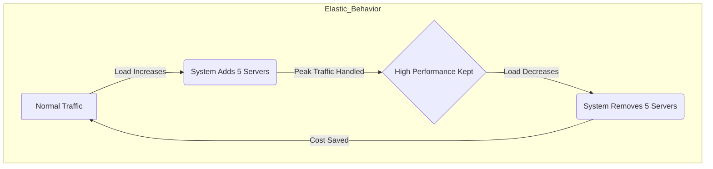

## 1. Definition
**Elasticity** is the ability of a system to **automatically** add or remove resources (like computing power, storage, or memory) based on the current workload demand.

Think of a **rubber band**:
*   If you pull it (increase demand), it stretches to accommodate the size.
*   If you let go (decrease demand), it instantly shrinks back to its original size.

In the Cloud, if your website suddenly gets 10,000 visitors, Elasticity automatically adds more servers to handle them. When the visitors leave, Elasticity removes those servers so you stop paying for them.

## 2. Key Characteristics
1.  **Automation:** It happens without human intervention. You don't call IT; the system detects the load and acts.
2.  **Dynamic:** It happens in real-time or near real-time.
3.  **Two-way movement:** It scales **Out** (adds resources) and scales **In** (removes resources).

## 3. Elasticity vs. Scalability (Crucial Distinction)
Students often confuse these two terms. They are related but different.

| Feature | **Scalability** | **Elasticity** |
| :--- | :--- | :--- |
| **Concept** | The *capacity* to grow. | The *action* of growing and shrinking instantly. |
| **Direction** | Mostly **Up** (handling growth over time). | **Up and Down** (handling spikes and drops). |
| **Trigger** | Strategic planning (e.g., "We are growing next year"). | Real-time demand (e.g., "CPU is at 90% right now!"). |
| **Goal** | To handle larger workloads permanently. | To match resources to demand exactly (Cost optimization). |

> [!TIP] **The Relationship**
> **Elasticity relies on Scalability.**
> You cannot be "Elastic" if your system isn't "Scalable."
> *   Scalability is the *capability* (the car has a top speed of 200mph).
> *   Elasticity is the *behavior* (driving fast when late, driving slow when early).

## 4. Why is Elasticity Important?

### A. Cost Efficiency (The "Pay-as-you-go" magic)
Without elasticity (On-Premise), you have to buy enough servers to handle your busiest day (e.g., Black Friday). The rest of the year, those servers sit idle, wasting electricity and money.
With **Elasticity**, you only provision (and pay for) the exact number of servers needed at that specific second.

### B. Performance (Availability)
If traffic spikes unexpectedly (e.g., your post goes viral), a non-elastic system would crash. An elastic system instantly adds resources to keep the site running smoothly.

## 5. Visual Representation

## 6. Real-World Example
**Netflix in the Evening:**
*   **6:00 PM:** People come home from work. Netflix usage spikes. The cloud **elastically expands**, spinning up thousands of virtual machines.
*   **2:00 AM:** People go to sleep. Usage drops. The cloud **elastically shrinks**, turning off those virtual machines to save money.