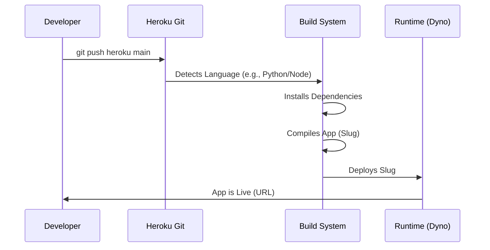

## Overview
**Heroku** is a cloud platform based on a managed container system, integrated data services, and a powerful ecosystem for deploying and running modern apps.

In the context of this course, Heroku is the textbook definition of **PaaS (Platform as a Service)**. It represents the shift from "managing servers" (IaaS) to "managing code."

---

## 1. What is Heroku?

*   **Type:** Public Cloud, **PaaS**.
*   **Philosophy:** "Focus on the app, not the ops."
*   **Underlying Infra:** Interestingly, Heroku runs **on top of AWS** (Amazon Web Services). It acts as a layer of abstraction that hides the complexity of AWS EC2 instances from the developer.

### The "Magic" Workflow
Heroku revolutionized cloud deployment with a simple command-line workflow. The developer pushes code to a Git repository, and Heroku takes over.

---

## 2. Course Case Studies

Your slides provide two specific examples of how Heroku solves problems better than IaaS or On-Premise solutions.

### Case A: The Student Project (Web App)
*   **Scenario:** A student develops a Python (Flask) application for managing student grades.
*   **The "Hard" Way (Local/IaaS):**
    *   Buy a server.
    *   Install Linux.
    *   Install Python.
    *   Install database drivers.
    *   Configure Apache/Nginx web server.
    *   Open firewall ports.
*   **The "Heroku" Way (PaaS):**
    1.  Create an account.
    2.  Send code: `git push heroku main`.
    3.  Heroku detects Python automatically.
    4.  Heroku installs dependencies (from `requirements.txt`).
    5.  Heroku assigns a public URL (e.g., `myapp.herokuapp.com`).
    6.  **Database:** The student adds a PostgreSQL database with **one click** (Add-on), without installing SQL server software manually.

### Case B: The Startup (Mobile Backend)
*   **Scenario:** A startup launching a mobile app needs a backend API to handle user data.
*   **Problem:** They have developers but no System Administrators. They cannot afford to spend time configuring servers.
*   **Solution:** They deploy the API on Heroku.
*   **Benefit:**
    *   **Time-to-market:** They launch in days, not weeks.
    *   **Scalability:** If the app goes viral, they just drag a slider on the dashboard to increase "Dynos" (Heroku's term for containers/servers) to handle the load.

---

## 3. Shared Responsibility on Heroku

Because Heroku is **PaaS**, the line of responsibility is different from AWS EC2 (IaaS).

| Component | Responsibility | Details |
| :--- | :--- | :--- |
| **Physical Servers** | **Heroku (AWS)** | Power, cooling, hardware. |
| **Virtualization** | **Heroku** | Managing the hypervisor. |
| **Operating System** | **Heroku** | Heroku patches Linux security flaws (e.g., Heartbleed) automatically. |
| **Runtime** | **Heroku** | Maintains the version of Python/Node.js/Java. |
| **Application Code** | **YOU** | If your code has a bug, the app crashes. |
| **Data** | **YOU** | You define who sees the data and what is stored. |

---

## 4. Key Terminology (Background Knowledge)

To understand Heroku fully, you should know these terms often associated with it:

*   **Dyno:** The unit of computing power in Heroku. It is essentially a lightweight, isolated container running your app.
*   **Buildpack:** Scripts that run when you deploy your app. They look at your code and say, "Oh, this is Java," then download the JDK automatically.
*   **Add-ons:** A marketplace of services (Databases, Logging, Email services) you can attach to your app instantly.
*   **Ephemeral Filesystem:** A critical concept. You cannot save uploaded files (like user avatars) directly to the Heroku server's disk because the disk is wiped every time the app restarts. You must save files to an external service like **AWS S3**.

---

## 5. Why use it? (Summary)

*   **Simplicity:** It removes the friction of deployment.
*   **Standardization:** It forces developers to write "Cloud Native" apps (following 12-factor app methodology).
*   **Focus:** It allows teams to focus entirely on **business logic** (the code that makes money) rather than **infrastructure plumbing** (the servers that cost money).

---
**References:**
- Course Slides: 51, 52, 53, 66, 76