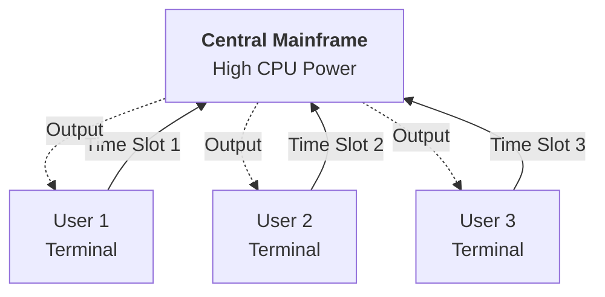

Here is the detailed explanation of **Mainframes and Time-Sharing**, the first major historical precursor to the Cloud.

---

# 19. Mainframe and Time-Sharing (1950s - 1970s)

## 1. The Mainframe
*   **What is it?** A Mainframe is a massive, high-performance central computer. In the 1950s, these were not desktop PCs; they were the size of a room, required specialized cooling, and cost millions of dollars.
*   **The Limitation:** Because they were so expensive, an organization (like a university or bank) could usually afford only **one**. It was inefficient to let just one person use it at a time.

## 2. The Innovation: Time-Sharing
*   **The Inventor:** The concept was notably theorized by **John McCarthy** (also a father of AI) in the late 1950s.
*   **The Concept:** Time-Sharing is a method that allows multiple users to access the **same** central computer simultaneously.
*   **How it works:**
    1.  **Dumb Terminals:** Users sat at "terminals" (a screen and keyboard with no processing power of their own).
    2.  **Slicing Time:** The Mainframe's Operating System splits its processing power into tiny time slots (milliseconds).
    3.  **Rotation:** It processes User A's command, then User B's, then User C's, and cycles back to A instantly.
    4.  **The Illusion:** Because the computer is so fast, every user feels like they have the **entire machine** to themselves, even though they are sharing it with dozens of others.

## 3. Why is this in the Cloud History?
This is the **ancestor** of the Cloud's core economic principle: **Mutualization (Resource Pooling).**

*   **Then:** Multiple users shared one Mainframe to lower the cost per user.
*   **Now (Cloud):** Multiple companies (Tenants) share the same Physical Server (via Virtualization) in an AWS datacenter to lower the cost.

**Key Takeaway:** Time-Sharing proved that computing resources could be treated as a **shared utility** rather than a personal possession.