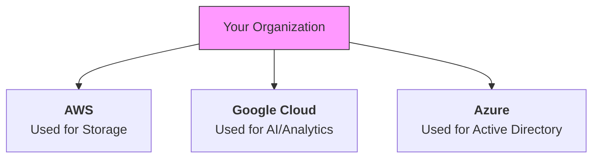

Here are the explanations for **Edge Computing** and **Multi-cloud** based on the "Future and Trends" section of your course.

---

# 1. Edge Computing

## Definition
**Edge Computing** ("Informatique en périphérie") is a distributed computing framework that brings enterprise applications closer to data sources such as IoT devices or local edge servers.

Instead of sending **all** data to a massive central cloud (Data Center) to be processed, the processing happens **at the "edge" of the network**, right where the data is created.

## Why do we need it? (The Latency Problem)
In standard Cloud Computing, data travels to a data center, gets processed, and comes back. This takes time (latency).
*   **Scenario:** A self-driving car sees a pedestrian.
*   **Cloud Approach:** Send image to server $\rightarrow$ Server decides "Stop" $\rightarrow$ Send command back to car. (Too slow, accident happens).
*   **Edge Approach:** The car's onboard computer (the Edge) decides "Stop" instantly. The Cloud is only used later to update the map.

## Key Characteristics
*   **Low Latency:** Faster response times because data doesn't travel far.
*   **Bandwidth Saving:** You don't clog the network sending terabytes of raw data; you only send the summary to the cloud.
*   **Context:** Mentioned in your slides as a major trend (2017-2020) alongside IoT (Internet of Things).

---

# 2. Multi-cloud

## Definition
**Multi-cloud** is a strategy where an organization uses **two or more** cloud computing services from **different providers** (e.g., using AWS *and* Google Cloud *and* Azure simultaneously).

It is different from **Hybrid Cloud** (which is Public + Private). Multi-cloud usually implies **Public A + Public B**.

## Why use Multi-cloud?

1.  **Avoid Vendor Lock-in:** If you build everything on AWS proprietary technology, it is hard to leave. Using multiple providers keeps you flexible.
2.  **"Best of Breed":** You might pick **AWS** for its massive storage (S3), **Google Cloud** for its superior AI/Machine Learning tools, and **Microsoft Azure** because your company uses Office 365. You pick the best tool from each shop.
3.  **Redundancy/Reliability:** If AWS has a global outage (rare, but it happens), your services on Azure might stay online.

## Visual Representation

## Context in Course
Your slides identify Multi-cloud as a **current trend (2023-2025)**. As the market matures, companies stop looking for the "one perfect cloud" and start managing a portfolio of different clouds to optimize costs and features.