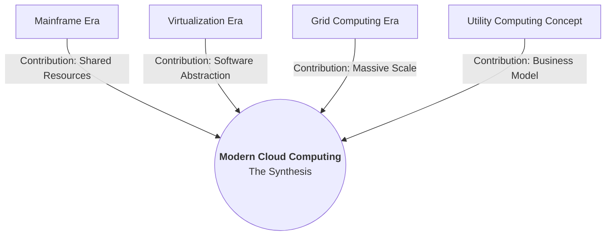

what does it mean?
Here is a detailed explanation of this specific **Crucial Insight**.

This concept is the **Thesis Statement** of the entire History chapter. It argues that Cloud Computing is not a sudden "magic" invention that appeared in 2006. Instead, it is the **culmination** (the final result) of combining four distinct historical technologies into one package.

If you take away any **one** of these four pillars, Modern Cloud Computing ceases to exist.

---

### The "Recipe" of the Cloud

Think of the Modern Cloud as a meal. The "Cloud" is the final dish, but the ingredients come from different decades of history.

---

### 1. From Mainframe: The Logic of "Pooling"
*   **The Historical Concept:** In the 1960s, computers were too expensive for everyone to have one. So, companies bought one giant Mainframe and used **Time-Sharing**. Multiple users accessed the *same* machine simultaneously.
*   **What it gave the Cloud:** **Multi-tenancy (Resource Pooling).**
    *   *Explanation:* Just like the Mainframe, the Cloud is based on the idea that hardware is efficient only when it is **shared**.
    *   *In the Cloud:* When you use Google Drive, your files are likely on the same physical hard drive as a stranger's files. The Cloud "pools" resources to lower the cost for everyone.

### 2. From Virtualization: The Mechanism of "Abstraction"
*   **The Historical Concept:** IBM realized that running one application on one massive computer was wasteful. They created software (Hypervisors) to slice one physical machine into many "virtual" machines.
*   **What it gave the Cloud:** **Hardware Independence & Agility.**
    *   *Explanation:* Virtualization allows the software (your server) to be completely separated from the hardware (the metal box).
    *   *In the Cloud:* This is what allows AWS to create a server for you in **seconds**. They aren't plugging in a cable; they are just copying a file (the Virtual Machine) via software. It makes the infrastructure "fluid."

### 3. From Grid: The Power of "Scale"
*   **The Historical Concept:** Scientists needed to solve massive math problems (like weather forecasting). They linked thousands of separate computers together to work as a single "Super-Brain."
*   **What it gave the Cloud:** **Resilience & Orchestration.**
    *   *Explanation:* The ability to coordinate thousands of servers to act as one system.
    *   *In the Cloud:* If you are Netflix, you don't run on *one* big server. You run on a "Grid" of thousands of small instances. If one breaks, the system routes around it. This provides the "Infinite Scale" promise of the Cloud.

### 4. From Utility: The "Business Model"
*   **The Historical Concept:** Utilities like water and electricity. You don't buy a power plant to turn on a light; you plug into the wall and pay for the kilowatts you use.
*   **What it gave the Cloud:** **Pay-as-you-go (OPEX).**
    *   *Explanation:* This turned IT from a **product** (something you buy and own) into a **service** (something you rent).
    *   *In the Cloud:* This removes the barrier to entry. A student can access the same supercomputers as NASA for $10, because they only pay for the 1 hour they use it.

---

### Summary: Why is this a "Synthesis"?

*   **Without Mainframe logic:** The Cloud would be too expensive (everyone would need their own dedicated hardware).
*   **Without Virtualization:** The Cloud would be too slow (manual setup of servers).
*   **Without Grid:** The Cloud would be too weak (could not handle Big Data).
*   **Without Utility:** The Cloud would be a bad business deal (high upfront costs).

**The Cloud is simply: Shared Hardware (Mainframe) + Software Agility (Virtualization) + Massive Scale (Grid) + Metered Billing (Utility).**