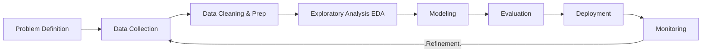

# Introduction to Data Science

## 1. What is Data Science?
Data Science is an interdisciplinary field that acts as the intersection between **Statistics**, **Computer Science**, and **Domain Knowledge**.

Its primary goal is to extract **meaningful insights** from data (structured or unstructured) to support decision-making.

### The Three Pillars
1.  **Computer Science:** Algorithms, data structures, and processing power to handle large datasets.
2.  **Mathematics & Statistics:** Modeling, probability, and hypothesis testing to validate findings.
3.  **Domain Knowledge:** Understanding the context (e.g., finance, medicine) to ask the right questions.

## 2. The Data Science Workflow
A data science project is never linear; it is iterative. However, it generally follows this pipeline:

*   **Problem Definition:** clearly identifying the business question (e.g., "How do we reduce patient readmissions?").
*   **Data Collection:** Gathering raw data from databases, APIs, or sensors.
*   **Cleaning & Prep:** The most time-consuming step (often 80% of the work). Handling missing values, outliers, and formatting.
*   **EDA (Exploratory Data Analysis):** Using visualization to understand patterns *before* modeling.
*   **Modeling:** Applying Machine Learning algorithms (e.g., Logistic Regression).
*   **Evaluation:** Checking accuracy using metrics (Precision, Recall).
*   **Deployment:** integrating the model into a live system (e.g., a web app).

## 3. Roles in Data Science (Crucial Distinctions)
Confusion often arises between these roles. Here is the definitive breakdown:

| Role | Primary Focus | Tools | Key Question |
| :--- | :--- | :--- | :--- |
| **Data Analyst** | Descriptive Analysis | SQL, Tableau, Excel | "What happened in the past?" |
| **Data Scientist** | Predictive Modeling | Python, Scikit-Learn, Statistics | "What will happen in the future?" |
| **Data Engineer** | Infrastructure & Pipelines | SQL, Hadoop, Spark, Cloud | "How do we get data from A to B reliably?" |
| **ML Engineer** | Deployment & Scaling | TensorFlow, Docker, APIs | "How do we make this model run in production?" |
| **Business Analyst** | Translation | PowerPoint, Dashboards | "How does this data solve our business problem?" |

> [!TIP] Critical Thinking: Why can't they replace each other?
> *   **Data Engineer vs. ML Engineer:** A Data Engineer builds the "highway" (pipelines) for data to travel on. An ML Engineer builds the "racecar" (model) that drives on it. A Data Engineer might not know the math behind Gradient Descent, and an ML Engineer might not know how to manage a distributed database cluster.
> *   **Analyst vs. Scientist:** An Analyst looks at *known* data to report facts. A Scientist implies *unknown* data using probability. A Scientist creates new algorithms; an Analyst uses existing tools to report.

## 4. Related Domains
*   **Artificial Intelligence (AI):** The broad concept of machines simulating human intelligence.
*   **Machine Learning (ML):** A subset of AI. Algorithms that learn from data without being explicitly programmed.
*   **Deep Learning:** A subset of ML using neural networks (mimicking the human brain).
*   **Big Data:** Deals with the *Vs* (Volume, Velocity, Variety). Data too large for a single computer to process.
