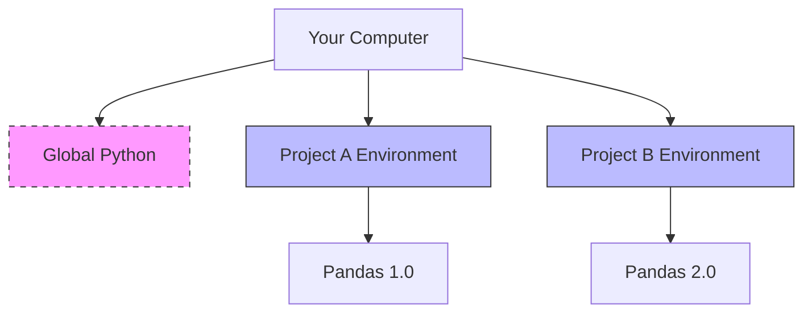

# Python Environment and Project Setup

## 1. Virtual Environments (Why and How)

### The Problem
You are working on Project A (requires `pandas` version 1.0) and Project B (requires `pandas` version 2.0). If you install Python globally, you can only have one version. Installing one breaks the other.

### The Solution: Virtual Environments (`venv` or `conda`)
A virtual environment is a self-contained folder containing a specific version of Python and a specific set of libraries.



### Essential Commands (Cheatsheet)

| Action | Command (Terminal) | Notes |
| :--- | :--- | :--- |
| **Create (Standard)** | `python -m venv env` | Creates a folder named `env` |
| **Create (Conda)** | `conda create -n myenv python=3.10` | More robust for data science |
| **Activate (Windows)** | `.\env\Scripts\activate` | Terminal prompt changes |
| **Activate (Mac/Linux)** | `source env/bin/activate` | Terminal prompt changes |
| **Install Libs** | `pip install pandas numpy` | Installs *into the active env* |
| **Snapshot** | `pip freeze > requirements.txt` | Saves list of installed libs |
| **Restore** | `pip install -r requirements.txt` | Installs libs from list |

## 2. Professional Project Structure
Never dump all files in one folder. Use this standard structure to keep your work scalable.

```
MyProject/
│
├── data/                  # DATA STORAGE
│   ├── raw/               # Original, immutable data (NEVER EDIT THIS)
│   └── processed/         # Cleaned data ready for analysis
│
├── notebooks/             # EXPLORATION
│   └── analysis.ipynb     # Jupyter notebooks for testing/viz
│
├── scripts/               # AUTOMATION
│   └── run_pipeline.py    # Scripts intended to be executed
│
├── utils/                 # REUSABLE CODE
│   ├── __init__.py        # Makes this folder importable
│   └── helpers.py         # Functions (cleaning, calc) used by other files
│
├── env/                   # Virtual Environment (Ignore in Git)
├── .gitignore             # Files to exclude from Git
└── requirements.txt       # List of dependencies
```

## 3. Git Essentials
Git is a "Time Machine" for your code.
1.  **`git init`**: Turns the current folder into a tracked repository.
2.  **`.gitignore`**: A file listing things Git should ignore.
    *   *Always Add:* `env/` (too big), `__pycache__/` (compiled files), `.DS_Store`.
3.  **`git add .`**: Stages all changes.
4.  **`git commit -m "message"`**: Saves a snapshot.

> [!WARNING] Common Mistake
> Never commit your virtual environment (`env/`) or large datasets (`data/raw/huge_file.csv`) to GitHub. It will bloat the repository and fail uploads. Use `.gitignore`.
