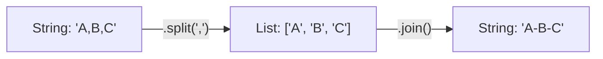

## 1. The `list()` Constructor Function

The `list()` function is a **Type Caster**. It attempts to convert whatever object you give it into a List.

### What can `list()` convert?
It accepts any **Iterable**. An iterable is any object capable of returning its members one at a time.

| Input Type | Code | Result | Reasoning |
| :--- | :--- | :--- | :--- |
| **String** | `list("Hello")` | `['H', 'e', 'l', 'l', 'o']` | Breaks string into characters. |
| **Tuple** | `list((1, 2))` | `[1, 2]` | Converts immutable tuple to mutable list. |
| **Range** | `list(range(3))` | `[0, 1, 2]` | Materializes the range numbers. |
| **Set** | `list({1, 2, 3})` | `[1, 2, 3]` | Converts set to list (order may vary!). |
| **List** | `list([1, 2])` | `[1, 2]` | Creates a **shallow copy** of the original list. |

### What can `list()` NOT convert?
It cannot convert single non-iterable items.

```python
# ❌ THIS WILL CRASH
x = list(5)       # TypeError: 'int' object is not iterable
y = list(True)    # TypeError: 'bool' object is not iterable
```

**How to list a single item:**
If you have a single number and want it inside a list, do not use `list()`. Use square brackets `[]`.
```python
# ✅ CORRECT
x = [5]           # Result: [5]
```

---

## 2. Strings and Lists (Split & Join)

Data cleaning often involves switching between text strings and lists.



### 1. `split()` (String $\to$ List)
Divides a string based on a delimiter (separator).
```python
text = "Apple, Banana, Cherry"
# Split by comma and space
fruits = text.split(", ") 
print(fruits) 
# Output: ['Apple', 'Banana', 'Cherry']
```

### 2. `join()` (List $\to$ String)
This acts as a "merger". It combines a list of strings into one string.
*   **Syntax:** `"separator".join(list)`
*   *Note:* The separator comes *first*.

```python
words = ['Data', 'Science', 'Rocks']
# Merge with a hyphen
result = "-".join(words)
print(result)
# Output: "Data-Science-Rocks"
```

> [!WARNING]
> `join()` only works if the list contains **Strings**. If your list has integers (`[1, 2, 3]`), `join` will crash. You must map them to strings first.

---

## 3. The `range()` Function

`range()` is a lazy sequence.
*   **`range(5)`** does **not** create the numbers 0, 1, 2, 3, 4 in memory immediately. It creates an object that is *ready* to count when asked.
*   To see the numbers immediately, you must wrap it in `list()`.

```python
r = range(5)
print(r)        # Output: range(0, 5) (It doesn't show the numbers!)

l = list(r)
print(l)        # Output: [0, 1, 2, 3, 4] (Now the numbers exist in memory)
```

---

## 4. Listing Dictionaries

When you apply `list()` to a dictionary, Python defaults to the **Keys**.

```python
data = {"Name": "Ali", "Age": 25, "City": "Paris"}

# 1. Default (Keys)
keys = list(data)
# Output: ['Name', 'Age', 'City']

# 2. Values
values = list(data.values())
# Output: ['Ali', 25, 'Paris']

# 3. Items (Tuples of Key/Value)
items = list(data.items())
# Output: [('Name', 'Ali'), ('Age', 25), ('City', 'Paris')]
```

---

## 5. Map and Filter (Lazy Evaluation)

In modern Python (Python 3), `map` and `filter` do not return lists. They return **Iterators**.
An iterator is a lightweight object that fetches the next item only when needed. This saves memory.

### `map()`
Applies a function to every item in a list.
```python
nums = [1, 2, 3]
squared = map(lambda x: x**2, nums)

print(squared) 
# Output: <map object at 0x7f...> (This is the iterator, not the data)

print(list(squared))
# Output: [1, 4, 9] (We forced the iterator to run)
```

### `filter()`
Keeps items where the function returns `True`.
```python
nums = [1, 2, 3, 4]
evens = filter(lambda x: x % 2 == 0, nums)

print(list(evens))
# Output: [2, 4]
```

---

## 6. Generators and `yield`

A **Generator** is a special type of function that returns an iterator. It uses `yield` instead of `return`.

### `return` vs `yield`
*   **`return`**: Calculates everything, sends it back, and destroys the function's memory.
*   **`yield`**: Calculates **one** value, pauses the function, and waits for you to ask for the next one.

```python
def count_up_to(n):
    count = 1
    while count <= n:
        yield count  # Pause here and give the number
        count += 1

# Usage
gen = count_up_to(3)

# We can convert it to a list
print(list(gen)) # [1, 2, 3]

# OR we can step through it manually
gen2 = count_up_to(3)
print(next(gen2)) # 1
print(next(gen2)) # 2
print(next(gen2)) # 3
# print(next(gen2)) # Crash! StopIteration error.
```

> [!TIP] Why use Generators?
> Imagine processing 1 Million rows of data.
> *   **List:** Loads 1 Million rows into RAM. Computer might freeze.
> *   **Generator:** Loads 1 row, processes it, forgets it, loads the next. Very memory efficient.

---

## 7. `*args` (Unpacking Lists)

The asterisk `*` operator is used to "unpack" or "explode" a list into individual arguments.

**Scenario:** You have a list `[1, 10]`, but a function expects two separate arguments `x` and `y`.

```python
def add(a, b):
    return a + b

nums = [5, 10]

# ❌ Wrong
# add(nums) -> Error! 'b' is missing, and 'a' became the whole list.

# ✅ Correct (Unpacking)
print(add(*nums)) 
# Equivalent to: add(5, 10)
# Output: 15
```

It creates a visual logic like this:
*   `nums` = `[5, 10]` (The box)
*   `*nums` = `5, 10` (Items taken out of the box)
