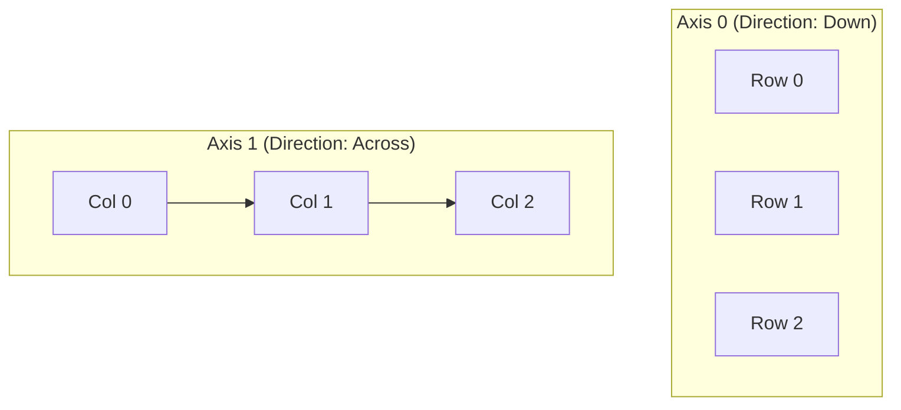

# NumPy (Numerical Python)

NumPy is the foundation of Data Science in Python. It provides the `ndarray`, which is up to 50x faster than Python lists because it stores data contiguously in memory and supports **vectorization**.

## 1. Axes and Dimensions
Understanding axes is the #1 hurdle in NumPy.

*   **1D Array:** Shape `(n,)`. Axis 0.
*   **2D Array (Matrix):** Shape `(rows, cols)`.
    *   **Axis 0:** Vertical direction (Down the columns).
    *   **Axis 1:** Horizontal direction (Across the rows).



> [!TIP] Memory Hook
> *   `np.mean(axis=0)`: "Collapse the rows." (Result = 1 value per column).
> *   `np.mean(axis=1)`: "Collapse the columns." (Result = 1 value per row).

## 2. Boolean Indexing (Masking)
The most powerful feature for filtering data without loops.

1.  **Create a Mask:** A True/False array based on a condition.
2.  **Apply Mask:** Use the mask to select data.

```python
grades = np.array([10, 15, 8, 19])
mask = grades > 12  # [False, True, False, True]
passed = grades[mask] # [15, 19]
```

**Logical Operators in NumPy:**
*   Use `&` (AND), `|` (OR), `~` (NOT).
*   **Important:** You *must* use parentheses around comparisons: `(A > 5) & (B < 10)`.

## 3. Key Functions
*   **`np.argmax()`**: Returns the **index** of the max value, not the value itself.
*   **`np.where(condition, val_if_true, val_if_false)`**: Vectorized "If-Else".
*   **`np.vstack` / `np.hstack`**: Stacking arrays vertically (adding rows) or horizontally (adding columns).
*   **`np.random.seed()`**: Ensures random numbers are reproducible (crucial for scientific experiments).

## 4. Broadcasting
NumPy automatically expands smaller arrays to match the shape of larger arrays during math operations.
*   *Example:* Adding `[1, 2, 3]` (Shape 3,) to a Matrix (Shape 3,3). NumPy adds the vector to *every row* of the matrix.