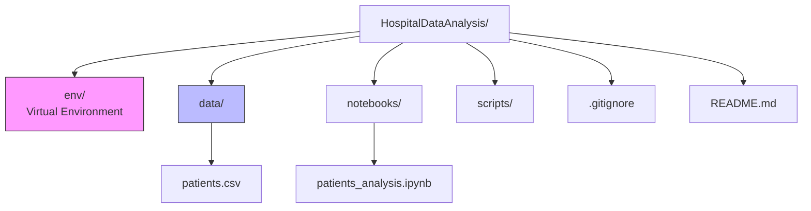

# Hospital Data Analysis Project 

## 1. Project Overview
This project is an introduction to the Data Science workflow using Python. It demonstrates how to set up a professional environment, load medical data, perform exploratory data analysis (EDA), and visualize basic health trends.

**Goal:** Analyze a small dataset of patients to understand the relationship between Age and Cholesterol levels.

## 2. Project Structure
The project follows a standard Data Science directory structure to ensure maintainability and scalability.



*   **`env/`**: Contains the isolated Python environment (Python binary + libraries). Ignored by Git.
*   **`data/`**: Stores the raw data (`patients.csv`). Separating data from code prevents accidental deletion.
*   **`notebooks/`**: Stores Jupyter Notebooks for exploration and visualization.
*   **`scripts/`**: (Optional) Stores pure Python (`.py`) scripts for automation.
*   **`.gitignore`**: A configuration file telling Git which files *not* to track (e.g., the heavy `env` folder).

## 3. Environment Setup & Theory

### Why use a Virtual Environment (`env`)?
In Python, installing libraries globally is dangerous. If Project A needs `pandas v1.0` and Project B needs `pandas v2.0`, a global installation causes conflicts.
A **Virtual Environment** creates a sandbox. We install libraries *inside* `HospitalDataAnalysis/env`, ensuring this project works forever, regardless of updates elsewhere on the computer.

### Why use Git?
Git is a version control system.
1.  **History:** It creates a timeline of changes (commits).
2.  **Safety:** If we break the code, we can "undo" to a previous state.
3.  **Collaboration:** It allows us to push code to GitHub to share with the team.

### How to Recreate This Environment
If you clone this project on a new machine, run:
```bash
# 1. Create env
python -m venv env

# 2. Activate env
source env/bin/activate  # or .\env\Scripts\activate on Windows

# 3. Install dependencies
pip install pandas numpy matplotlib
```

## 4. Code & Function Documentation

This section explains the key functions used in `notebooks/patients_analysis.ipynb`.

### A. Loading Data
```python
pd.read_csv(filepath)
```
*   **Role:** Reads a Comma Separated Values (CSV) file and converts it into a Pandas DataFrame.
*   **Why:** CSV is the standard format for exchanging simple data. Pandas converts this text into a structured table (rows/columns) that we can manipulate programmatically.

### B. Exploratory Analysis
```python
df.describe()
```
*   **Role:** Generates descriptive statistics for numerical columns only.
*   **Output:** Count, Mean, Standard Deviation (std), Min, Max, and Quartiles (25%, 50%, 75%).
*   **Insight:** Helps quickly spot outliers (e.g., if Max Age is 150, we know the data is dirty).

```python
df['Column'].value_counts()
```
*   **Role:** Counts the occurrence of unique values in a specific column.
*   **Use Case:** Ideal for categorical data (e.g., checking if the dataset is balanced between 'Male' and 'Female').

### C. Visualization
```python
plt.plot(x, y, marker='o', linestyle='none')
```
*   **Role:** Creates a 2D chart.
*   **Parameters:**
    *   `x`, `y`: The data arrays.
    *   `marker='o'`: Draws a dot for each data point.
    *   `linestyle='none'`: **Crucial.** By default, `plt.plot` draws a connected line. For this data, connecting patients suggests a sequence that doesn't exist. We turn off the line to create a **Scatter Plot**.

## 5. Critical Thinking: Roles in Data
*Referencing Exercise 2 of the Tutorial.*

1.  **Why can't a Data Engineer and ML Engineer replace each other?**
    *   A **Data Engineer** focuses on **Infrastructure**. They build the pipelines that move and store terabytes of data. They prioritize reliability and speed.
    *   An **ML Engineer** focuses on **Models**. They take the data provided by the Engineer and build algorithms to predict outcomes. They prioritize mathematical accuracy and model latency.
    *   *Analogy:* The Data Engineer builds the race track (Roads/Databases). The ML Engineer builds the car (Model/Algorithm). You cannot race without a track, and a track is useless without a car.

2.  **Why can't a Data Analyst and Data Scientist replace each other?**
    *   A **Data Analyst** looks at the **Past**. They answer "What happened?" using descriptive stats and dashboards.
    *   A **Data Scientist** looks at the **Future**. They answer "What will happen?" using predictive modeling and complex algorithms.