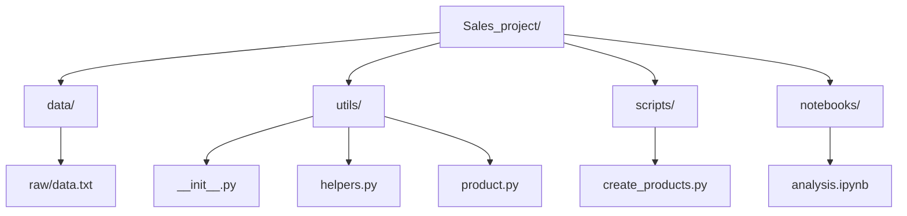

# Sales Analysis Project (Python Essentials) 

## 1. Project Overview
This project demonstrates essential Python programming techniques for Data Science. Unlike simple scripts, this project uses a **modular architecture** to process product sales data. It covers string manipulation, Object-Oriented Programming (OOP), error handling, and memory optimization for large datasets.

**Key Concepts:**
*   **Modular Code:** Separating logic into reusable `utils` packages.
*   **Data Cleaning:** Parsing raw text files with robust error handling.
*   **OOP:** Using Classes to model business entities (`Product`).
*   **Optimization:** Using **Generators** to handle "Big Data" (1 million rows) without crashing RAM.

## 2. Project Structure
The project is organized to mimic a professional software development environment.



*   **`utils/`**: Contains our custom library code.
    *   `__init__.py`: An empty file that tells Python "treat this folder as an importable package".
*   **`data/raw/`**: Stores the input text file.

## 3. Module Documentation

### A. Helper Functions (`utils/helpers.py`)

#### `clean_lines(lines)`
*   **Goal:** Preprocess raw text from a file.
*   **Logic:** It loops through a list of strings, applies `.strip()` to remove invisible characters (like `\n` or spaces), and removes empty lines.
*   **Why:** Raw text files often contain empty rows or formatting errors that cause crashes later in the pipeline.

#### `parse_products(lines)`
*   **Goal:** Convert text strings (`"Laptop,1000,3"`) into usable Python Tuples (`("Laptop", 1000.0, 3)`).
*   **Robustness:** Uses a `try...except ValueError` block.
    *   If a line contains bad data (e.g., `"BadData,Free,Five"`), the code will **not crash**. It catches the error, prints a warning, and moves to the next line.

### B. The Product Class (`utils/product.py`)

#### `class Product`
Instead of using simple lists or dictionaries, we define a custom object.

*   **Attributes:** `name`, `price`, `quantity`.
*   **Method `total_value()`**: Encapsulates the logic `price * quantity`. This ensures we don't have to rewrite this math every time we need the total.
*   **Magic Method `__repr__`**:
    *   *Without it:* Printing the list gives `[<Product object at 0x7f...>]`.
    *   *With it:* Printing gives `[Product(name='Laptop', total=3000.0)]`.
    *   *Why:* Crucial for debugging.

## 4. The "One Million Products" Problem (Exercise 6)

One of the most important concepts in this tutorial is **Memory Management**.

### The Problem: `readlines()`
In the standard approach, we used:
```python
with open('data.txt') as f:
    lines = f.readlines() # <--- DANGER
```
This loads **every single line** of the file into the computer's RAM (Random Access Memory) at once.
*   If the file has 10 lines: Fine.
*   If the file has **1 Million lines** (Big Data): The program crashes or the computer freezes.

### The Solution: Generators (`yield`)
We implemented a generator function.

```python
def product_generator(file):
    for line in open(file):
        # Process logic...
        yield Product(...) 
```

**How it works (The Conveyor Belt Analogy):**
1.  The Generator reads **Line 1**.
2.  It creates **Product 1**.
3.  It sends Product 1 to the main loop to be counted (`total_sales += val`).
4.  It **deletes** Product 1 from memory immediately.
5.  It reads **Line 2**.

**Result:** Whether the file has 10 lines or 10 billion lines, the RAM usage remains tiny and constant.

## 5. How to Run
1.  **Generate Data:** Run the setup cells in the Notebook to create `data/raw/data.txt`.
2.  **Run Analysis:** Execute `notebooks/analysis.ipynb`.
3.  **Run as Script:** Alternatively, run from terminal:
    ```bash
    python scripts/create_products.py
    ```