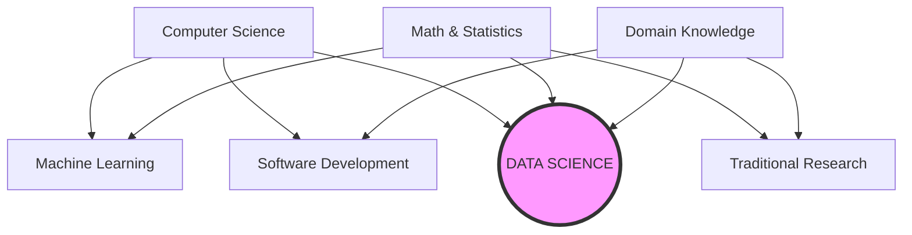

# 1. Introduction and Definition of Data Science

## 1.1 What is Data Science?

**Data Science** is not a single subject; it is an **interdisciplinary field**. It integrates scientific methods, processes, algorithms, and systems to extract knowledge and insights from data.

The core goal is to take data (which can be structured like Excel sheets or unstructured like text/images) and transform it into **actionable insights** or **automated products**.

### The Three Pillars
Data Science sits at the intersection of three primary fields. You must understand how they overlap:

1.  **Computer Science:** Provides the tools to scrape, process, and manipulate data (Algorithms, Databases, Coding).
2.  **Statistics & Mathematics:** Provides the theoretical backbone to model data and prove results (Probability, Linear Algebra).
3.  **Domain Knowledge:** Provides the context to ask the right questions and interpret results correctly (e.g., understanding Finance to build a credit scoring model).

> [!TIP] **Student Reminder**
> A common mistake is thinking Data Science is just "coding" or just "math."
> *   Coding without Math is just software engineering.
> *   Math without Domain Knowledge is just theoretical research.
> *   **Data Science requires all three.**

### Core Processes
Data Science involves a cycle of operations:
*   **Data Collection & Cleaning:** Getting the raw material.
*   **Analysis & Visualization:** Looking for patterns.
*   **Machine Learning:** Building predictive models.
*   **Communication:** Explaining the results to stakeholders.

---

## 1.2 Importance of Data Science

Why has this field exploded in popularity? Because data is now a strategic asset. Organizations use it to move from **intuition-based** decisions to **evidence-based** decisions.

### Key Benefits
*   **Efficiency:** Optimizing operations (e.g., UPS routing trucks to save fuel).
*   **Personalization:** Tailoring experiences (e.g., Netflix recommendations).
*   **Risk Prediction:** Identifying problems before they happen (e.g., Fraud detection).
*   **Strategic Support:** Backing up executive decisions with hard numbers.

### Real-World Example: Healthcare
Imagine a hospital managing patient records.

| Scenario | Without Data Science | With Data Science |
| :--- | :--- | :--- |
| **Data State** | Scattered, paper-based, hard to access. | Centralized, digitized, accessible. |
| **Diagnosis** | Reactive (treat when sick). | **Proactive** (predict sickness). |
| **Analysis** | Doctors rely solely on memory/experience. | Algorithms detect trends (e.g., flu outbreak regions). |
| **Outcome** | Standardized care. | **Personalized** treatments based on history. |

> [!NOTE] **The Shift**
> The transition from "Without" to "With" Data Science represents a shift from **Descriptive Analytics** (What happened?) to **Predictive/Prescriptive Analytics** (What will happen, and what should we do?).
