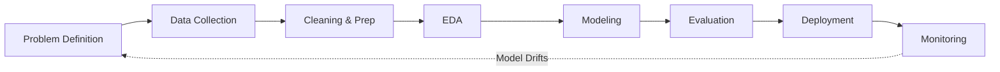

# 2. Key Components and Workflow

## 2.1 The Four Components

To practice Data Science effectively, you integrate four specific skill sets:

1.  **Statistics and Mathematics**
    *   *Role:* The foundation for modeling and hypothesis testing.
    *   *Why it matters:* You cannot know if a pattern is real or just random noise without probability theory.
    *   *Example:* Calculating the probability that a patient has diabetes based on blood sugar levels.

2.  **Computer Science**
    *   *Role:* Provides the infrastructure and algorithms.
    *   *Why it matters:* Math equations can't run themselves on Terabytes of data; you need efficient code.
    *   *Example:* Writing a Python script to train a Decision Tree on 1 million emails to classify "Spam" vs. "Not Spam."

3.  **Domain Knowledge**
    *   *Role:* Contextual relevance.
    *   *Why it matters:* A model might find a correlation that makes no sense in the real world. Domain knowledge filters this.
    *   *Example:* In banking, knowing *why* a credit score drops (e.g., missed payments) helps in feature selection.

4.  **Communication**
    *   *Role:* Translation.
    *   *Why it matters:* You must translate complex math into plain English for decision-makers.
    *   *Example:* Instead of showing a raw confusion matrix, you show a bar chart of "Projected Sales Growth."

---

## 2.2 The Data Science Workflow (Lifecycle)

Data Science is not linear; it is a cycle. However, a typical project follows these steps. You must memorize this flow.

### Detailed Breakdown

#### 1. Problem Definition
*   **What it is:** Clearly stating the business question.
*   **Crucial Tip:** Don't start coding yet. If you solve the wrong problem, the code is useless.
*   *Example:* "We want to predict which patients will return to the hospital within 30 days."

#### 2. Data Collection
*   **What it is:** Gathering raw data from SQL databases, APIs, sensors, or web scraping.
*   *Example:* Pulling Electronic Health Records (EHR) and lab results.

#### 3. Data Cleaning and Preparation (The "80%" Step)
*   **What it is:** Handling missing values (`NaN`), removing duplicates, fixing typos, and detecting outliers.
*   **Why:** "Garbage In, Garbage Out." Models cannot learn from dirty data.
*   *Example:* Imputing (filling in) missing blood pressure values with the average age-group value.

#### 4. Exploratory Data Analysis (EDA)
*   **What it is:** Using visualization and descriptive stats to "get a feel" for the data.
*   **Goal:** Find patterns *before* modeling.
*   *Example:* Plotting a histogram of patient ages to see if the dataset is skewed toward elderly people.

#### 5. Modeling
*   **What it is:** Applying Machine Learning algorithms (Statistical models).
*   *Example:* Training a **Logistic Regression** model to output a probability (0 to 1) of readmission.

#### 6. Evaluation
*   **What it is:** Testing the model on data it has never seen before.
*   **Metrics:** Accuracy, Precision, Recall, F1-Score.
*   *Example:* Checking if the model correctly identified 90% of high-risk patients.

#### 7. Deployment
*   **What it is:** Putting the model into a live system (Production).
*   *Example:* Integrating the Python model into the hospital's software so doctors see a "Risk Score" on their screen.

#### 8. Monitoring
*   **What it is:** Watching the model over time.
*   **Why:** The world changes (e.g., COVID-19 happens), and old data patterns may no longer apply (**Data Drift**).
*   *Example:* Retraining the model a year later with new patient data.
