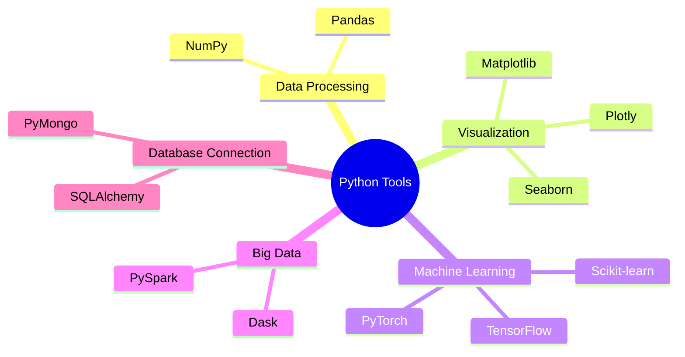

# 5. Common Tools in Python for Data Science

The power of Python comes from its **libraries** (collections of pre-written code). You rarely write algorithms from scratch; you import these tools.

## 5.1 Data Analysis & Manipulation

| Library | Purpose | Key Concept |
| :--- | :--- | :--- |
| **Pandas** | Tabular Data | The **DataFrame** (think of it as a programmable Excel sheet). Used for cleaning and filtering. |
| **NumPy** | Numerical Math | The **Array**. faster than Python lists. Used for matrix math and linear algebra. |
| **SciPy** | Scientific Comp | Advanced math functions (integration, optimization, signal processing). |

## 5.2 Data Visualization

| Library | Level | Use Case |
| :--- | :--- | :--- |
| **Matplotlib** | Low-Level | The foundation. Powerful but requires a lot of code to make things pretty. |
| **Seaborn** | High-Level | Built on top of Matplotlib. Makes beautiful statistical plots (heatmaps, violin plots) with 1 line of code. |
| **Plotly** | Interactive | Creates dashboards where you can zoom, hover, and click. |

## 5.3 Machine Learning & AI

| Library | Focus | Description |
| :--- | :--- | :--- |
| **Scikit-learn** | Classical ML | The gold standard for Regression, Clustering, and Decision Trees. Great for beginners. |
| **TensorFlow** | Deep Learning | Created by Google. Industrial strength for Neural Networks. |
| **PyTorch** | Deep Learning | Created by Meta (Facebook). Highly flexible, preferred by researchers. |

## 5.4 Big Data & Data Engineering

When data becomes too large for your laptop's RAM, you use these tools to distribute the work across many computers (a cluster).

*   **PySpark:** Python API for Apache Spark. Fast distributed processing.
*   **Dask:** Parallel computing that mimics Pandas/NumPy syntax but handles larger-than-memory data.
*   **Hadoop (via PyDoop):** Older ecosystem for storage (HDFS) and processing (MapReduce).

