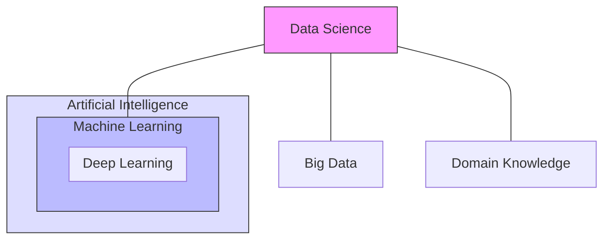

# 6. Data Science vs. Related Domains

It is crucial to distinguish Data Science from its neighbors. In interviews, confusing these terms is a red flag.

## 6.1 Data Science vs. Machine Learning (ML)
*   **Relationship:** ML is a **subset** (a tool) of Data Science.
*   **Data Science:** The broad process (Cleaning + Vis + ML + Communication).
*   **Machine Learning:** The specific step of creating algorithms that learn from data.
*   *Analogy:* Data Science is the entire car factory; Machine Learning is the engine assembly line.

## 6.2 Data Science vs. Artificial Intelligence (AI)
*   **AI:** The broad goal of simulating human intelligence (reasoning, perception).
*   **Data Science:** Focused on extracting *insights* from data.
*   **Overlap:** They overlap significantly (e.g., using Neural Networks), but AI also includes things like Robotics, which isn't strictly Data Science.

## 6.3 Data Science vs. Big Data
*   **Big Data:** Refers to the **Volume, Velocity, and Variety** of data. It is the *infrastructure* (Hadoop, Spark).
*   **Data Science:** Refers to the *analysis*.
*   *Distinction:* You can do Data Science on "Small Data" (an Excel file). You cannot do Big Data analytics without specialized infrastructure.

## 6.4 Data Science vs. Business Intelligence (BI)
This is the most common confusion.

| Feature | Business Intelligence (BI) | Data Science (DS) |
| :--- | :--- | :--- |
| **Time Focus** | **Past & Present** | **Future** |
| **Question** | "What happened last quarter?" | "What will happen next quarter?" |
| **Methods** | Aggregation, Reporting, KPIs | Predictive Modeling, Machine Learning |
| **Output** | Static Reports / Dashboards | Interactive Models / Automated Actions |


```