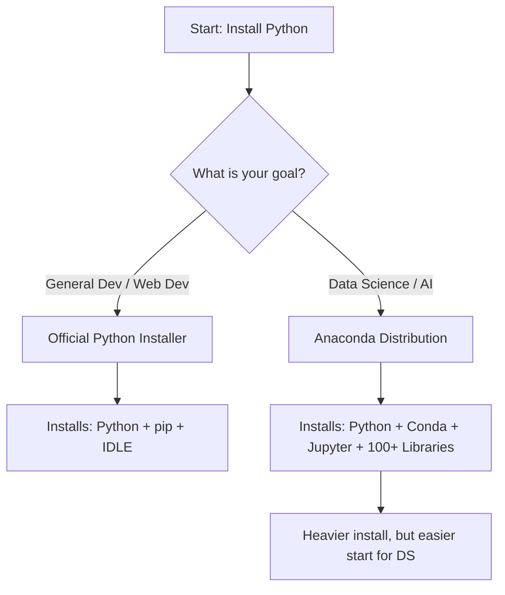

# 2. Installing Python

There are two primary ways to set up Python on your machine. Choosing the right one depends on your goals.

## 2.1 Option 1: Official Python Installation
**Best for:** General software development, learning the language basics, or lightweight scripting.

**Steps:**
1.  Visit [python.org/downloads](https://python.org/downloads).
2.  Download the latest version.
3.  **CRITICAL STEP:** During the installation wizard, you must check two boxes:
    *   [ ] **"Add Python to PATH"**
    *   [ ] **"Customize installation"** $\rightarrow$ enable `pip` and `IDLE`.
4.  Verify installation by opening a terminal (Command Prompt/PowerShell) and typing:
    ```bash
    python --version
    ```

> [!WARNING] **What is "PATH"?**
> The `PATH` is a system variable that tells your operating system where to look for executable programs. If you **forget** to check "Add Python to PATH," typing `python` in your terminal will result in an error saying the command is not recognized. You would then have to type the full file path (e.g., `C:\Users\You\AppData\Local\Programs\Python\python.exe`) every time, which is painful.

## 2.2 Option 2: Install Anaconda (Recommended for Data Science)
**Best for:** Data Science, Machine Learning, and Scientific Computing.

**What is Anaconda?**
Anaconda is a distribution that acts as a "one-stop-shop." It pre-installs:
*   Python itself.
*   **Jupyter Notebook** (essential for data exploration).
*   **Conda:** A powerful package and environment manager.
*   Hundreds of scientific libraries (NumPy, Pandas, etc.) pre-configured to work together.

**Steps:**
1.  Visit [anaconda.com/products/distribution](https://anaconda.com/products/distribution).
2.  Download the installer.
3.  Follow the setup instructions.
4.  Open **Anaconda Navigator** (GUI) or **Anaconda Prompt** (Terminal).

**Verification:**
To ensure Anaconda is working, open your terminal/prompt and run:
```bash
conda --version
python --version
```

## 2.3 Visualizing the Choice



```

---
