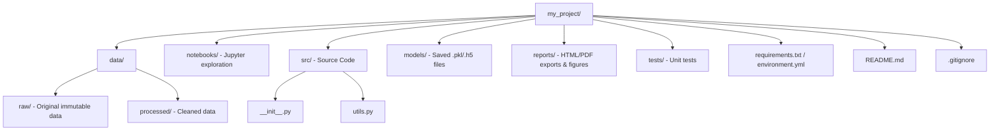

# 4. Structure of a Data Science Project

Organization separates a hobbyist from a professional. A good folder structure ensures scalability, reproducibility, and easier collaboration.

## 4.1 The Standard Directory Tree



## 4.2 Detailed Folder Explanations

### 📂 data/
Never edit your raw data directly.
*   **raw/**: The original CSV, JSON, or Excel files. Treat these as **read-only**. If you mess up your cleaning script, you can always go back to these.
*   **processed/**: The data after you have cleaned, merged, and transformed it, ready for analysis.

### 📂 notebooks/
Contains your Jupyter Notebooks (`.ipynb`). These are for experimentation, exploration, and visual analysis. They are often messy draft pads.

### 📂 src/ (Source)
This is where your production-quality code lives.
*   **`__init__.py`**: An often empty file that tells Python "Treat this directory as a package." It allows you to import functions from this folder into your notebooks (e.g., `from src.utils import clean_data`).
*   **utils.py**: Helper functions used across multiple notebooks.

### 📂 models/
Where you save your trained machine learning models (serialized files like `.pkl` or `.h5`). This allows you to load a trained model later without retraining it.

### 📂 outputs/ or reports/
Generated figures (PNG/JPG), HTML reports, or tables exported for stakeholders.

### 📄 Configuration Files
*   **requirements.txt**: A list of pip-installed libraries. Created via `pip freeze > requirements.txt`.
*   **environment.yml**: The equivalent file for Anaconda users. Created via `conda env export > environment.yml`.
*   **README.md**: The documentation. It should explain what the project is, how to install it, and how to run it.
*   **.gitignore**: Tells Git which files to **ignore**.
    *   *Crucial:* You generally **ignore** the `data/` folder (too large), `env/` (virtual environment), and `__pycache__`.

```
