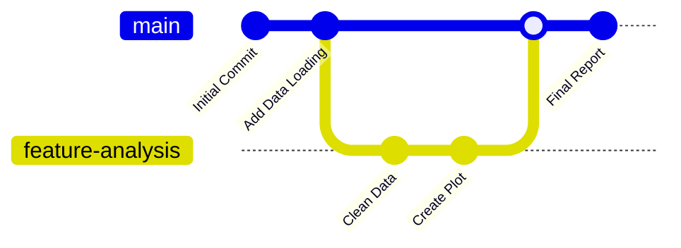

# 8. Version Control with Git

**Git** is a Distributed Version Control System (DVCS). It acts like a "save point" system for your code, allowing you to track changes, undo mistakes, and collaborate.

## 8.1 The Basic Git Workflow



### Key Commands

1.  **Initialize:** Start tracking a folder.
    ```bash
    git init
    ```
2.  **Check Status:** See which files have changed.
    ```bash
    git status
    ```
3.  **Stage Changes (The "Shopping Cart"):** Select which files you want to save.
    ```bash
    git add .           # Add all changed files
    git add script.py   # Add specific file
    ```
4.  **Commit (The "Checkout"):** Permanently save the snapshot.
    ```bash
    git commit -m "Description of what I changed"
    ```
5.  **History:** See a log of changes.
    ```bash
    git log --oneline --graph --decorate
    ```
6.  **Branches:** Work on a new feature without breaking the main code.
    ```bash
    git branch new-feature      # Create
    git checkout new-feature    # Switch to it
    # OR
    git checkout -b new-feature # Create and Switch
    ```
7.  **GitHub Interaction:**
    ```bash
    git push origin main        # Upload code to GitHub
    git pull origin main        # Download updates from GitHub
    ```
8.  **Undo:**
    ```bash
    git restore file.py         # Discard local changes (DANGER)
    ```

> [!TIP] **The "Staging Area" Concept**
> Beginners often confuse `add` and `commit`.
> *   `git add` is like putting items in a box.
> *   `git commit` is sealing the box and putting a label on it.
> You can't commit until you have added something to the staging area.

```
