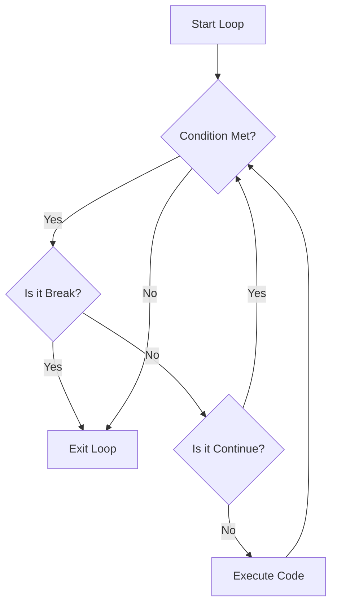

# 1. Python Basics and Control Flow

## 1. Variables and Data Types
Variables serve as containers for storing data values. Unlike statically typed languages (like C++ or Java), Python is **dynamically typed**, meaning you do not need to declare the variable type explicitly. Python infers the type based on the value assigned.

### Core Data Types
| Type | Name | Example | Description | Mutable? |
| :--- | :--- | :--- | :--- | :--- |
| `int` | Integer | `x = 42` | Whole numbers (positive/negative) | No |
| `float` | Floating Point | `pi = 3.14` | Decimal numbers | No |
| `str` | String | `s = "Hello"` | Text sequences | No |
| `bool` | Boolean | `flag = True` | Logical Truth values (True/False) | No |
| `list` | List | `l = [1, 2]` | Ordered collection of items | **Yes** |
| `dict` | Dictionary | `d = {"k": "v"}` | Key-Value pairs | **Yes** |
| `tuple` | Tuple | `t = (1, 2)` | Ordered collection (immutable) | No |
| `set` | Set | `s = {1, 2}` | Unordered unique items | **Yes** |

### Type Conversion (Casting)
You can manually convert variables from one type to another using built-in functions. This is crucial when dealing with user input (which often comes as a string).

```python
x = "100"       # String
y = int(x)      # Converts "100" to integer 100
z = float(x)    # Converts "100" to float 100.0
a = str(y)      # Converts 100 back to string "100"
b = bool(0)     # False (0 is always False)
c = bool("Hi")  # True (Non-empty strings are True)
```

> [!INFO] Truthiness in Python
> In Python, the following are considered `False`:
> *   `None`
> *   `False`
> *   Zero (`0`, `0.0`)
> *   Empty collections: `""`, `[]`, `()`, `{}`.
>
> Almost everything else is considered `True`.

---

## 2. Operators
Python processes data using arithmetic, comparison, and logical operators.

### Arithmetic Operators
*   `+`, `-`, `*`: Standard addition, subtraction, multiplication.
*   `/`: **True Division**. Always returns a float (e.g., `10 / 3` → `3.333`).
*   `//`: **Floor Division**. Returns the integer part, rounding down (e.g., `10 // 3` → `3`).
*   `%`: **Modulus**. Returns the remainder (e.g., `10 % 3` → `1`). Useful for checking even/odd numbers.
*   `**`: **Exponentiation**. Power of (e.g., `2 ** 3` → `8`).

### Comparison & Logical Operators
*   **Comparison:** `==` (equal), `!=` (not equal), `>`, `<`, `>=`, `<=`. These return a `bool`.
*   **Logical:** `and`, `or`, `not`.

```python
x = True
y = False
print(x and y) # False (both must be True)
print(x or y)  # True (at least one must be True)
print(not x)   # False (reverses the boolean)
```

---

## 3. Control Flow

### Conditionals (if, elif, else)
These allow the program to make decisions. Indentation (whitespace) defines the blocks of code.

```python
grade = 13

if grade > 12:
    print("Good")      # Runs if grade > 12
elif grade >= 10:
    print("Accept")    # Runs if grade is between 10 and 12
else:
    print("Fail")      # Runs if none of the above are true
```

### Loops
Loops allow you to repeat code blocks.

#### 1. For Loop
Used when you know the number of iterations or are iterating over a sequence (list, string, range).
*   **`range(start, stop, step)`**: Generates numbers from `start` up to (but not including) `stop`.

```python
# Iterating a list
fruits = ["apple", "banana"]
for fruit in fruits:
    print(fruit)

# Iterating a range (0 to 2)
for i in range(3):
    print(i) # Prints 0, 1, 2
```

#### 2. While Loop
Used when you want to loop as long as a specific condition is `True`.

```python
count = 0
while count < 5:
    print(count)
    count += 1  # Vital: Update condition to avoid infinite loops
```

### Loop Control Statements
*   **`break`**: Exits the loop *immediately*, skipping any remaining code in the loop block.
*   **`continue`**: Skips the *rest* of the current iteration and jumps back to the top for the next item.
*   **`pass`**: A placeholder. It does nothing. Used when syntax requires a block of code (like in an empty function or loop) but you haven't written the logic yet.


```
