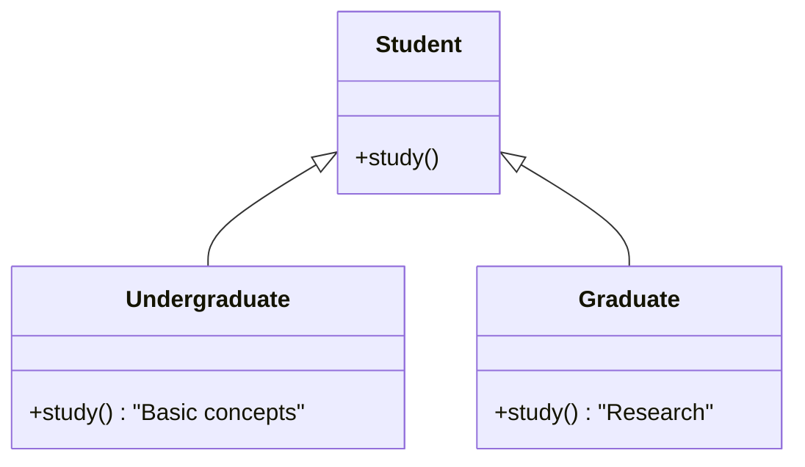

# 4. Object-Oriented Programming (OOP)

OOP is a paradigm based on "objects" that contain **data** (attributes) and **code** (methods).

## 1. Core Concepts

### Class vs. Object
*   **Class:** The **blueprint** or template. (e.g., The concept of a `Car`).
*   **Object (Instance):** A specific **realization** of that blueprint. (e.g., That specific red Toyota in your driveway).

### The `__init__` Constructor
This method is automatically called when a new object is created. It initializes the object's attributes.

### The `self` Parameter
`self` refers to the **current instance** of the class. It allows each object to maintain its own data.
*   `self.name = "Ali"` sets the name for *this specific person*, not all people.

```python
class Person:
    # Constructor
    def __init__(self, name, age):
        self.name = name  # Instance Attribute
        self.age = age    # Instance Attribute

    # Method
    def greet(self):
        print(f"Hi, I am {self.name}")

p1 = Person("Ali", 25)
p2 = Person("Sara", 30)
```

## 2. Class vs Instance Attributes
*   **Instance Attribute (`self.variable`):** Unique to each object (e.g., a student's name).
*   **Class Attribute (Defined outside methods):** Shared by **all** instances of that class (e.g., the school name).

```python
class Student:
    speciality = "AI" # Class Attribute (Shared)

    def __init__(self, name):
        self.name = name # Instance Attribute (Unique)

s1 = Student("Amine")
s2 = Student("Sara")

# If we change Student.speciality, it changes for EVERYONE.
```

## 3. Encapsulation
Restricting direct access to data to prevent accidental modification.
*   **Public:** `name` (Accessible everywhere).
*   **Protected:** `_name` (Convention: "Please don't touch this outside the class").
*   **Private:** `__name` (Strict: Python mangles the name to make it hard to access).

```python
class BankAccount:
    def __init__(self, balance):
        self.__balance = balance # Private

    def deposit(self, amount):
        self.__balance += amount # Modified internally via method

    def get_balance(self):
        return self.__balance    # Accessed via getter

acc = BankAccount(1000)
# print(acc.__balance) # This throws an AttributeError!
print(acc.get_balance()) # This works
```

## 4. Inheritance and Polymorphism
*   **Inheritance:** Creating a new class (Child) from an existing class (Parent). The child gains all attributes and methods of the parent.
*   **Polymorphism:** Child classes can override methods of the parent to provide specific behavior.



```python
class Student:
    def study(self):
        print("Studying...")

class GraduateStudent(Student):
    def study(self):
        print("Conducting AI Research") # Overrides parent method

s = GraduateStudent()
s.study() # Output: Conducting AI Research
```

## 5. Composition and Aggregation
These describe "Has-A" relationships rather than "Is-A" (Inheritance).
*   **Composition:** Strong relationship. If the parent dies, the child dies. (e.g., A House *has* Rooms).
*   **Aggregation:** Weak relationship. Objects can exist independently. (e.g., A Teacher *has* Students, but students exist without the teacher).

## 6. Magic Methods (Dunder Methods)
Special methods surrounded by double underscores (`__`) that define how objects behave with built-in Python operations.

| Method | Role | Example Trigger |
| :--- | :--- | :--- |
| `__init__` | Constructor | `x = Class()` |
| `__str__` | String representation (User friendly) | `print(x)` |
| `__repr__` | String representation (Developer friendly) | `x` in console |
| `__add__` | Defines addition behavior | `x + y` |
| `__eq__` | Defines equality logic | `x == y` |

```python
class Point:
    def __init__(self, x, y):
        self.x = x
        self.y = y
    
    # Allows us to do: p1 + p2
    def __add__(self, other):
        return Point(self.x + other.x, self.y + other.y)

    # Allows us to do: print(p1)
    def __str__(self):
        return f"({self.x}, {self.y})"
```
```
