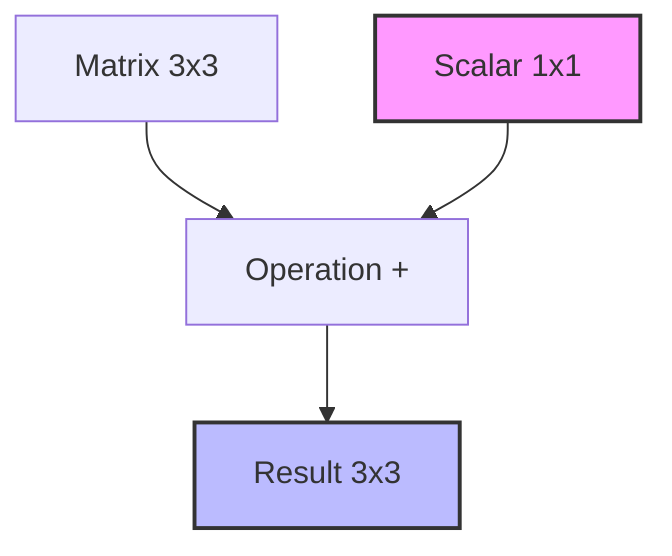

# 1. NumPy: Numerical Python

**NumPy** (Numerical Python) is the foundational library for scientific computing in Python. It provides high-performance multidimensional array objects and tools for working with these arrays. It is the building block for other libraries like Pandas, Scikit-Learn, and Matplotlib.

## 1.1. Why NumPy? (vs Python Lists)

While Python lists are flexible, they are slow for heavy mathematical operations because they hold pointers to objects in scattered memory locations.

*   **Speed:** NumPy arrays (ndarrays) are stored in contiguous memory blocks (C-style).
*   **Vectorization:** Operations apply to the whole array at once (SIMD operations) without explicit Python `for` loops.
*   **Memory Efficiency:** Uses fixed types (e.g., `int64`, `float32`) rather than Python's heavy object overhead.

## 1.2. The `ndarray` Object

The core of NumPy is the **N-dimensional array**.

```python
import numpy as np

# Creating an array from a list
a = np.array([1, 2, 3]) 
print(a)
```

### 1.2.1. Array Attributes
To understand the structure of your data, inspect these attributes:

| Attribute | Description | Example Output |
| :--- | :--- | :--- |
| **`a.ndim`** | Number of dimensions (axes). | `2` |
| **`a.shape`** | Tuple showing size in each dimension (rows, cols). | `(3, 4)` |
| **`a.size`** | Total number of elements. | `12` |
| **`a.dtype`** | Data type of elements (int, float, bool). | `int64` |
| **`a.itemsize`** | Memory usage (bytes) per element. | `8` |
| **`a.nbytes`** | Total memory consumed by the array. | `96` |

> [!TIP]
> **Shape Memorization**
> In a 2D array, `shape` is `(rows, columns)`. Think of it as RC (Cola).

## 1.3. Array Creation Methods

Don't manually type large arrays. Use these generators:

### 1.3.1. Constant & Sequence Arrays
```python
# 1. Zeros: Initialized with 0 (useful for placeholders)
np.zeros((2, 3)) 

# 2. Ones: Initialized with 1
np.ones((3, 2))

# 3. Full: Fill with specific value
np.full((2, 2), 7) # Fills 2x2 matrix with 7s

# 4. Identity Matrix: Square matrix with 1s on diagonal, 0s elsewhere
np.eye(3) 

# 5. Range (Start, Stop, Step) - Integer based
np.arange(0, 10, 2) # [0, 2, 4, 6, 8] (Stop is exclusive)

# 6. Linspace (Start, Stop, Num_Points) - Float based
np.linspace(0, 1, 5) # [0.0, 0.25, 0.5, 0.75, 1.0] (Stop is inclusive by default)
```

### 1.3.2. Random Arrays
Essential for initializing weights in ML or simulations.

*   `np.random.rand(d0, d1)`: Uniform distribution **[0, 1)**.
*   `np.random.randn(d0, d1)`: **Normal (Gaussian)** distribution (mean=0, std=1).
*   `np.random.randint(low, high, size)`: Random integers.

> [!WARNING]
> `np.empty((2,3))` creates an array without initializing values. It displays whatever garbage data existed in that memory slot. Use only if you plan to immediately overwrite every element.

## 1.4. Indexing and Slicing

Accessing data in NumPy is similar to Python lists but more powerful.

### 1.4.1. Basic Slicing `[start:stop:step]`
*   **1D:** `a[2:5]`
*   **2D:** `a[row_slice, col_slice]`

```python
a = np.array([[1, 2, 3], [4, 5, 6], [7, 8, 9]])

# Specific element [row, col]
val = a[1, 2] # Row index 1, Col index 2 -> Value 6

# Slice rows
rows = a[0:2] # First two rows

# Slice columns (The Comma is Key!)
cols = a[:, 1] # All rows, only column index 1 -> [2, 5, 8]
```

### 1.4.2. Boolean Indexing (Masking)
This is used to **filter** data.

```python
data = np.array([10, 20, 30, 40])
mask = data > 25       # Creates [False, False, True, True]
result = data[mask]    # Returns [30, 40]

# One-liner
result = data[data > 25] 
```

## 1.5. Vectorization & Arithmetic

NumPy delegates math to C-level optimizations. Operations are **element-wise**.

```python
a = np.array([1, 2, 3])
b = np.array([4, 5, 6])

sum_val = a + b    # [5, 7, 9] - No loop needed!
prod_val = a * b   # [4, 10, 18] - Element-wise multiplication
scalar = a * 10    # [10, 20, 30] - Broadcasting
```

### 1.5.1. Broadcasting
Broadcasting allows NumPy to perform arithmetic on arrays of different shapes (e.g., adding a scalar to a matrix). NumPy "stretches" the smaller array to match the larger one.



## 1.6. Aggregation & Universal Functions (ufuncs)

Standard math functions applied to every element or summarized.

| Function | Description |
| :--- | :--- |
| `np.sqrt(a)` | Square root of every element. |
| `np.exp(a)` | Exponential ($e^x$). |
| `np.sum(a)` | Sum of all elements. |
| `np.mean(a)` | Average. |
| `np.std(a)` | Standard Deviation. |

### 1.6.1. The `axis` Argument
When aggregating 2D arrays, `axis` defines the direction:
*   `axis=0`: Collapse **rows** (perform operation down the columns).
*   `axis=1`: Collapse **columns** (perform operation across the rows).

## 1.7. Reshaping & Stacking

Changing the geometry of data without changing the data itself.

*   **`reshape(rows, cols)`**: Returns a new shape. Total elements must match.
    *   *Tip:* Use `-1` as a dimension to let NumPy calculate it automatically. `a.reshape(2, -1)` automatically calculates the columns.
*   **`ravel()`**: Flattens multidimensional array to 1D.
*   **`hstack((a, b))`**: Stacks arrays horizontally (adds columns).
*   **`vstack((a, b))`**: Stacks arrays vertically (adds rows).

## 1.8. Linear Algebra (`np.linalg`)

*   `np.dot(a, b)`: Matrix multiplication (Dot product).
*   `np.linalg.inv(a)`: Inverse of matrix.
*   `np.linalg.eig(a)`: Eigenvalues/Eigenvectors.
