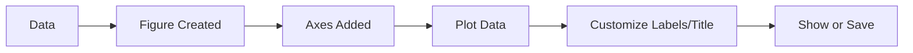

# 3. Matplotlib: The Core Visualization Library

**Matplotlib** is the grandfather of Python plotting. It gives you full control over every pixel, but can be verbose.

## 3.1. Two Interfaces (The Confusion Point)

Matplotlib has two ways to code. Mixing them leads to bugs.

### 3.1.1. Functional Approach (Pyplot Style)
Mimics MATLAB. Quick and dirty. State-based (Matplotlib tracks the "current" figure).
```python
plt.plot(x, y)
plt.title("Title") # Changes title of the *current* plot
plt.show()
```

### 3.1.2. Object-Oriented (OO) Approach (Recommended)
Explicitly create `Figure` and `Axes` objects and call methods on them.
*   **Figure:** The canvas/window.
*   **Axes:** The actual plot area (coordinate system) inside the figure.

```python
# Create Figure and Axes
fig, ax = plt.subplots(figsize=(5, 3))

# Call methods on the AXES object
ax.plot(x, y)
ax.set_title("Title")  # Note the 'set_' prefix
ax.set_xlabel("X Label")
plt.show()
```

> [!KEY CONCEPT]
> **Why OO?**
> The OO approach is essential when creating complex layouts, multiple subplots, or integrating into applications. It clearly defines *which* plot you are modifying.

## 3.2. Basic Syntax & Format Strings

`plt.plot(x, y, format_string, **kwargs)`

*   **Format String:** A shortcut for color, marker, and line style.
    *   `'r--o'` = **Red** color, **Dashed** line, **Circle** marker.
    *   `'g^'` = Green triangles.
*   **Kwargs (Keyword Arguments):**
    *   `color='green'`
    *   `linestyle='--'`
    *   `linewidth=2`
    *   `alpha=0.5` (Transparency)
    *   `label='Legend Name'`

## 3.3. Common Chart Types

| Function | Type | Use Case |
| :--- | :--- | :--- |
| `plt.plot()` | Line Chart | Trends over time. |
| `plt.bar()` | Bar Chart | Comparing discrete categories. |
| `plt.scatter()` | Scatter Plot | Correlation/Relationship between two numeric variables. |
| `plt.hist()` | Histogram | Distribution/Frequency of a single variable. |
| `plt.pie()` | Pie Chart | Proportions of a whole (use sparingly). |

## 3.4. Subplots

### 3.4.1. `plt.subplots()` (OO Way)
Returns an array of axes.

```python
fig, axes = plt.subplots(nrows=2, ncols=2)
# axes is now a 2x2 array. Access specific plots via index:
axes[0, 0].plot(x, y) # Top Left
axes[1, 1].bar(x, y)  # Bottom Right
plt.tight_layout()    # Prevents overlap
```

## 3.5. Text and Annotations
*   `plt.text(x, y, "String")`: Places text at coordinates.
*   `plt.annotate(...)`: Adds text with an arrow pointing to a specific data point. Requires `xy` (arrow tip) and `xytext` (text location).


```

