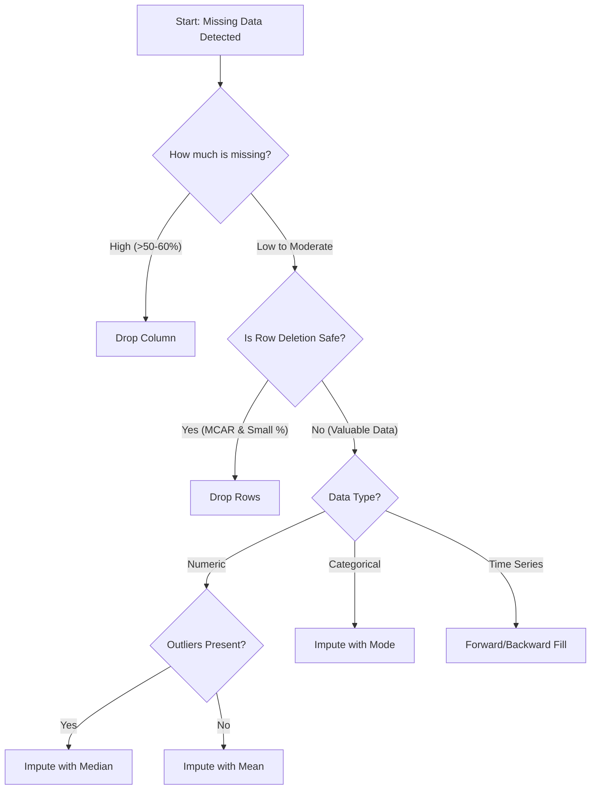

# 1. Missing Data Handling

## Overview
Missing data is one of the most pervasive issues in real-world datasets. It occurs when no data value is stored for the variable in an observation. Ignoring missing data can lead to crashed models, while mishandling it can introduce **bias** and invalid conclusions.

### Common Causes
*   **Data Entry Errors:** Manual mistakes or typos.
*   **Sensor Failures:** Equipment malfunction during data collection.
*   **Non-response:** Users refusing to answer sensitive survey questions (e.g., income).
*   **Corrupted Files:** Data loss during transfer.

---

## 1. Types of Missing Data
Understanding *why* data is missing is the most critical step before fixing it. The strategy changes based on the mechanism of "missingness."

### A. Missing Completely at Random (MCAR)
*   **Definition:** The probability of being missing is effectively random. There is **no relationship** between the missing value and any other variable in the dataset, nor the value itself.
*   **Example:** A survey sheet is lost in the mail. It could have belonged to a rich person, a poor person, young, or old. The loss is random.
*   **Implication:** You can generally drop these rows without introducing bias (though you lose data volume).

### B. Missing at Random (MAR)
*   **Definition:** The missingness is related to **other observed variables**, but not the missing value itself.
*   **Example:** Younger people are more likely to skip a question about "Income."
    *   We know *Age* influences the missingness.
    *   However, within the group of young people, the missingness is not related to how much they actually earn.
*   **Implication:** Deleting these rows *will* introduce bias (e.g., your model will under-represent young people). You should usually impute (fill) these values based on the related variables.

### C. Missing Not at Random (MNAR)
*   **Definition:** The missingness is related to the **value itself**. This is the most dangerous type.
*   **Example:** People with extremely high incomes choose not to reveal their income because of privacy concerns.
*   **Implication:** The missing data is systematically different from the observed data. Imputation is difficult; advanced modeling or domain knowledge is required.

---

## 2. Detecting Missing Values
Before fixing, you must quantify the problem using Python libraries like `pandas` and `seaborn`.

### Key Commands

| Command | Description | Tip |
| :--- | :--- | :--- |
| `df.isnull()` | Returns a Boolean mask (True where missing). | computationally expensive to print the whole thing. |
| `df.isnull().sum()` | Counts missing values per column. | **Best first step.** Look for columns with >50% missing. |
| `sns.heatmap(df.isnull())` | Visualizes the locations of missing data. | Great for seeing patterns (e.g., blocks of missing rows). |
| `df[df.isnull().any(axis=1)]` | Filters and shows only rows with at least one missing value. | Use to inspect specific problem rows. |

> [!TIP] **Percentage Check**
> Instead of just raw counts, check the percentage of missing data. This helps decide between dropping and imputing.
> ```python
> # Calculate percentage
> missing_percent = (df.isnull().sum() / len(df)) * 100
> ```

---

## 3. Strategies for Handling Missing Data



### Strategy 1: Deletion (Dropping)
*   **Drop Rows:** `df.dropna()`
    *   Use when missing data is MCAR and constitutes a tiny percentage (< 5%) of the dataset.
*   **Drop Columns:** `df.drop(columns=['col_name'])`
    *   Use when a specific feature has an overwhelming amount of missing data (e.g., > 60%) and provides little information.

### Strategy 2: Simple Imputation (Filling)
Filling gaps with a statistical estimate.

*   **Mean:** Good for normally distributed numeric data. **Sensitive to outliers.**
*   **Median:** Best for skewed numeric data or data with outliers.
*   **Mode:** The most frequent value. **Required for categorical data** (you cannot calculate the mean of "Red", "Blue", "Green").
*   **Constant:** Filling with "Unknown" or 0. Useful if "missing" actually means "doesn't possess this feature" (e.g., House has no garage -> GarageArea = 0).

### Strategy 3: Time-Series Imputation
If data is ordered by time (e.g., stock prices, weather), "mean" implies looking into the future, which is wrong.

*   **Forward Fill (`ffill`):** Propagate the last valid observation forward. "If it was 20 degrees yesterday, assume it is 20 degrees today until told otherwise."
*   **Backward Fill (`bfill`):** Use the next valid observation to fill a gap.

### Strategy 4: Advanced Imputation (KNN)
Uses **K-Nearest Neighbors**.
1.  Finds `k` rows that are most similar to the row with missing data (based on other columns).
2.  Averages the values of those neighbors to fill the gap.
*   **Pros:** More accurate than simple mean/median.
*   **Cons:** Computationally expensive for large datasets.

### Python Implementation Example
```python
# Simple Imputation
df['Age'] = df['Age'].fillna(df['Age'].mean())      # Numeric
df['City'] = df['City'].fillna(df['City'].mode()[0]) # Categorical

# KNN Imputation (sklearn)
from sklearn.impute import KNNImputer
imputer = KNNImputer(n_neighbors=2)
df[['Age', 'Income']] = imputer.fit_transform(df[['Age', 'Income']])
```
```
