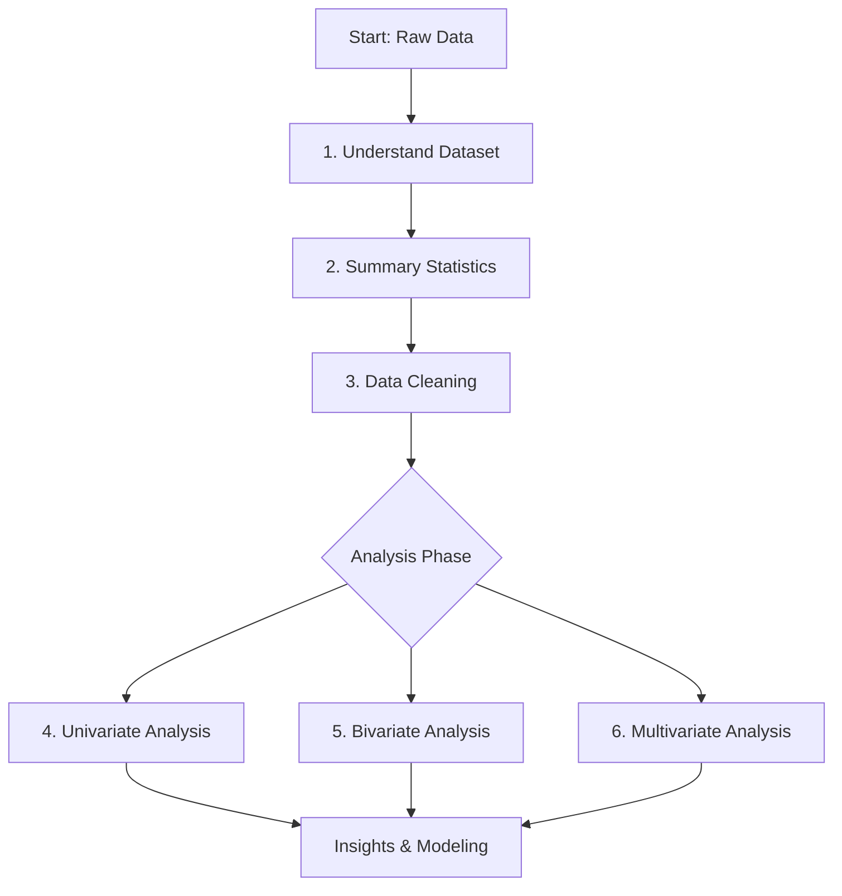

# 1. Introduction to Exploratory Data Analysis (EDA)

## Definition
**Exploratory Data Analysis (EDA)** is the critical initial step in the data science pipeline where a dataset is examined in depth before any formal modeling, hypothesis testing, or machine learning takes place.

Think of EDA as "interviewing" the data. You are asking questions to understand its personality, its flaws, and its hidden stories.

### The Main Purpose
1.  **Understand Structure:** What does the data look like? (Rows, columns, data types).
2.  **Identify Characteristics:** What are the averages? The spread? The distributions?
3.  **Reveal Insights:** Find patterns that dictate how you should clean the data and which models you should choose.

---

## The EDA Checklist
When starting a new project, follow this mental checklist to ensure no stone is left unturned:

1.  **Understand the Dataset:** Load data, check dimensions, data types, and understand what each column represents (Data Dictionary).
2.  **Summary Statistics:** Calculate central tendencies (mean, median) and dispersion (standard deviation) to get a mathematical feel for the data.
3.  **Data Cleaning:** The most time-consuming part. Handle missing values, remove duplicates, and fix incorrect data types.
4.  **Univariate Analysis:** Look at variables one by one (distribution, outliers).
5.  **Bivariate Analysis:** Look at the relationship between two variables (correlations, associations).
6.  **Multivariate Analysis:** Look at interactions between three or more variables.

---

## Setting up the Environment
To perform EDA effectively in Python, we rely on a standard stack of data science libraries.

### Key Libraries
*   **Pandas (`pd`):** The backbone of data manipulation. Used for DataFrames.
*   **NumPy (`np`):** Used for numerical operations and array handling.
*   **Matplotlib (`plt`):** The foundational plotting library.
*   **Seaborn (`sns`):** Built on top of Matplotlib, it makes statistical graphics beautiful and easier to write.

### Code Implementation
It is best practice to set visualization styles early to ensure consistency across your notebook.

```python
import pandas as pd
import numpy as np
import matplotlib.pyplot as plt
import seaborn as sns

# Set visualization style for cleaner plots
sns.set(style="whitegrid")

# Configuration to adjust figure size globally (optional but recommended)
plt.rcParams['figure.figsize'] = (10, 6)
```

> [!TIP] **Why `whitegrid`?**
> Using `sns.set(style="whitegrid")` adds horizontal grid lines to your plots. This makes it much easier to estimate values on the Y-axis visually without having to hover over data points.

---

## The EDA Workflow Diagram

