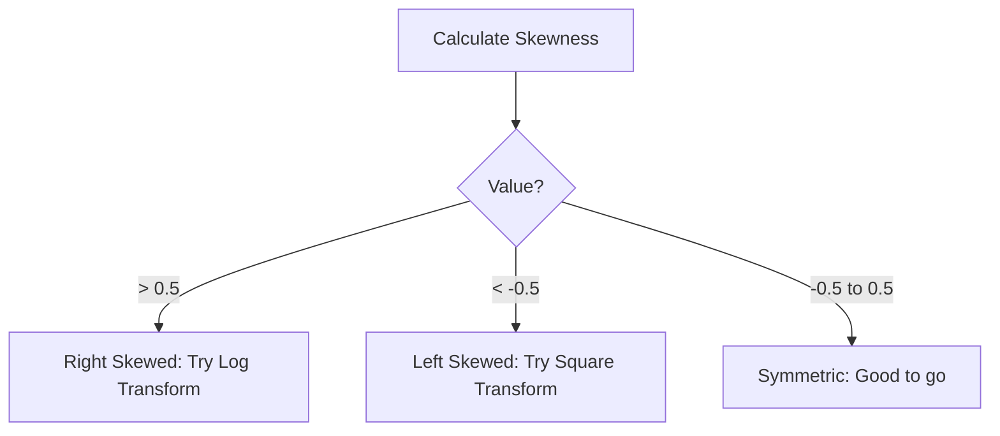

# 4. Statistical Metrics and Distribution

Summary statistics provide a "high-level" mathematical description of your data.

## The `describe()` Method
This is the Swiss Army knife of numerical analysis.

```python
df.describe()
```

**Key Outputs Explanation:**
*   **Count:** Data availability.
*   **Mean:** The average. Highly sensitive to outliers.
*   **Std (Standard Deviation):** Average distance from the mean. High std = data is spread out; Low std = data is clustered.
*   **Min/Max:** The range of the data.
*   **25%, 50% (Median), 75%:** Quartiles. The Median is robust against outliers.

---

## Skewness and Kurtosis
These two metrics define the **shape** of your distribution. They are critical for validating assumptions in statistical models (like Linear Regression, which assumes normality).

### 1. Skewness
Measures the **asymmetry** of the distribution.

| Value Range | Type | Description | Visualization | Action |
| :--- | :--- | :--- | :--- | :--- |
| $\approx 0$ | **Symmetric** | Normal distribution (Bell curve). | Center peak. | No action needed. |
| $> 0$ | **Right-Skewed** | Positive skew. The tail drags to the right. | Mean > Median. | Log transform, Square Root transform. |
| $< 0$ | **Left-Skewed** | Negative skew. The tail drags to the left. | Mean < Median. | Exponential transform, Power transform. |

**Fisher's Definition:** A value between -0.5 and 0.5 is generally considered symmetric.

### 2. Kurtosis
Measures the **tailedness** (outliers) of the distribution compared to a normal distribution.

| Value | Type | Description | Implication |
| :--- | :--- | :--- | :--- |
| $\approx 0$ | **Mesokurtic** | Similar to Normal Distribution. | Standard behavior. |
| $> 0$ | **Leptokurtic** | "Skinny" peak, heavy/fat tails. | **More outliers than normal.** High risk of extreme events. |
| $< 0$ | **Platykurtic** | "Flat" peak, light/thin tails. | **Fewer outliers than normal.** Data is very uniform. |

### Code Implementation
You need `scipy` for accurate calculation.
```python
from scipy.stats import skew, kurtosis

# Calculate for a specific column
s = skew(df['sepal_length'])
k = kurtosis(df['sepal_length'])

print(f"Skewness: {s}, Kurtosis: {k}")
```

> [!TIP] **Interpretation Tip**
> If you have **High Kurtosis (> 1)**, your model might struggle with the extreme outliers. You should investigate those data points—are they errors or genuine anomalies?


```
