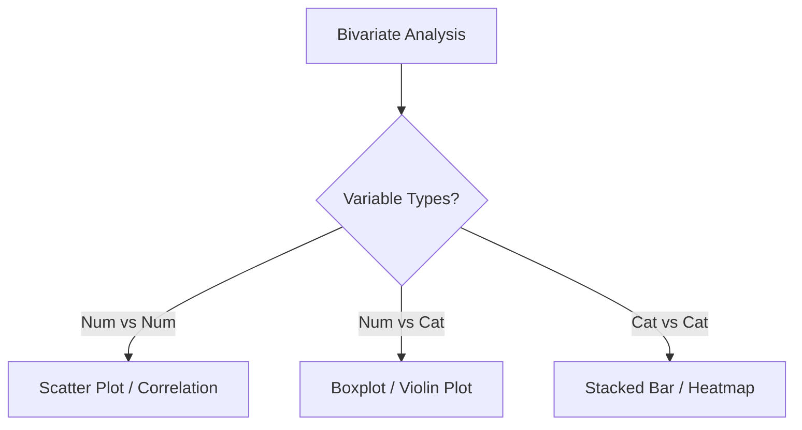

# 6. Bivariate Analysis

**Bivariate Analysis** explores the relationship between **two variables**. This helps reveal associations, trends, and potential predictive power.

## 1. Numerical vs. Numerical
Does one number increase when the other increases?

### Scatter Plot
The most direct way to visualize the relationship.
```python
sns.scatterplot(x='sepal_length', y='sepal_width', hue='species', data=df)
```
*   **Hue:** Adding a categorical variable as color (`hue='species'`) technically makes this multivariate, but is standard practice in scatter plots to see clusters.

### Correlation (Pearson)
Measures the strength of the **linear** relationship.

*   **Formula:** $r = \frac{Cov(X,Y)}{\sigma_X \sigma_Y}$
*   **Range:** -1 to +1.
    *   **+1:** Perfect positive linear relationship.
    *   **-1:** Perfect negative linear relationship.
    *   **0:** No linear relationship.

**Correlation Types:**
1.  **Pearson:** Default. Checks for linearity.
2.  **Spearman:** Checks for monotonic relationships (based on rank). Use this if your data is non-linear or has outliers.
3.  **Kendall:** Used for small datasets or ordinal data.

---

## 2. Numerical vs. Categorical
How does a number distribution change across different groups?

### Boxplot (Grouped)
Compares the spread and median of a value across categories.
```python
sns.boxplot(x='species', y='sepal_length', data=df)
```
*   *Insight:* "Are Virginica flowers significantly longer than Setosa flowers?"

### Violin Plot
Combines a Boxplot with a KDE (Kernel Density Estimate).
*   *Advantage:* Shows the density shape (is it bimodal?) which a boxplot hides.
```python
sns.violinplot(x='species', y='petal_length', data=df)
```

---

## 3. Categorical vs. Categorical
Is there an association between two text columns?

### Cross-Tabulation (Crosstab)
Creates a frequency table.
```python
ct = pd.crosstab(df['category_1'], df['category_2'])
```

### Stacked Bar Chart
Visualizes the Crosstab.
```python
ct.plot(kind='bar', stacked=True)
```

### Heatmap
Visualizes the Crosstab with color intensity.
```python
sns.heatmap(ct, annot=True, cmap='Blues')
```

---

## Decision Tree: Which Plot to Use?


