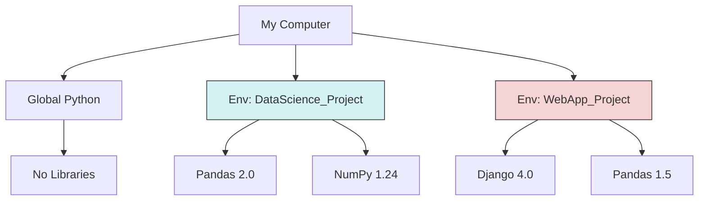

# 1. Python Architecture & Environment

## 1.1. The Nature of Python
Python is a **high-level, interpreted, general-purpose** programming language. To master it, you must understand how it works under the hood.

### Interpreted vs. Compiled
Unlike C++ or Java, which are **compiled** (translated entirely into machine code before running), Python is **interpreted**.

*   **The Process:** When you run a script, the Python Interpreter reads the code line-by-line, converts it into "Bytecode" (intermediate instructions), and then executes it.
*   **Implication:**
    *   *Pros:* Rapid development (no compile wait time), highly dynamic, cross-platform.
    *   *Cons:* Generally slower execution speed than C++.
    *   *The Fix:* Libraries like **NumPy** are written in C, allowing Python to call C-speed code while keeping the Python syntax simple.

### Dynamic Typing
You do not need to declare variable types (e.g., `int x = 5`). Python infers the type at runtime.
*   **Duck Typing:** "If it walks like a duck and quacks like a duck, it's a duck." Python cares about what an object *can do* (its methods), not strictly what it *is*.

## 1.2. The Environment: Virtual Environments
> [!DANGER] **The Dependency Hell**
> One of the biggest mistakes beginners make is installing every library into their global Python installation.
> *   *Scenario:* Project A needs `pandas v1.0`. Project B needs `pandas v2.0`.
> *   *Result:* If you only have one environment, one project will break.

### What is a Virtual Environment?
A self-contained directory tree that contains a specific Python installation and a specific set of libraries.



### Setup Workflow (The Professional Way)

1.  **Create:**
    ```bash
    # Standard Python
    python -m venv myenv
    
    # OR using Conda (Preferred for Data Science)
    conda create -n myenv python=3.10
    ```
2.  **Activate:**
    *   Windows: `myenv\Scripts\activate`
    *   Mac/Linux: `source myenv/bin/activate`
    *   Conda: `conda activate myenv`
3.  **Install:**
    ```bash
    pip install pandas
    ```
4.  **Freeze (Share):**
    To ensure others use the exact same versions:
    ```bash
    pip freeze > requirements.txt
    ```

## 1.3. Version Control (Git)
Git is the industry standard for saving your work history.

*   **Repository (Repo):** The folder being tracked.
*   **Commit:** A snapshot of your code at a specific point in time.
*   **Branch:** A parallel version of your code (e.g., "experiment-1") so you don't break the main code.

> [!TIP] **The `.gitignore` File**
> You must create a file named `.gitignore` in your root folder. Inside, list files you **never** want to upload to GitHub:
> *   `env/` (Your virtual environment is huge and OS-specific; others recreate it using `requirements.txt`)
> *   `data/` (Large datasets should not be in Git)
> *   `__pycache__/` (Compiled Python bytecode)

```
