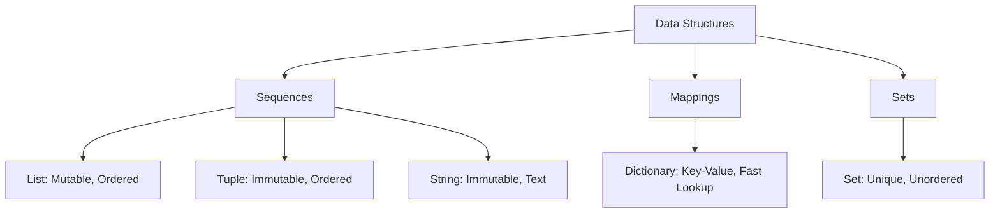

# 2. Core Data Structures

Python's power lies in its built-in data structures. Understanding the difference between Mutable and Immutable types is critical for memory management and avoiding bugs.

## 2.1. Mutable vs. Immutable

| Type | Definition | Examples | Implication |
| :--- | :--- | :--- | :--- |
| **Mutable** | Can be changed after creation. | List, Dictionary, Set | Passed by *reference*. Modifying it inside a function changes the original. |
| **Immutable** | Cannot be changed after creation. | Integer, String, Tuple | Passed by *value*. Modifying creates a *new* copy. |

## 2.2. Lists (`[]`)
Ordered, mutable sequences.
*   **Best for:** Storing a collection of items that might change.
*   **Performance:** Slicing is fast `O(k)`, but inserting in the middle is slow `O(n)`.

```python
# Slicing Syntax: [start : stop : step]
# Stop is EXCLUSIVE (does not include the index)
numbers = [0, 1, 2, 3, 4, 5]
print(numbers[1:4])   # [1, 2, 3]
print(numbers[::-1])  # [5, 4, 3, 2, 1, 0] (Reverse trick)
```

## 2.3. Tuples (`()`)
Ordered, **immutable** sequences.
*   **Best for:** Fixed data (coordinates, database records, configuration).
*   **Why use them?** They are faster than lists and serve as "write-protected" data.

```python
point = (10, 20)
# point[0] = 5  <-- ERROR: TypeError (Item assignment not supported)
```

## 2.4. Dictionaries (`{key: value}`)
Unordered Key-Value pairs. Keys must be **unique** and **immutable**.
*   **Best for:** Fast lookups (Hash Map). Searching a dictionary is `O(1)` (instant), whereas searching a list is `O(n)` (scan everything).

```python
data = {"name": "Alice", "age": 25}

# Safe Access (Prevents crashing if key is missing)
email = data.get("email", "No Email Found") 
```

## 2.5. Sets (`{}`)
Unordered collections of **unique** elements.
*   **Best for:** Removing duplicates and mathematical operations (Union, Intersection).

```python
ids = [1, 2, 2, 3, 4, 4]
unique_ids = list(set(ids)) # [1, 2, 3, 4]

# Set Math
a = {1, 2, 3}
b = {3, 4, 5}
print(a & b) # Intersection: {3}
print(a - b) # Difference: {1, 2}
```

## 2.6. Summary Diagram


```
