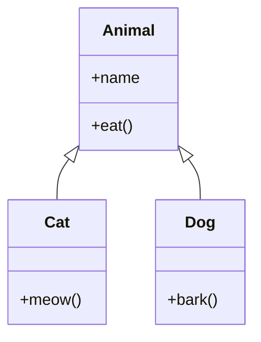

# 4. Object-Oriented Programming (OOP)

OOP allows you to structure code by bundling related data and behavior into "Classes." This is essential for building scalable applications and is used heavily in libraries like Sklearn and PyTorch.

## 4.1. The Blueprint Concept
*   **Class:** The blueprint (e.g., `Car`). Defines what data it has and what it can do.
*   **Object (Instance):** The actual thing built from the blueprint (e.g., `Toyota Camry`).

## 4.2. Anatomy of a Class

```python
class Student:
    # Class Attribute (Shared by ALL students)
    school = "Algiers Univ"

    # Constructor (__init__)
    # Initializes the specific instance
    def __init__(self, name, age):
        self.name = name  # Instance Attribute (Unique to this student)
        self.age = age

    # Method (Behavior)
    def introduce(self):
        # 'self' allows the code to know WHICH student is talking
        return f"I am {self.name}, age {self.age}"

# Creating Objects
s1 = Student("Amine", 22)
s2 = Student("Sara", 20)
```

> [!NOTE] **What is `self`?**
> `self` represents the **current instance** of the class. When you call `s1.introduce()`, Python actually runs `Student.introduce(s1)`. `self` is how the function knows to use "Amine" and not "Sara".

## 4.3. Magic Methods (Dunder Methods)
Methods with double underscores `__` that define how objects behave with Python operators.

*   `__init__`: Constructor.
*   `__str__`: User-friendly string representation (used by `print()`).
*   `__repr__`: Developer-friendly representation (used in debugging lists).
*   `__add__`: Defines behavior for `+`.

## 4.4. Inheritance
Allows a child class to inherit attributes and methods from a parent class. Promotes code reuse.


```
