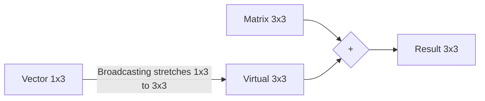

# 2.5. Mathematics, Aggregation, and Broadcasting

## 1. Aggregation and The Axis Concept

Functions like `sum`, `mean`, and `std` reduce the dimensions of an array. The `axis` parameter controls *how* it collapses.

* **`axis=0`**: Actions performed **down the columns** (collapses rows).
  * *Use Case:* "Average grade per module".
* **`axis=1`**: Actions performed **across the rows** (collapses columns).
  * *Use Case:* "Average grade per student".

## 2. `np.maximum` vs `np.max`

This is a common quiz question:
* **`np.max(arr)`**: Looks inside ONE array and finds the single largest value.
* **`np.maximum(arr1, arr2)`**: Compares TWO arrays **element-wise**. It compares `arr1[0]` vs `arr2[0]` and picks the larger, then moves to index 1, etc.

## 3. Statistics
* **`np.mean()`, `np.median()`, `np.sum()`**
* **`np.var()`**: Variance.
* **`np.std()`**: Standard Deviation.
* **`np.percentile(arr, q)`**: Calculates the q-th percentile (e.g., 50 = Median, [25, 75] = Quartiles).

## 4. Broadcasting (Matching shapes)

Broadcasting is the rule set NumPy uses to perform math on arrays with **different shapes**.

**The Rule:** Dimensions are compatible if:
1. They are equal, OR
2. One of them is **1**.

NumPy "stretches" the dimension of size 1 to match the other.

* **(3, 3) + (1, 3)** $\rightarrow$ **Valid** (Row is stretched 3 times).
* **(3, 3) + (3, 1)** $\rightarrow$ **Valid** (Column is stretched 3 times).
* **(3, 3) + (1, 2)** $\rightarrow$ **Error** (Shapes do not align, and no 1s match the 2).

