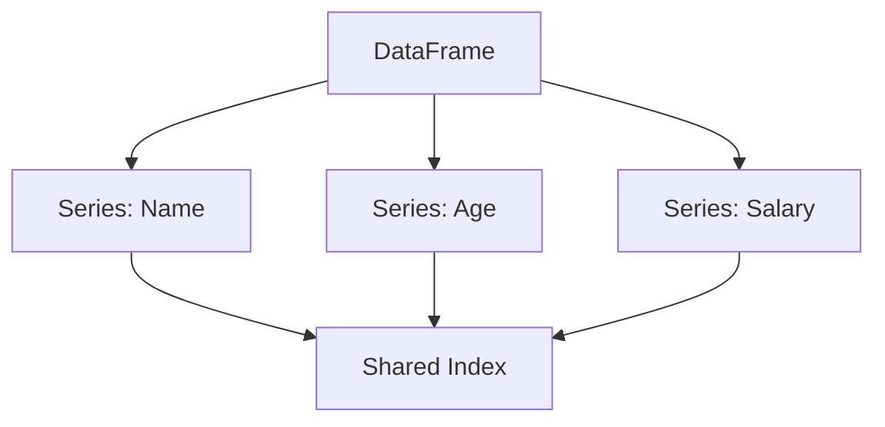

# 3.1. Pandas Foundations and I/O

**Pandas** (Panel Data) is the standard library for working with structured (tabular) data in Python. Unlike NumPy, which is for mathematical matrices, Pandas handles real-world data where columns have names and contain different data types (strings, integers, dates).

## 1. Core Data Structures

### A. The Series (1D)
Think of a Series as a **single column** of data, but with superpowers. It is built on top of a NumPy array but has an explicit **Index** (labels).

```python
import pandas as pd
# Creating a Series
s = pd.Series([10, 20, 30], index=['a', 'b', 'c'])
print(s['a']) # Returns 10
```

*   **Data:** The actual values (homogeneous type).
*   **Index:** The labels used to access the data (can be integers, strings, or dates).

### B. The DataFrame (2D)
A table of data. It is essentially a collection of **Series** objects that share the same **Index**.



## 2. Reading Data (Input)

Getting data into Pandas is the first step. The `read_csv` function is the most common entry point, but it has critical parameters you must know.

```python
df = pd.read_csv(
    'data.csv',
    index_col='ID',      # 1. Use 'ID' column as the row labels
    parse_dates=['Date'] # 2. Convert 'Date' column to datetime objects immediately
)
```

> [!TIP] **Critical Parameters**
> *   `index_col`: If you don't set this, Pandas creates a default index (0, 1, 2...). If your data has a unique ID, use it here.
> *   `parse_dates`: If you skip this, dates load as **Strings** (`object`). You won't be able to extract years/months later without converting them.
> *   `header`: Which row contains column names (default is 0).

## 3. Writing Data (Output)

```python
df.to_csv('cleaned_data.csv', index=False)
```

> [!DANGER] **The `index=False` Trap**
> By default (`index=True`), Pandas saves the row numbers (0, 1, 2...) as a new column in your CSV.
> If you save and reload the file 3 times, you will end up with columns like `Unnamed: 0`, `Unnamed: 0.1`, etc.
> **Always set `index=False`** unless the index contains meaningful data (like a User ID or Date).

## 4. Other Formats
*   **Excel:** `pd.read_excel('file.xlsx')` (Requires `openpyxl` library).
*   **JSON:** `pd.read_json('file.json')` (Common for web APIs).
*   **Pickle:** `df.to_pickle('data.pkl')` (Binary format. Extremely fast, preserves exact data types, but not human-readable).
```
