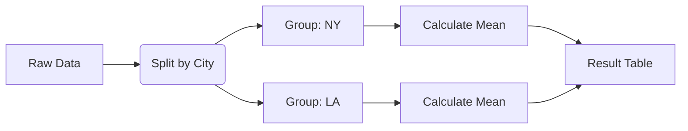

# 3.5. Grouping and Aggregation

## 1. The Split-Apply-Combine Strategy
The `groupby` function is the most powerful analysis tool. It breaks data into buckets, calculates stats, and reassembles it.



```python
# Basic Syntax
df.groupby('Category')['Sales'].mean()

# Multiple Aggregations
df.groupby('Category').agg({
    'Sales': ['sum', 'mean'],
    'Profit': 'max'
})
```

## 2. Advanced Selectors
*   **`df.max()`**: Returns the highest **value**.
*   **`df.idxmax()`**: Returns the **Index Label** associated with the highest value.
    *   *Example:* If you want to know **which month** had the highest sales, use `idxmax()`. If you want to know **what** that sales number was, use `max()`.

## 3. Transformation (`apply` vs `map`)

| Method | Scope | Use Case |
| :--- | :--- | :--- |
| **`map()`** | Series | Dictionary mapping (e.g., Male -> 0, Female -> 1). |
| **`apply()`** | Series/DF | Applying complex custom functions. |
| **`applymap()`** | DataFrame | Applying a function to every single cell element-wise. |

## 4. Pivot Tables
Spreadsheet-style summary.
```python
pt = df.pivot_table(
    index='Month', 
    columns='Product', 
    values='Sales', 
    aggfunc='sum' # What to do if multiple sales exist for same Month/Product
)
```
```
