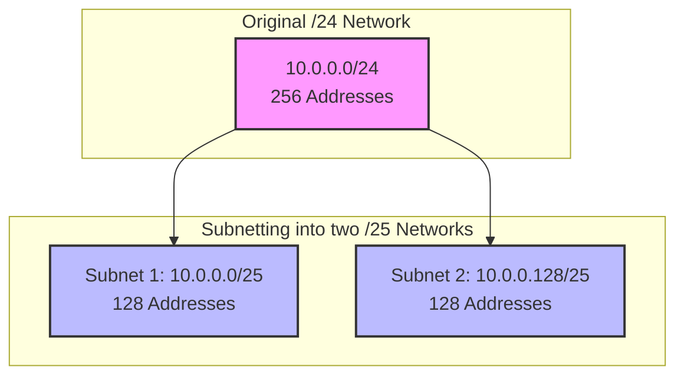
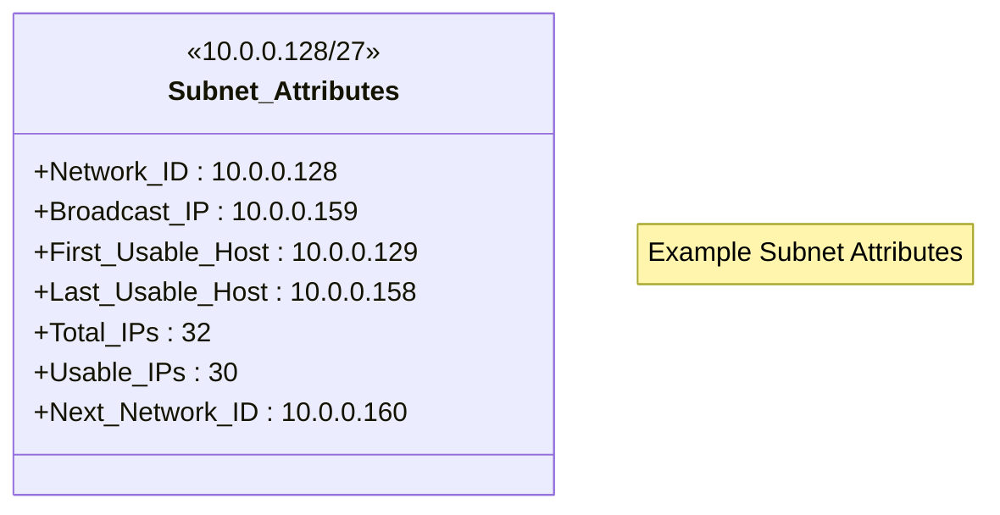

# 2.1. What is Subnetting

## 1. Introduction: The Core Concept

At its heart, **subnetting** is the process of taking one large network and logically dividing it into multiple smaller, more manageable networks called **sub-networks** or **subnets**.

Imagine you have a large block of 256 IP addresses, for example, `10.0.0.0` through `10.0.0.255`. In networking terms, this block is often referred to as `10.0.0.0/24`.

Subnetting is like taking this single large block and slicing it into smaller pieces. You could slice it into:

- Two medium-sized blocks of 128 addresses each.
- Four smaller blocks of 64 addresses each.
- Eight even smaller blocks of 32 addresses each.
- Or even a mix of different sizes.

This division allows for better network organization, improved security, and more efficient use of IP addresses.

---

## 2. The 7 Key Attributes of a Subnet

Every subnetting problem you will ever encounter requires you to solve for one or more of seven key pieces of information about a given subnet. Understanding these attributes is the foundation of mastering subnetting.

1.  **Network ID (Network Address)**
2.  **Broadcast IP (Broadcast Address)**
3.  **First Usable Host IP**
4.  **Last Usable Host IP**
5.  **Next Network ID**
6.  **Subnet Mask & CIDR Notation**
7.  **Number of IP Addresses (Total and Usable)**

---

## 3. Detailed Explanation of Each Attribute

Let's use the subnet `10.0.0.128/27` as our example. This subnet contains 32 total IP addresses, from `10.0.0.128` to `10.0.0.159`.

#### 1. Network ID

The **Network ID** is the very first IP address in a subnet. It's used to identify the subnet itself.

- **It is not a usable IP address** and cannot be assigned to a device (like a computer or a phone).
- For our example subnet `10.0.0.128/27`, the Network ID is `10.0.0.128`.

#### 2. Broadcast IP

The **Broadcast IP** is the very last IP address in a subnet. It has a special purpose: any data sent to this address is delivered to _every single device_ within that subnet.

- **It is also not a usable IP address** and cannot be assigned to a single device.
- For our example, the Broadcast IP is `10.0.0.159`.

> ** reminder: The Two Reserved Addresses**
> In any given subnet, two addresses are always reserved and can't be assigned to individual hosts: the first address (Network ID) and the last address (Broadcast IP).

#### 3. First Usable Host IP

This is the first IP address in the subnet that can be assigned to a device.

- It is always **one higher than the Network ID**.
- Formula: `First Host IP = Network ID + 1`
- For our example, the First Host IP is `10.0.0.129` (`128 + 1`).

#### 4. Last Usable Host IP

This is the last IP address in the subnet that can be assigned to a device.

- It is always **one lower than the Broadcast IP**.
- Formula: `Last Host IP = Broadcast IP - 1`
- For our example, the Last Host IP is `10.0.0.158` (`159 - 1`).

The range between the first and last host IP is called the **usable host range**.

#### 5. Number of IP Addresses

This attribute has two parts:

- **Total Addresses:** The total count of all IPs in the block, including the reserved ones. For a `/27` network, this is 32.
- **Usable Addresses:** The number of IPs that can actually be assigned to devices.
- Formula: `Usable Addresses = Total Addresses - 2`
- For our example, there are `32 - 2 = 30` usable addresses.

#### 6. Subnet Mask & CIDR Notation

The **Subnet Mask** and its shorthand, **CIDR (Classless Inter-Domain Routing) notation**, define the size of the subnet. They specify which part of an IP address identifies the network and which part identifies the host.

- **Subnet Mask:** A 32-bit number that looks like an IP address (e.g., `255.255.255.224`).
- **CIDR Notation:** A slash followed by a number (e.g., `/27`) representing the number of `1`s in the subnet mask's binary form.
- For our example, the CIDR is `/27`, which corresponds to the subnet mask `255.255.255.224`.

> [!NOTE] The Network ID alone is not enough!
> An address like `10.0.0.0` could refer to a huge network (`/24`) or a tiny one (`/29`). You **must** pair the Network ID with a mask or CIDR to uniquely identify a specific subnet.

#### 7. Next Network ID

This is the Network ID of the very next consecutive subnet. This attribute is extremely useful for planning IP address allocation, especially with Variable-Length Subnet Masking (VLSM).

- It is always **one higher than the Broadcast IP** of the current subnet.
- Formula: `Next Network = Broadcast IP + 1`
- For our `/27` subnet (which ends at `.159`), the Next Network ID is `10.0.0.160`.

#### Visualizing the Attributes

---

## 4. Summary

In the upcoming notes, you will learn a simple and fast method using a "cheat sheet" to derive all seven of these attributes for any given IP address and subnet mask in under 60 seconds. Mastering these seven concepts is the first step toward becoming a subnetting pro.
