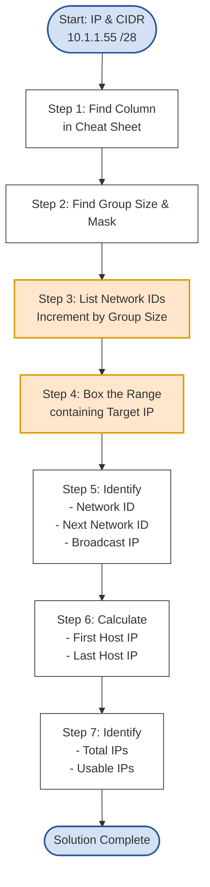

# 2.3. Solving Subnetting Problems

## 1. Introduction

With the cheat sheet created, we can now outline the simple, repeatable process to solve for all seven subnetting attributes for any given IP address and mask. This method is designed to be fast, efficient, and eliminate the need for manual binary conversions.

We will walk through the process with a concrete example.

**Problem:** Find all seven attributes for the IP address `10.1.1.55 /28`.

---

## 2. The 7-Step Process

Here is a visual overview of the steps we will take. The core of the process revolves around finding the "Group Size" and using it to list the network boundaries.

### Step 1 & 2: Use the Cheat Sheet to Find Your Column, Group Size, and Mask

First, locate the column in your cheat sheet that corresponds to the given CIDR notation.

- **Problem:** `/28`
- **Cheat Sheet Column:**

| 16  |
| :-: |
| 240 |
| /28 |

From this column, we immediately get three key attributes:

- **Group Size:** 16
- **Subnet Mask:** The interesting octet is `240`, so the full mask is `255.255.255.240`.
- **Total Number of IPs:** This is the same as the Group Size, which is `16`. (The number of usable IPs is `16 - 2 = 14`).

### Step 3: List Network IDs by Incrementing by the Group Size

This is the most critical step. The "Group Size" is your magic number. You will list out the network IDs for the subnet by starting at `0` and repeatedly adding the group size.

- **Group Size:** 16
- **Target IP's last octet:** 55
- **Action:** List multiples of 16 until you **pass** the target IP's value.

`0, 16, 32, 48, 64`

We stopped at `64` because it's the first multiple of 16 that is greater than `55`.

> [!TIP] It is crucial that you go one step _past_ your target IP. This last number is your "Next Network ID," which you need to find the broadcast address.

### Step 4: Box the Range

Your target IP (`.55`) lives in the "bucket" or range between two of the network IDs you just listed.

`... 32,` **`48`**`, [our IP .55 lives here],` **`64`** `, ...`

This tells us everything we need to know.

### Step 5: Identify Network ID, Next Network, and Broadcast IP

From the "boxed" range, we can directly identify three more attributes.

- **Network ID:** The number on the left side of the box.
  - **Full Network ID:** `10.1.1.48`
- **Next Network ID:** The number on the right side of the box.
  - **Full Next Network ID:** `10.1.1.64`
- **Broadcast IP:** This is always one less than the Next Network ID.
  - **Broadcast IP:** `10.1.1.63` (`.64 - 1`)

### Step 6: Calculate First and Last Host IPs

These are derived directly from the Network ID and Broadcast IP.

- **First Host IP:** Network ID + 1
  - `10.1.1.48 + 1` = `10.1.1.49`
- **Last Host IP:** Broadcast IP - 1
  - `10.1.1.63 - 1` = `10.1.1.62`

### Step 7: Finalize the Number of IPs

We already found this in Step 2, but we'll list it here to complete the set.

- **Total IPs:** 16 (from the Group Size)
- **Usable IPs:** 14 (`16 - 2`)

---

## 3. Solution Summary for 10.1.1.55 /28

- **Network ID:** `10.1.1.48`
- **Broadcast IP:** `10.1.1.63`
- **First Host IP:** `10.1.1.49`
- **Last Host IP:** `10.1.1.62`
- **Next Network:** `10.1.1.64`
- **Subnet Mask:** `255.255.255.240`
- **Total / Usable IPs:** `16 / 14`

---

## 4. Second Example: 10.1.1.37 /29

Let's run through the process one more time, a bit faster.

1.  **CIDR:** `/29`
2.  **Cheat Sheet:** This gives us a **Group Size of 8** and a mask of `255.255.255.248`.
3.  **List Network IDs (increments of 8) until we pass 37:**
    `0, 8, 16, 24, 32, 40`
4.  **Box the Range:** Our IP `.37` lives between `32` and `40`.
5.  **Identify IDs:**
    - Network ID: `10.1.1.32`
    - Next Network: `10.1.1.40`
    - Broadcast IP: `10.1.1.39` (`.40 - 1`)
6.  **Calculate Host IPs:**
    - First Host IP: `10.1.1.33` (`.32 + 1`)
    - Last Host IP: `10.1.1.38` (`.39 - 1`)
7.  **Number of IPs:**
    - Total: 8 (from Group Size)
    - Usable: 6 (`8 - 2`)

This systematic process works for any subnetting problem in the fourth octet. With practice, you'll be able to perform these steps mentally in seconds.
