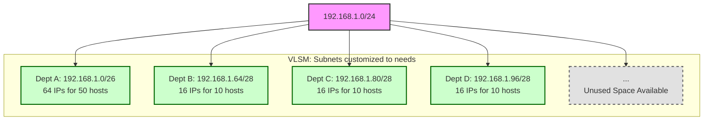

# 3.1. FLSM vs VLSM: An Overview

When designing an IP addressing scheme, there are two primary methods for allocating subnets: Fixed-Length Subnet Masking (FLSM) and Variable-Length Subnet Masking (VLSM). Understanding the difference is crucial for efficient network design.

---

## 1. Fixed-Length Subnet Mask (FLSM)

**FLSM is the older, more rigid method of subnetting.** The core principle of FLSM is that when you divide a larger network block, **all the resulting subnets must be the exact same size**.

#### Example

Imagine you are given the network block `192.168.1.0/24` (256 addresses) and you need to create subnets for four different departments.

- With FLSM, you decide on one size that fits the largest department's needs and apply it to all.
- If your largest department needs 50 hosts, you would need a `/26` subnet (64 addresses).
- With FLSM, you must create four `/26` subnets, even if other departments only need 10 hosts.

```mermaid
graph TD
    %% Styling
    classDef root fill:#f9f,stroke:#333,stroke-width:2px;
    classDef waste fill:#ffcccc,stroke:#cc0000,stroke-width:2px;
    classDef okay fill:#ccffcc,stroke:#006600,stroke-width:2px;

    A[192.168.1.0/24]:::root --> B[Dept A: 192.168.1.0/26<br/>64 IPs for 50 hosts<br/>(Good Fit)]:::okay;
    A --> C[Dept B: 192.168.1.64/26<br/>64 IPs for 10 hosts<br/>(High Waste)]:::waste;
    A --> D[Dept C: 192.168.1.128/26<br/>64 IPs for 10 hosts<br/>(High Waste)]:::waste;
    A --> E[Dept D: 192.168.1.192/26<br/>64 IPs for 10 hosts<br/>(High Waste)]:::waste;

    subgraph "FLSM: All subnets fixed to /26"
        B; C; D; E;
    end
```

**Characteristics of FLSM:**

- **Simplicity:** Easy to plan and manage.
- **Wasteful:** Leads to significant waste of IP addresses, as small networks get oversized blocks.
- **Inflexible:** Cannot adapt to networks with varying size requirements.
- **Legacy:** Rarely used in modern network design due to its inefficiency. It was required by older routing protocols like RIPv1.

---

## 2. Variable-Length Subnet Mask (VLSM)

**VLSM is the modern, flexible method of subnetting.** The core principle of VLSM is that you can divide a network block into subnets of **different sizes**, tailored to the specific needs of each segment.

This is possible because modern routing protocols (like OSPF, EIGRP, RIPv2, BGP) transmit the subnet mask along with the network address in their updates, so routers can handle prefixes of varying lengths.

#### Example

Using the same `192.168.1.0/24` block and department requirements:

- **Department A (50 hosts):** Needs a `/26` (64 addresses). We allocate `192.168.1.0/26`.
- **Departments B, C, D (10 hosts each):** Each needs a `/28` (16 addresses). We can carve these smaller subnets out of the remaining address space.
  - Dept B: `192.168.1.64/28`
  - Dept C: `192.168.1.80/28`
  - Dept D: `192.168.1.96/28`



**Characteristics of VLSM:**

- **Efficiency:** Drastically reduces IP address waste by right-sizing subnets.
- **Flexibility:** Allows for hierarchical network design that can be easily summarized (supernetting).
- **Scalability:** Makes it easier to add new subnets of different sizes as the network grows.
- **Modern Standard:** VLSM is the standard for IP address planning in virtually all modern networks.

---

## 3. Key Differences Summarized

| Feature              | Fixed-Length Subnet Mask (FLSM)            | Variable-Length Subnet Mask (VLSM)                 |
| :------------------- | :----------------------------------------- | :------------------------------------------------- |
| **Subnet Size**      | All subnets are the same size.             | Subnets can be different sizes.                    |
| **Efficiency**       | Inefficient; high IP address waste.        | Highly efficient; minimizes waste.                 |
| **Flexibility**      | Rigid and inflexible.                      | Flexible and scalable.                             |
| **Routing Protocol** | Used by older, classful protocols (RIPv1). | Used by modern, classless protocols (OSPF, EIGRP). |
| **Modern Usage**     | Legacy concept, rarely used.               | The current industry standard.                     |

In the following notes, we will explore the specific techniques for solving problems related to both FLSM and, more importantly, VLSM.
