# 3.3. Variable-Length Subnet Mask (VLSM)

## 1. Introduction to VLSM

Variable-Length Subnet Mask (VLSM) is the modern standard for designing IP addressing schemes. Unlike the rigid FLSM method, VLSM allows you to subnet a network into pieces of **different sizes**, which dramatically improves efficiency and reduces wasted IP addresses.

The key to solving VLSM problems is a systematic allocation process. You are typically given:

- A large block of IP addresses to work with (e.g., `9.9.9.0/24`).
- A list of network segments with different host requirements (e.g., Sales needs 50 hosts, Engineering needs 10 hosts, etc.).

Your job is to assign the smallest possible subnet to each segment without any of the subnets overlapping.

---

## 2. The Two-Step VLSM Process

Solving any VLSM problem can be broken down into two main steps.

#### Step 1: Determine the Required Subnet Size for Each Segment

First, go through your list of requirements and determine the appropriate CIDR prefix for each network segment.

- **Rule:** Always choose the **smallest subnet** that can accommodate the required number of hosts.
- **Reminder:** The number of required hosts refers to **usable IPs**. You must account for the Network and Broadcast addresses.
  - Required IPs = Number of Hosts + 2

**Example Requirements:**

- Network A: Needs **25 hosts**.
  - `25 + 2 = 27` total IPs needed.
  - The smallest group size from the cheat sheet that fits 27 is `32`.
  - A group size of 32 corresponds to a `/27`.
- Network B: Needs **50 hosts**.
  - `50 + 2 = 52` total IPs needed.
  - Smallest group size is `64`.
  - Corresponds to a `/26`.
- Network C: Needs **10 hosts**.
  - `10 + 2 = 12` total IPs needed.
  - Smallest group size is `16`.
  - Corresponds to a `/28`.

#### Step 2: Allocate the Subnets from Largest to Smallest

This is the most critical part of the process to ensure efficient allocation and avoid fragmenting your address space.

- **Rule:** Always allocate the subnets starting with the **largest requirement first**, then the next largest, and so on, down to the smallest.
- **Method:** Use the "Next Network" attribute from our subnetting process to keep track of the available address space.

---

## 3. Worked Example: Solving a VLSM Problem

**Problem:** You have been given the address block `9.9.9.0/24` to subnet for the following requirements:

- Network A: 25 hosts
- Network B: 50 hosts
- Network C: 10 hosts
- Link 1 (Point-to-Point): 2 hosts
- Link 2 (Point-to-Point): 2 hosts

### Step 1: Determine Sizes

- Network B (50 hosts) -> requires `/26`
- Network A (25 hosts) -> requires `/27`
- Network C (10 hosts) -> requires `/28`
- Link 1 (2 hosts) -> requires `/30`
- Link 2 (2 hosts) -> requires `/30`

> [!NOTE] For point-to-point links (2 hosts), a `/30` is the standard answer for entry-level exams. A `/30` has 4 total IPs and 2 usable IPs. In modern networking, a `/31` (2 total, 2 usable IPs) is often used, but `/30` is the safer assumption unless specified.

### Step 2: Allocate from Largest to Smallest

**1. Allocate the largest subnet: Network B (`/26`)**

- Our available block starts at `9.9.9.0`.
- A `/26` has a group size of `64`.
- The first available `/26` is `9.9.9.0/26`.
- **Allocation for Network B:** `9.9.9.0/26`
- **Next Available IP:** The next network after `9.9.9.0/26` is `9.9.9.64`.

**2. Allocate the next largest: Network A (`/27`)**

- Our available block now starts at `9.9.9.64`.
- A `/27` has a group size of `32`.
- The first available `/27` is `9.9.9.64/27`.
- **Allocation for Network A:** `9.9.9.64/27`
- **Next Available IP:** The next network after `9.9.9.64/27` is `9.9.9.96` (`64 + 32`).

**3. Allocate the next largest: Network C (`/28`)**

- Our available block now starts at `9.9.9.96`.
- A `/28` has a group size of `16`.
- The first available `/28` is `9.9.9.96/28`.
- **Allocation for Network C:** `9.9.9.96/28`
- **Next Available IP:** `9.9.9.112` (`96 + 16`).

**4. Allocate the point-to-point links (`/30`)**

- Our available block starts at `9.9.9.112`.
- A `/30` has a group size of `4`.
- The first `/30` is `9.9.9.112/30`.
- **Allocation for Link 1:** `9.9.9.112/30`
- The next available IP is `9.9.9.116`.
- The second `/30` is `9.9.9.116/30`.
- **Allocation for Link 2:** `9.9.9.116/30`
- **Next Available IP:** `9.9.9.120`.

### Final Allocation Table

| Network   | Host Req. | Required CIDR | Allocated Subnet |
| :-------- | :-------: | :-----------: | :--------------- |
| Network B |    50     |      /26      | `9.9.9.0/26`     |
| Network A |    25     |      /27      | `9.9.9.64/27`    |
| Network C |    10     |      /28      | `9.9.9.96/28`    |
| Link 1    |     2     |      /30      | `9.9.9.112/30`   |
| Link 2    |     2     |      /30      | `9.9.9.116/30`   |

The remaining address space from `9.9.9.120` to `9.9.9.255` is unallocated and available for future growth.

```mermaid
gantt
    title VLSM Allocation for 9.9.9.0/24
    dateFormat  X
    axisFormat %s

    section Allocations
    Network B (/26) [0-63]    :done,    netb, 0, 64
    Network A (/27) [64-95]   :done,    neta, 64, 96
    Network C (/28) [96-111]  :done,    netc, 96, 112
    Link 1 (/30) [112-115]    :active,  l1, 112, 116
    Link 2 (/30) [116-119]    :active,  l2, 116, 120
    Unused Space [120-255]    :crit,    unused, 120, 256
```

---

## 4. Why Allocate Largest to Smallest?

Allocating from largest to smallest ensures that you don't fragment your address space. If you were to allocate a small subnet (like a `/30`) from the beginning of a large block, you might prevent a larger subnet (like a `/26`) from being able to fit there, as larger subnets have stricter starting boundaries (e.g., a `/26` can only start on multiples of 64: 0, 64, 128, 192). The largest-to-smallest rule guarantees a contiguous and efficient allocation.
