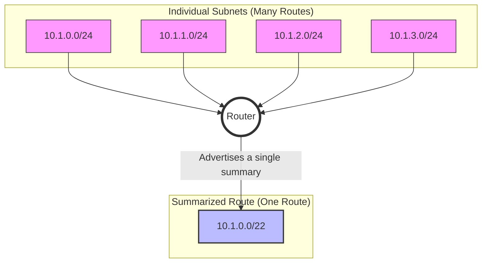

# 3.4. Supernetting (Route Summarization)

## 1. What is Supernetting?

**Supernetting** (also known as **IP aggregation** or **route summarization**) is the process of taking multiple smaller, contiguous network blocks and combining them into a single, larger network advertisement. It is the reverse of subnetting.

- **Subnetting:** Breaks one large network into many smaller ones.
- **Supernetting:** Combines many small networks into one larger one.

The primary goal of supernetting is to reduce the size of routing tables on routers. Instead of advertising a dozen individual routes, a router can advertise a single summary route, which saves memory, CPU processing, and improves network stability.



---

## 2. The Two-Step Process for Supernetting

To find the best summary route for a given list of networks, you only need to follow two simple steps.

**Problem:** Find the single best summary route for the following six networks:

- `9.9.16.0/28`
- `9.9.32.0/28`
- `9.9.48.0/28`
- `9.9.64.0/28`
- `9.9.80.0/28`
- `9.9.96.0/28`

### Step 1: Find the Lowest and Highest IP Addresses

Identify the full range of addresses you need to summarize.

- **Lowest IP Address:** This is the Network ID of the first network in your list.
  - `9.9.16.0`
- **Highest IP Address:** This is the **Broadcast IP** of the last network in your list.
  - To find this, we need the Next Network ID for `9.9.96.0/28`. A `/28` has a group size of 16.
  - Next Network = `9.9.112.0` (`96 + 16`).
  - Broadcast IP = `9.9.111.255` (The IP right before the Next Network).

So, our full range to summarize is from `9.9.16.0` to `9.9.111.255`.

### Step 2: Find the Smallest Subnet Block that Contains this Range

Now we need to find the shortest possible prefix (smallest CIDR number) that covers this entire range.

1.  **Convert to Binary:** The easiest way to do this is to write out the lowest and highest addresses in binary. We only need to focus on the octets that are different. In this case, it's the third octet.

    - `16` = `00010000`
    - `111` = `01101111`

    ```
    Lowest:  9.9.00010000.0
    Highest: 9.9.01101111.255
    ```

2.  **Find the Matching Bits:** Look from left to right and find how many bits match perfectly between the two numbers.

    ```
      00010000  (16)
      01101111  (111)
    ^
    |
    Bit 1 doesn't match.
    ```

    Let's check the full 32-bit address:

    - First octet (`9`) matches. (8 bits)
    - Second octet (`9`) matches. (8 bits)
    - In the third octet, the very first bit is different (`0` vs `1`).

    The total number of matching bits, starting from the far left, is `8 + 8 = 16`. The 17th bit is where they first differ.

3.  **Determine the Summary Route:**

    - The number of matching bits becomes your new CIDR prefix. Here, it is `/16` (because the first 16 bits match).
    - The network address of the summary route is found by taking the lowest IP address (`9.9.16.0`) and setting all the bits after the matching prefix to zero.

    Let's re-examine. The first bit of the third octet doesn't match. This means our summary must be larger than a /17. Let's look at the binary more carefully:

    Lowest: `00001001.00001001.00010000.00000000`
    Highest:`00001001.00001001.01101111.11111111`

    Let's find the matching bits from left to right.

    - First 8 bits match.
    - Next 8 bits match.
    - Third octet:
      `00010000`
      `01101111`
      The first bit (`0` vs `0`) matches.
      The second bit (`0` vs `1`) does not match.

    So, the number of matching bits is `8 (1st octet) + 8 (2nd octet) + 1 (in 3rd octet) = 17`. The summary mask is `/17`.

    The network address for the summary route is the lowest address (`9.9.16.0`) with all bits after the `/17` prefix set to `0`.

    - `9.9.16.0` in binary (first 17 bits): `00001001.00001001.0`
    - Setting all subsequent bits to `0`: `00001001.00001001.00000000.00000000`
    - This converts to `9.9.0.0`.

**Answer:** The best summary route is `9.9.0.0/17`.

> [!TIP] The "find matching bits" method is the most foolproof way to determine the summary CIDR. The number of matching bits from the left is your summary prefix length.

---

## 3. Summarization Goals: Single Route vs. Exact Match

Sometimes the goal of summarization changes.

- **Summarize to a Single Network:** This is the most common goal, used for routing. You find the smallest single block that contains all your subnets, even if it also includes some unallocated addresses. Our example above did this.
- **Summarize to an Exact Match:** This is used for things like Access Control Lists (ACLs) where you need to be precise. You summarize as much as possible without including any extra IP addresses. This may result in more than one summary route.

**Example:** Summarize `9.9.64.0/26` and `9.9.128.0/26`.

- These are not contiguous. `9.9.64.0/26` covers `.64` to `.127`. `9.9.128.0/26` covers `.128` to `.191`.
- **Single Route Summary:** The lowest IP is `9.9.64.0` and the highest is `9.9.128.255`. Following the binary method, this summarizes to `9.9.0.0/24`. This is very broad. A better summary would be `9.9.64.0/24` which covers 9.9.64.0 to 9.9.64.255, and includes both of our networks.
- **Exact Match Summary:** You cannot summarize them further without including addresses in between. The "exact match" would be to leave them as two separate entries: `9.9.64.0/26` and `9.9.128.0/26`.

For most networking exams and routing scenarios, the goal is to find the single best summary route.
