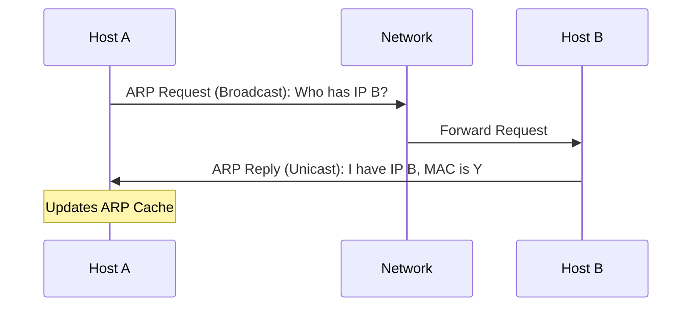

# 1.12. Address Resolution Protocol (ARP)

## 1. The Gap Between Layer 2 and Layer 3
*   **Layer 3 (IP):** We know the Logical Address (e.g., `192.168.1.50`).
*   **Layer 2 (MAC):** To build a frame, we absolutely need the Physical Address (e.g., `00:AA:BB:CC:DD:EE`).
*   **Problem:** How do we find the MAC address if we only have the IP?
*   **Solution:** **ARP**.

---

## 2. How ARP Works
Scenario: Host A wants to send data to Host B on the same LAN.

### Step 1: Check Cache
Host A checks its local **ARP Cache** (a RAM table).
*   *Command:* `arp -a`
*   If the entry exists, it uses the MAC. If not, it proceeds to Step 2.

### Step 2: ARP Request (Broadcast)
Host A shouts to the network.
*   **Packet:** "Who has IP `192.168.1.50`? Tell `192.168.1.10`."
*   **Destination MAC:** `FF:FF:FF:FF:FF:FF` (Broadcast).
*   **Result:** Every device on the switch receives this and processes it (CPU interrupt).

### Step 3: ARP Reply (Unicast)
Host B sees its IP in the request.
*   **Packet:** "I am `192.168.1.50`. My MAC is `00:AA:BB:CC:DD:EE`."
*   **Destination MAC:** Host A's specific MAC.
*   **Result:** Only Host A receives this.

### Step 4: Update Cache
Host A saves the pair (`192.168.1.50` = `00:AA:BB:CC:DD:EE`) in its cache for a specific time (aging timer) to avoid repeating this process for every packet.

---

## 3. ARP in Remote Communication
If Host A wants to talk to a Google Server (External Network):
1.  Host A sees destination is **not** local.
2.  Host A needs to send the packet to its **Default Gateway** (Router).
3.  Host A sends an ARP Request for the **Router's IP**, not Google's IP.
4.  The Ethernet Frame Destination MAC will be the **Router's MAC**.
5.  The IP Packet Destination IP will be **Google's IP**.

> [!WARNING] **Security Risk**
> **ARP Spoofing (Poisoning):** Since ARP has no authentication, a malicious actor can reply to an ARP request saying "I am the Router." The victim will then send all internet traffic to the attacker (Man-in-the-Middle attack).
