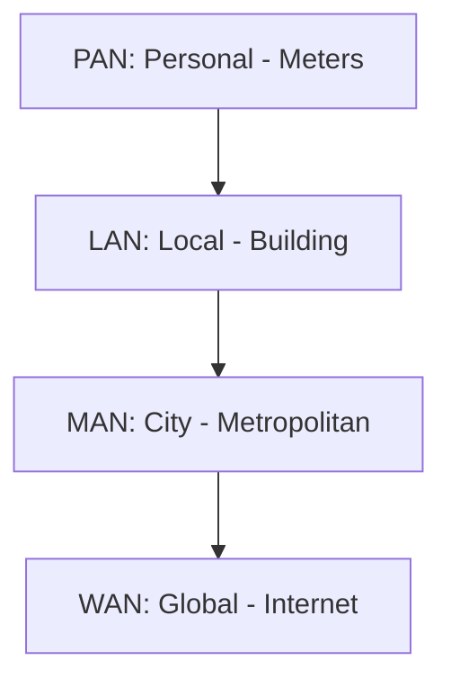

## 1. Classification by Geographic Scope (The "Area" Networks)
This classification is based on the physical distance covered by the network.

### PAN (Personal Area Network)
*   **Range:** A few meters (< 10m). Centered around a single person.
*   **Use Case:** Connecting a headset to a phone, a mouse to a laptop, or syncing a Fitbit.
*   **Technology:** Bluetooth, Zigbee, NFC.

### LAN (Local Area Network)
*   **Range:** Limited geography (Building, Home, Campus, Factory). usually < 10km.
*   **Characteristics:** High speed (Gbps), owned and managed by the organization (private).
*   **Technology:** Ethernet (IEEE 802.3), Wi-Fi (IEEE 802.11).

### MAN (Metropolitan Area Network)
*   **Range:** A city or a large campus.
*   **Use Case:** Interconnecting various LANs within a city (e.g., University departments spread across a town).
*   **Technology:** WiMAX, Metro Ethernet, Fiber rings.

### WAN (Wide Area Network)
*   **Range:** Country, Continent, or Global (The Internet).
*   **Characteristics:** Uses telecommunication service providers (ISPs) to connect. Slower speeds than LANs generally.
*   **Technology:** 4G/5G, Satellite, MPLS, Leased Lines.

---

## 2. Classification by Topology
Topology describes how devices are connected. We distinguish between **Physical Topology** (how cables are plugged) and **Logical Topology** (how data flows).

### A. Bus Topology
*   **Structure:** All devices connect to a single central cable (backbone).
*   **Pros:** Cheap, easy to install for small networks.
*   **Cons:** **Single point of failure** (if the cable breaks, the whole network dies). High collision rate. Requires "terminators" at ends to absorb signals.

### B. Star Topology (Most Common)
*   **Structure:** All devices connect to a central device (Switch or Hub).
*   **Pros:** Easy to troubleshoot. If one cable breaks, only that device goes down.
*   **Cons:** The central node is the single point of failure.
[[Qs1]]
### C. Ring Topology
*   **Structure:** Devices form a closed loop. Data travels in one direction (usually).
*   **Mechanism:** Token passing (only the device with the "token" can transmit).
*   **Pros:** Deterministic (predictable delay), no collisions.
*   **Cons:** If one node fails, the ring breaks (unless dual-ring).

### D. Mesh Topology
*   **Full Mesh:** Every device connects to every other device. High redundancy, very expensive cabling.
*   **Partial Mesh:** Critical devices are fully meshed, others are not. Good balance of cost/reliability.

### E. Tree Topology (Extended Star)
*   **Structure:** Hierarchical. A root node (core switch) connects to other switches, which connect to end devices.
*   **Use:** Standard in modern large buildings.

---

## 3. Classification by Architecture
How do computers share resources?

### Client/Server
*   **Roles:** Distinct.
    *   **Server:** Powerful, always on, provides services (Web, DB, Email).
    *   **Client:** Requests services.
*   **Pros:** Centralized security, backups, and management.
*   **Cons:** Expensive hardware. Single point of failure (if server dies, clients halt).

### Peer-to-Peer (P2P)
*   **Roles:** No dedicated server. Every device acts as both a client and a server.
*   **Use Case:** Home networks, BitTorrent.
*   **Pros:** Cheap, easy to set up, redundant.
*   **Cons:** Decentralized (hard to secure), hard to back up data, performance drops with more users.

> [!NOTE] **Exam Reminder**
> A network might be a **Physical Star** (cables into a central box) but operate as a **Logical Bus** (if that box is a Hub, data is broadcast to everyone like a bus).

