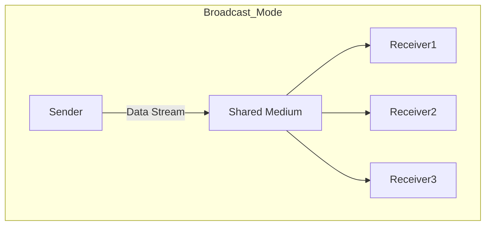

# 1.3. Transmission Modes

This section defines how data propagates between the sender and the receiver(s).

---

## 1. Broadcast Mode (Diffusion)
In this mode, the transmission medium is **shared**. When one device talks, it sends the signal onto the medium, and potentially everyone can "hear" it.

*   **Mechanism:** The sender puts data on the wire. Every device receives it but checks the **Destination Address**. If the address matches their own, they process it; otherwise, they discard it.
*   **Control:** Only one device can transmit at a time to avoid **collisions**.
*   **Typical Usage:** LANs (Ethernet/Wi-Fi).

### Types of Diffusion:
1.  **Unicast (1-to-1):** A message sent from a specific source to a **single** specific destination.
2.  **Multicast (1-to-Many):** A message sent to a specific **group** of devices (e.g., video streaming to subscribers).
3.  **Broadcast (1-to-All):** A message sent to **everyone** on the network (e.g., ARP requests "Who has IP X?").

---

## 2. Point-to-Point Mode
In this mode, a physical link connects **exactly two** devices.

*   **Mechanism:** There is no addressing ambiguity at the physical layer because there is only one place for the data to go—the other end of the wire.
*   **Routing:** When Device A wants to talk to Device Z (not directly connected), the data hops from node to node (A -> B -> C -> Z).
*   **Typical Usage:** WAN links (e.g., a leased line between two routers in different cities).

> [!IMPORTANT] **Key Distinction**
> *   **LANs** generally operate in **Broadcast mode** (Shared medium logic, even if switched).
> *   **WANs** generally operate in **Point-to-Point mode** (Long distance direct links).
