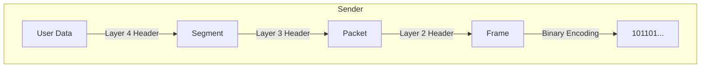

## 1. The Problem: Heterogeneity
Networks consists of hardware from different vendors (Cisco, Huawei, Dell) running different software (Windows, Linux, macOS).
**Problem:** How do we ensure they all understand each other?
**Solution:** **Protocols**.

## 2. Definition of a Protocol
A protocol is a strict **set of rules** that governs communication. It defines:
1.  **Format:** What the data looks like (headers, footers).
2.  **Order:** Who speaks first, how to initiate/end connection.
3.  **Meaning:** How to interpret the signals.

---

## 3. The OSI Model (Open Systems Interconnection)
Developed by ISO to standardize network communication into **7 abstract layers**. This is a *theoretical reference model*.

### The 7 Layers (Top to Bottom)
*Mnemonic: **P**lease **D**o **N**ot **T**hrow **S**ausage **P**izza **A**way* (Bottom-up) or * **A**ll **P**eople **S**eem **T**o **N**eed **D**ata **P**rocessing* (Top-down).

| #     | Layer            | Function                                                  | PDU (Data Unit) |
| :---- | :--------------- | :-------------------------------------------------------- | :-------------- |
| **7** | **Application**  | Interface for the user (HTTP, FTP, SMTP).                 | Data            |
| **6** | **Presentation** | Formatting, Encryption, Compression (JPEG, ASCII).        | Data            |
| **5** | **Session**      | Managing sessions (Start, Stop, Keep-alive).              | Data            |
| **4** | **Transport**    | End-to-end delivery, Reliability, Flow Control (TCP/UDP). | **Segment**     |
| **3** | **Network**      | Logical Addressing (IP), Routing (Best Path).             | **Packet**      |
| **2** | **Data Link**    | Physical Addressing (MAC), Error detection, Media Access. | **Frame**       |
| **1** | **Physical**     | Transmission of raw bits over media (Voltages, Light).    | **Bits**        |
[[Qs2]]

---

## 4. The TCP/IP Model
This is the *practical* model actually used in the Internet. It condenses the OSI layers.

| OSI Layer | TCP/IP Layer | Key Protocols |
| :--- | :--- | :--- |
| Application, Presentation, Session | **Application** | HTTP, DNS, DHCP, SMTP |
| Transport | **Transport** | TCP, UDP |
| Network | **Internet** | IP, ICMP, ARP, OSPF |
| Data Link, Physical | **Network Access** | Ethernet, Wi-Fi, PPP |

---

## 5. Encapsulation and Decapsulation
As data moves down the stack (Sender), each layer adds its own "header" (envelope) containing specific info for that layer. This is **Encapsulation**.
As data moves up the stack (Receiver), each layer reads its header and removes it. This is **Decapsulation**.

> [!TIP] **Layer Interaction**
> *   **Vertical Interaction:** Layer N provides services to Layer N+1.
> *   **Horizontal Interaction:** Layer N on the sender communicates logically with Layer N on the receiver using the protocol header.
