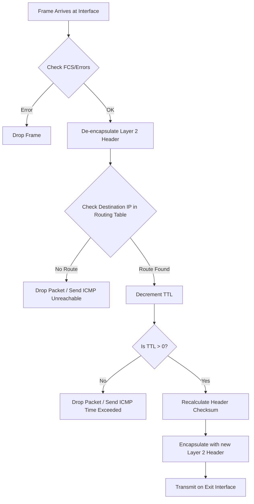

### **Definition**
An **IP Router** is a Layer 3 (Network Layer) device whose primary function is to **forward packets** from one network to another. It acts as the "traffic controller" of the internetwork.

*   **Key Characteristic:** It connects at least two different logical networks (subnets). Therefore, a router has multiple physical interfaces, each with a unique IP address belonging to the specific network it connects to.
*   **Context:** Unlike a switch (which connects devices within the *same* network using MAC addresses), a router connects *different* networks using IP addresses.

### **Core Functions**
When a router receives a frame, it performs a specific sequence of operations:

1.  **De-encapsulation:** It strips the Layer 2 header (Ethernet frame) to expose the Layer 3 IP packet.
2.  **Decision Making:** It looks at the **Destination IP** of the packet and consults its **Routing Table** to find the best path.
3.  **TTL Management:** It decrements the **Time To Live (TTL)** value in the IP header by 1.
    *   *Critical Rule:* If TTL reaches 0, the packet is **dropped** (destroyed) to prevent infinite loops, and an ICMP "Time Exceeded" message is usually sent back to the sender.
4.  **Re-Checksum:** Because the TTL changed, the header checksum must be recalculated.
5.  **Encapsulation:** It re-encapsulates the IP packet into a new Layer 2 frame appropriate for the outgoing interface (e.g., Ethernet, PPP, Serial).
6.  **Transmission:** It sends the frame out the exit interface towards the next hop.

### **Packet Processing Flow**

> [!TIP] **Student Reminder: The Default Gateway**
> A router often acts as the **Default Gateway** for hosts on a LAN.
> *   If a PC wants to talk to a device on a *different* network, it **must** send the data to its default gateway (the router's local interface).
> *   Without a gateway, a host is trapped in its local LAN.

---

---
