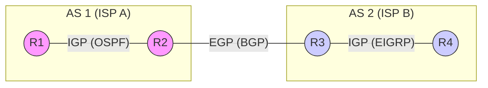

Here are the detailed Obsidian notes for the second half of Chapter 2 (Sections 2.7 to 2.10).

---

# 2.7. Autonomous Systems (AS)

### **Definition**
An **Autonomous System (AS)** is a collection of connected IP prefixes (networks) under the control of a **single administrative entity** (like an ISP, a large university, or a corporation) that presents a common, clearly defined routing policy to the Internet.

*   **The Problem:** We cannot broadcast routing updates to the entire world. It would consume too much bandwidth and compromise security.
*   **The Solution:** Divide the internet into "fiefdoms" (AS). Inside the AS, you route how you want. Between ASs, you use a standardized language.

### **Numbering (ASN)**
Just like IP addresses, every AS needs a unique identifier called an **Autonomous System Number (ASN)**.
*   **Format:** 16-bit number (ranges from 1 to 65535).
*   **Allocation:** Managed by **IANA** (Internet Assigned Numbers Authority) and delegated to RIRs (Regional Internet Registries like RIPE, ARIN, AFRINIC).
*   **Ranges:**
    *   **Public AS:** 1 - 64511 (Routable on the Internet).
    *   **Private AS:** 64512 - 65535 (For internal use only, similar to private IPs).

### **IGP vs. EGP**
The concept of AS creates two distinct categories of routing protocols:

| Category | Full Name | Scope | Protocol Examples | Purpose |
| :--- | :--- | :--- | :--- | :--- |
| **IGP** | **Interior Gateway Protocol** | **Intra-AS** (Inside the AS) | RIP, OSPF, EIGRP | Optimize speed and efficiency within the organization. |
| **EGP** | **Exterior Gateway Protocol** | **Inter-AS** (Between ASs) | BGP | Handle vast numbers of routes and enforce political/economic policies. |

---

---
