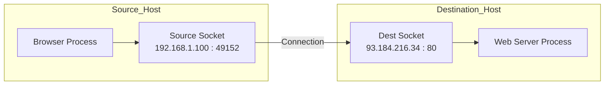

## 3.2. Addressing: Ports and Sockets
How does the computer know that an incoming packet is for the Web Browser and not the Email Client?

### 3.2.1. The Port Number
While an **IP Address** identifies a specific machine on the network, a **Port Number** identifies a specific **process or service** running inside that machine.

*   **Identifier:** A 16-bit integer.
*   **Range:** 0 to 65,535.

#### Classification of Ports (IANA Standards)
The Internet Assigned Numbers Authority (IANA) divides ports into three categories:

| Category | Range | Description |
| :--- | :--- | :--- |
| **Well-Known Ports** | **0 - 1,023** | Reserved for core system services and common protocols (HTTP, FTP, DNS). Generally require "Root" or Admin privileges to bind to. |
| **Registered Ports** | **1,024 - 49,151** | Assigned to specific user processes or applications (e.g., Minecraft, SQL Server) registered with IANA to avoid conflicts. |
| **Dynamic/Private Ports** | **49,152 - 65,535** | Ephemeral ports. Used dynamically by client applications (e.g., your browser opening a connection) to identify the "return address" for a session. |

> [!TIP] **Command Line Trick**
> You can see which ports are currently open or in use on your machine using the command:
> `netstat -an`

#### Common Well-Known Ports
*   **20/21:** FTP (File Transfer)
*   **22:** SSH (Secure Shell)
*   **23:** Telnet (Unsecured remote login)
*   **25:** SMTP (Email Sending)
*   **53:** DNS (Domain Name Service)
*   **67/68:** DHCP (IP auto-configuration)
*   **80:** HTTP (Web)
*   **110:** POP3 (Email Retrieval)
*   **443:** HTTPS (Secure Web)

---

### 3.2.2. The Socket
A **Socket** is the combination of an IP Address and a Port Number. It uniquely identifies a specific communication endpoint in the network.

$$ \text{Socket} = \text{IP Address} : \text{Port Number} $$

**The Socket Pair:**
To establish a connection, we need a **Socket Pair** (one for the source, one for the destination). This allows the Transport layer to uniquely identify a conversation.

*   **Local Socket:** `{Local IP, Local Port}`
*   **Remote Socket:** `{Remote IP, Remote Port}`

### 3.2.3. Multiplexing and Demultiplexing
*   **Multiplexing (Sender side):** Gathering data chunks from different sockets, encapsulating them with headers (containing the source/dest ports), and passing them to the network layer.
*   **Demultiplexing (Receiver side):** Examining the Destination Port in the header to direct the segment to the correct socket/application.

**Example: The Web Server Scenario**
A web server listens on **Port 80**. How does it handle 10,000 users simultaneously?
*   It has **one** listening socket on Port 80.
*   However, for every client connection, a unique **Session** is identified by the **Client's Socket** (Client IP + Client Port).
*   Even if 50 users connect from different IPs to the same server IP:80, the server distinguishes them using their Source IP and Source Port.
