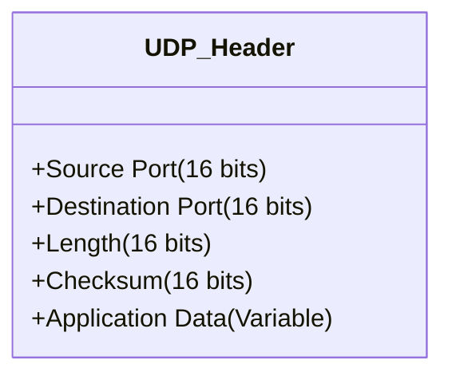

## 3.4. UDP in Detail (User Datagram Protocol)
UDP is described in **RFC 768**. It is the simplest transport protocol. It provides the absolute minimum required for the Transport layer to function (Ports + Error check).

### 3.4.1. Key Characteristics
1.  **No Handshake:** It starts sending data instantly. This reduces latency (delay) significantly compared to TCP.
2.  **Datagram Oriented:** It preserves message boundaries. It sends "messages," not a continuous "stream" of bytes like TCP.
3.  **Application Responsibility:** Since UDP doesn't fix errors or order packets, if the application needs these features (e.g., TFTP), the **Application Layer** must implement them itself.

### 3.4.2. The UDP Header
The UDP header is very lightweight, consisting of only **8 Bytes** (64 bits).

**Field Breakdown:**
1.  **Source Port (16 bits):** The port number of the application sending the data. (Optional in some cases, set to 0 if not used).
2.  **Destination Port (16 bits):** The port number of the application that should receive the data. **Crucial for Demultiplexing.**
3.  **Length (16 bits):** The total length of the UDP datagram (Header + Data) in bytes. The minimum value is 8 (just the header).
4.  **Checksum (16 bits):** Used for error detection.
    *   It covers the Header, the Data, and a "Pseudo-Header" (IP addresses from the Network layer).
    *   This ensures that the packet arrived at the correct destination IP and the data wasn't corrupted in transit.
    *   If the checksum fails, UDP silently discards the packet.

### 3.4.3. When is UDP Efficient?
*   **Request-Response Protocols:** Like DNS or DHCP. The query is one packet; the response is one packet. Setting up a TCP connection (3 packets) just to send 1 packet of data is wasteful.
*   **Real-Time Applications:** Voice and Video. The human ear/eye can tolerate a small glitch (lost packet), but cannot tolerate lag/buffering (TCP retransmission delays).
*   **Multicast/Broadcast:** TCP is strictly one-to-one (Unicast). UDP can broadcast messages to multiple receivers at once (used in streaming or service discovery).