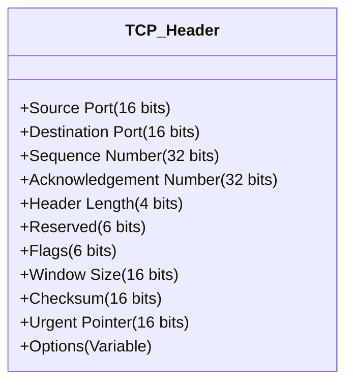
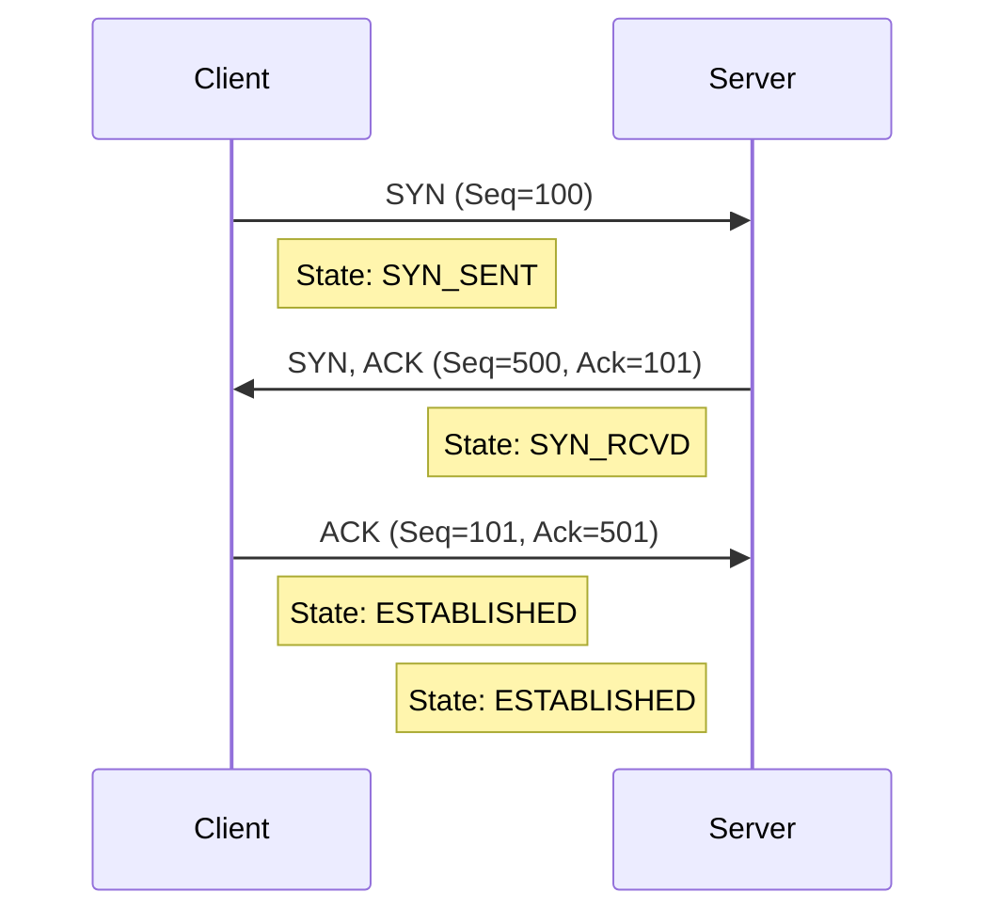

Based on the slides provided (182-199) and the text you pasted, you have covered the **General Purpose**, **Addressing**, and **UDP**.

The most critical and complex part of this chapter is **TCP** (Slides 194-199). This is where most exam questions come from because it involves logic, states, and "math" (sequencing).

Here are the detailed notes for the remaining sections: **TCP Structure**, **Connection Management**, and **Reliability/Flow Control**.

---

---
--- START OF FILE 3.5 TCP Structure and Header.md ---

# 3.5. TCP Structure and Header Details
**Reference:** Slides 194-195

TCP (Transmission Control Protocol) is a stateful, reliable protocol. To manage this reliability, the TCP Header is much larger and more complex than UDP. While UDP has an 8-byte header, TCP has a minimum **20-byte** header.

### 3.5.1. The TCP Segment Structure
A TCP packet is called a **Segment**.
$$ \text{Segment} = \text{TCP Header} + \text{Application Data} $$

### 3.5.2. Detailed Header Fields
You must understand what each field does to understand how TCP diagnoses network issues.

#### 1. Addressing (Rows 1)
*   **Source Port (16 bits) & Destination Port (16 bits):** Identifies the sending and receiving applications (just like UDP).

#### 2. Tracking Data (Rows 2 & 3) - *Crucial for Exams*
*   **Sequence Number (32 bits):**
    *   TCP sees data as a **stream of bytes**, not a pile of packets.
    *   This number indicates the position of the *first byte of data* in this segment within the entire data stream.
    *   *Example:* If I send a file of 1000 bytes in two segments of 500, the first segment has Seq #0 (technically random ISN), the second has Seq #500.
*   **Acknowledgment Number (32 bits):**
    *   This is the number sent by the **Receiver**.
    *   It tells the Sender: **"I have received everything up to byte X-1. Please send me byte X next."**
    *   *Note:* It is always the *next expected byte*.

#### 3. Management (Row 4)
*   **Header Length / Data Offset (4 bits):** Tells the receiver where the header ends and the actual data begins (since Options can make the header variable size).
*   **Control Flags (6 bits):** These 1-bit flags manage the state of the connection. You must memorize these.

| Flag | Name | Function |
| :--- | :--- | :--- |
| **URG** | Urgent | Indicates the "Urgent Pointer" field is significant (rarely used today). |
| **ACK** | Acknowledgment | **Very Important.** Indicates that the "Acknowledgment Number" field is valid. (Most packets after the first one have this set). |
| **PSH** | Push | Tells the receiver "Don't wait to fill your buffer, pass this data to the application immediately." (Used in Telnet/SSH). |
| **RST** | Reset | "Emergency Stop." Aborts a connection immediately due to an error (e.g., connecting to a closed port). |
| **SYN** | Synchronize | **Connection Setup.** Used to initiate a connection and synchronize Sequence Numbers. |
| **FIN** | Finish | **Connection Teardown.** Used to close the connection politely. |

#### 4. Flow & Errors (Row 5)
*   **Window Size (16 bits):**
    *   Used for **Flow Control**.
    *   The receiver tells the sender: "I currently have room for X bytes in my buffer."
    *   The sender must strictly obey this limit.
*   **Checksum (16 bits):** Used for error detection (covers Header + Data + Pseudo-Header).
*   **Urgent Pointer (16 bits):** Points to the end of urgent data (only if URG flag is set).

---

---
--- START OF FILE 3.6 TCP Connection Management.md ---

# 3.6. TCP Connection Management
**Reference:** Slides 196-197

Because TCP provides a guaranteed service, it cannot just start blasting data (like UDP). It must "call ahead" to make sure the receiver is ready.

### 3.6.1. The 3-Way Handshake (Connection Establishment)
Before any data is transferred, the Client and Server exchange three packets to synchronize their Sequence Numbers (ISN).

> [!TIP] **Exam Mnemonic:**
> **SYN** $\rightarrow$ **SYN-ACK** $\rightarrow$ **ACK**

**Step 1: Client sends SYN**
*   **Flags:** `SYN = 1`, `ACK = 0`
*   **Data:** The Client chooses a random **Initial Sequence Number (ISN)**, let's call it `Seq = x`.
*   **Meaning:** "I want to connect. My data stream will start at index `x`."

**Step 2: Server sends SYN-ACK**
*   **Flags:** `SYN = 1`, `ACK = 1`
*   **Data:**
    *   Server acknowledges Client's ISN: `Ack = x + 1` (I expect `x+1` next).
    *   Server chooses its own ISN: `Seq = y`.
*   **Meaning:** "I heard you (ACK). I accept. My data stream starts at index `y`."

**Step 3: Client sends ACK**
*   **Flags:** `SYN = 0`, `ACK = 1`
*   **Data:**
    *   Client acknowledges Server's ISN: `Ack = y + 1`.
    *   Client Sequence: `Seq = x + 1`.
*   **Meaning:** "Connection Established. I am ready to send data."

---

### 3.6.2. Connection Termination (4-Step process)
Unlike UDP, a TCP connection stays open until explicitly closed. It uses a "polite" goodbye to ensure all data is finished.

**The Concept:** TCP is **Full Duplex** (two independent one-way streets). You must close each street separately.

1.  **Client:** "I am done sending data." (Sends **FIN**).
2.  **Server:** "I received your request to stop." (Sends **ACK**).
    *   *At this point, the Client cannot send data, but can still receive if the Server has more to say.*
3.  **Server:** "I am also done sending data." (Sends **FIN**).
4.  **Client:** "Goodbye." (Sends **ACK**).

---

---
--- START OF FILE 3.7 TCP Reliability and Flow Control.md ---

# 3.7. TCP Reliability and Flow Control
**Reference:** Slides 198-199

This is the "logic" layer of TCP. How does it ensure data arrives correctly and without overwhelming the receiver?

### 3.7.1. Reliability: PAR (Positive Acknowledgment with Retransmission)
TCP uses a mechanism where every data segment sent must be acknowledged.

**The Rules:**
1.  **Sender:** Starts a timer when a segment is sent.
2.  **Receiver:** If the segment arrives intact, send an **ACK** back with the number of the *next expected byte*.
3.  **Sender:** If the timer expires (Timeout) and no ACK is received, **Retransmit** the segment.

> [!NOTE] **Common Misconception**
> ACKs in TCP are **Cumulative**.
> If the Receiver sends `ACK 5000`, it means "I have received **all** bytes from 0 to 4999 correctly. I am waiting for byte 5000."

### 3.7.2. Flow Control (Windowing)
**The Problem:** The sender is a Supercomputer; the receiver is a cheap Smartphone. The Supercomputer can send data faster than the Smartphone can process (save to disk/display). If the buffer overflows, packets are dropped.

**The Solution:** The **Sliding Window**.

Every TCP ACK packet contains a field called **Window Size**.
*   This is a notification from the Receiver to the Sender.
*   **Meaning:** "I currently have `N` bytes of free space in my buffer."

#### Detailed Flow Control Example (The "Exercise" Logic)

Imagine a buffer size of **3000 bytes**.

1.  **Handshake:** Receiver says: `Window Size = 3000`.
2.  **Transmission 1:** Sender sends **1000 bytes**.
    *   Receiver buffer: 1000 used, 2000 free.
    *   Application is slow and hasn't read anything yet.
    *   Receiver replies: `ACK 1001`, `Window Size = 2000`.
3.  **Transmission 2:** Sender receives the ACK. It sees it can send 2000 more bytes. It sends another **1000 bytes**.
    *   Receiver buffer: 2000 used, 1000 free.
    *   Receiver replies: `ACK 2001`, `Window Size = 1000`.
4.  **Transmission 3:** Sender sends **1000 bytes**.
    *   Receiver buffer: 3000 used, **0 free**.
    *   Receiver replies: `ACK 3001`, `Window Size = 0`.
5.  **Stop:** The Sender **stops** transmitting immediately. It enters a wait state.
6.  **Recovery:** The Application on the receiver finally processes the data, clearing the buffer.
    *   Receiver sends a "Window Update" segment: `Window Size = 3000`.
    *   Sender resumes.

> [!TIP] **Exam Math Trick**
> **Effective Window** = (advertised Window Size) - (Amount of unacknowledged data already sent).
> If the Receiver says "Window 1000" and you just sent 200 bytes that haven't been ACKed yet, you can only send 800 more.

### 3.7.3. Congestion Control (Brief Overview)
While Flow Control protects the *Receiver*, **Congestion Control** protects the *Network*.
*   If the network is slow (routers are full), TCP automatically slows down.
*   **Slow Start:** TCP starts sending slowly (1 segment) and exponentially increases speed until it hits a limit or packets get lost.
*   **Congestion Avoidance:** If a packet is lost (timeout), TCP assumes the network is congested and drastically reduces its transmission speed, then slowly ramps back up.

---