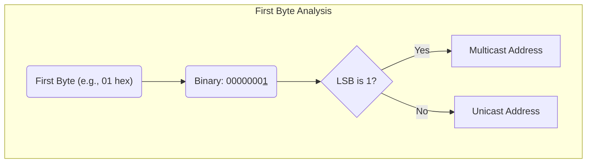

## Exercise 01: MAC Address Analysis

> [!Note] Given the following MAC addresses:
> 
> a) `01-00-5E-AB-CD-EF`
> b) `00-00-25-47-EF-CD`
> c) `11-52-AB-9B-DC-12`
> d) `00-01-4B-B4-A2-EF`
>
> 1.  Determine the type of each MAC address (Unicast, Multicast, or Broadcast).
> 2.  State whether these addresses can be used in the "source address" field of an Ethernet frame.

### 1. Solution According to the Notes

Your notes correctly identify the core rule: _"Le type est déterminé par le bit de poids faible du premier octet"_ (The type is determined by the least significant bit of the first byte).

- A `1` in this position means **Multicast**.
- A `0` in this position means **Unicast**.

The notes then apply this rule:

- `01` -> `0000000**1**` -> Multicast
- `00` -> `0000000**0**` -> Unicast
- `11` -> `0001000**1**` -> Multicast
- `00` -> `0000000**0**` -> Unicast

For the second part, your notes state a clear conclusion: _"l'@ source doit être toujours Unicast"_ (The source address must always be Unicast). Based on this, the notes correctly identify `b)` and `d)` as valid source addresses and `a)` and `c)` as invalid.

### 2. Formal, Detailed Solution

#### Essential Background Knowledge

A **MAC (Media Access Control) address** is a 48-bit, globally unique hardware address assigned to a Network Interface Card (NIC). It operates at Layer 2 (Data Link) of the OSI model and is used for addressing within a local network segment (like a LAN).

The first byte of a MAC address contains special flags. The most important one for this exercise is the **Least Significant Bit (LSB)**, which determines if the address is Unicast or Multicast.

- **Unicast:** A unicast address identifies a single, unique NIC. Frames sent to a unicast address are delivered to one specific device.
- **Multicast:** A multicast address represents a group of devices. Frames sent to a multicast address are delivered to all devices that have subscribed to that group.
- **Source Address Rule:** The source of a data frame must be a single, identifiable device. Therefore, the source MAC address **must always be a Unicast address**. A device cannot send data claiming to be a group.

#### Step-by-Step Analysis

**1. Type of each MAC address:**

- **a) `01-00-5E-AB-CD-EF`**
  - First byte: `01` (hex) = `00000001` (binary).
  - The LSB is `1`.
  - **Type: Multicast**.

- **b) `00-00-25-47-EF-CD`**
  - First byte: `00` (hex) = `00000000` (binary).
  - The LSB is `0`.
  - **Type: Unicast**.

- **c) `11-52-AB-9B-DC-12`**
  - First byte: `11` (hex) = `00010001` (binary).
  - The LSB is `1`.
  - **Type: Multicast**.

- **d) `00-01-4B-B4-A2-EF`**
  - First byte: `00` (hex) = `00000000` (binary).
  - The LSB is `0`.
  - **Type: Unicast**.

**2. Validity as a Source Address:**

- a) Multicast: **Invalid** as a source address.
- b) Unicast: **Valid** as a source address.
- c) Multicast: **Invalid** as a source address.
- d) Unicast: **Valid** as a source address.

> [!Note] **Hexadecimal Shortcut**
> You don't always need to convert to binary. Look at the **second digit** of the first byte:
>
> - If it's an **even** number (0, 2, 4, 6, 8, A, C, E), the LSB is 0 (Unicast).
> - If it's an **odd** number (1, 3, 5, 7, 9, B, D, F), the LSB is 1 (Multicast).
>   Example: `1**1**` is odd -> Multicast. `0**0**` is even -> Unicast.

---
